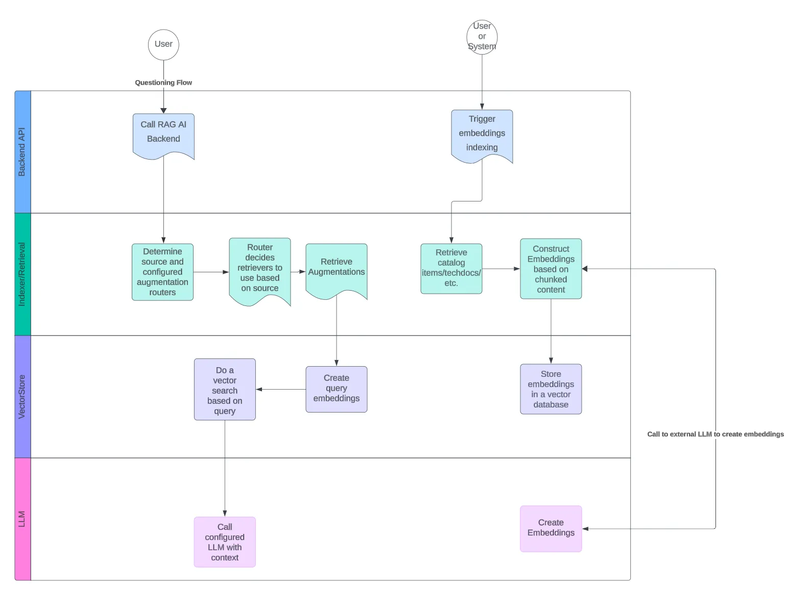
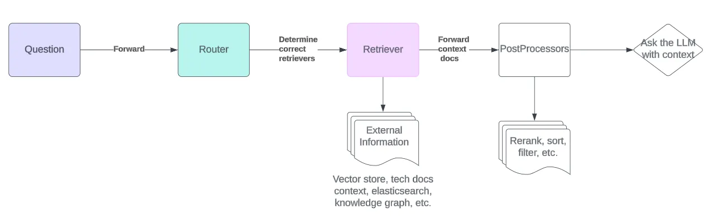

## Data storage

The plugin provides a vector storage option to use the Backstage PostgreSQL database with a support of `pgVector` database extension. This extension should be installable by default on most Postgres instance installation methods, including AWS RDS installations. 

## More information

The AI Assistant plugin can be used with or without embeddings information that are stored and retrieved from a PostgreSQL database. To extend the plugin to support other LLMs, it is recommended to use the provided base class `DefaultVectorAugmentationIndexer.ts` from `@roadiehq/rag-ai-backend-retrieval-augmenter` package. Note that in most cases the embeddings that are created need to be using the same models as the actual queries that are run. 

See more information about configuration and extension options from the plugin [FE GitHub repository](https://github.com/RoadieHQ/roadie-backstage-plugins/tree/main/plugins/frontend/rag-ai) and the plugin [BE GitHub repository](https://github.com/RoadieHQ/roadie-backstage-plugins/tree/main/plugins/backend/rag-ai-backend).

## Configuration options 

The plugin enables extensive configuration options to modify your prompts, embedding chunk sizes, large language model identifiers that can be used as well as the actual sources of data that is used to construct, retrieve and process for the eventual context sent to the LLM. 

See full configuration options below.

```yaml
# Roadie RAG AI configuration
ai:
  # (Optional) Supported sources to query information from using RAG. This can be used to omit unnecessary sources from being retrievable. Defaults to [catalog]
  supportedSources: ['catalog']

  # (Optional) Texts to inject to the prompts when querying the LLM. Defaults to hardcoded prompts within the codebase.
  prompts:
    # (Optional) Prefix prompt to add to the query. This prompt is always succeeded by a text blob of embeddings retrieved by the RAG engine.
    prefix: 'you are an LLM designed to do this and that... based on... Use the following documents to...'

    # Suffix prompt to add to the query. This prompt is always succeeded by text query user has input.
    suffix: 'Begin! \n Question: \n'

  storage:
    pgvector:
      # (Optional) The size of the chunk to flush when storing embeddings to the DB. Defaults to 500
      chunksize: 500

  # Embeddings engine configuration options
  embeddings:
    # Generic embeddings options
    # (Optional) The chunk size of an embedding. Determines how big or small the individual pieces of context stored alongside the vectors and sent to the LLM are. Defaults to 1000
    chunkSize: 1000

    # (Optional) The overlap between adjacent chunks of embeddings. The bigger the number, the more overlap. Defaults to 200
    chunkOverlap: 200

    # AWS Bedrock Embeddings configuration
    awsBedrock:
      # (Required) Name of the Bedrock model to use to create Embeddings.
      modelName: 'amazon.titan-embed-text-v1'

      ## AWS Bedrock uses integration-aws-node package to configure credentials. See the package README for more info.

    # OpenAI Embeddings configuration
    openai:
      # (Optional) The API key for accessing OpenAI services. Defaults to process.env.OPENAI_API_KEY
      openAIApiKey: 'sk-123...'

      # (Optional) Name of the OpenAI model to use to create Embeddings. Defaults to text-embedding-3-small
      modelName: 'text-embedding-3-small'

      # (Optional) The size of the batch to use when creating embeddings. Defaults to 512, max is 2048
      batchSize: 512

      # (Optional) The number of dimensions to generate. Defaults to use the default value from the chosen model
      embeddingsDimensions: 1536
```

<details><summary>Example minimal configuration</summary>

```yaml
aws:
  mainAccount:
    accessKeyId: ${BEDROCK_AWS_ACCESS_KEY_ID}
    secretAccessKey: ${BEDROCK_AWS_SECRET_ACCESS_KEY}

ai:
  embeddings:
    bedrock:
      modelName: 'amazon.titan-embed-text-v1'
```

</details>


## Data Flow

The plugin exposes two main paths to enable retrieval-augmented generation assisted LLM questioning. 



### Indexing

The `@roadiehq/rag-ai-backend` plugin does not automatically generate Embeddings or index contexts of catalog items, instead it exposes an endpoint that allows you to configure either a periodical or event based embedding generation. This approach is taken to minimize the financial impact when calling potentially expensive third party LLM endpoints. Creating embeddings from large catalog items or TechDocs maybe produce large amounts of data and make multiple calls to generate embeddings.

The ideal option to manage embeddings creation is to make them event based. They should be triggered when new information has been added into the system.

> If you don't want to create embeddings and don't want to provide contextual information to your queries, you can configure the plugin prompt templates to not refer to embedded contextual information, thus providing you an interface to ask generic questions from configured LLMs.  

### Querying

The querying path provides a sane set of defaults to enable initial RAG querying with a backing vector database and a similarity search based on the vector embeddings. The functionality can be extended to provide other data sources like knowledge graphs or plain text search functionality. The processing of the retrieved augmentation data can be enhanced, reranked, filtered and modified using post processor that can provide more accurate information related to the queries users are asking.


