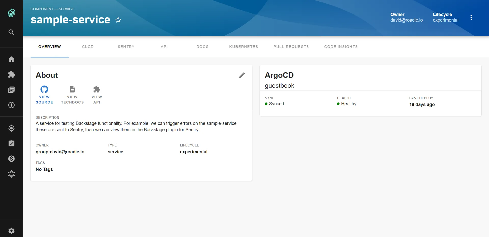

The Argo CD plugin seamlessly integrates with your entity pages to provide clear visibility into your deployment status. Here's how it appears in your Backstage instance:



The plugin displays your Argo CD application status directly in the entity overview, showing sync status, health status, and deployment timing at a glance.

### Plugin Components

The Argo CD plugin provides two main UI components that you can add to your entity pages:

#### Overview Card

The `EntityArgoCDOverviewCard` displays essential information about your Argo CD applications:
- Application name and Argo CD instance
- Sync status (synced, out-of-sync, unknown)
- Health status (healthy, degraded, progressing, etc.)
- Last sync timestamp
- Direct link to the Argo CD dashboard

#### History Card

The `EntityArgoCDHistoryCard` shows deployment history:
- Recent application revisions
- Commit information and timestamps
- Deployment status for each revision
- Quick access to view changes

You can add the history card to your entity pages like this:

```typescript
import { EntityArgoCDHistoryCard } from '@roadiehq/backstage-plugin-argo-cd';

<Grid item md={6}>
  <EntityArgoCDHistoryCard />
</Grid>
```

### Required Annotations

To connect your Backstage entities to Argo CD applications, you need to add specific annotations to your entity metadata:

#### Basic Application Mapping

For a single Argo CD application:

```yaml
metadata:
  annotations:
    argocd/app-name: my-service
```

#### Multiple Applications

To display multiple applications for one entity:

```yaml
metadata:
  annotations:
    argocd/app-selector: app1,app2,app3
```

#### Custom Namespace

If using the "Applications in any namespace" feature:

```yaml
metadata:
  annotations:
    argocd/app-name: my-service
    argocd/app-namespace: custom-namespace
```

#### Instance Selection

For multiple Argo CD instances:

```yaml
metadata:
  annotations:
    argocd/app-name: my-service
    argocd/instance-name: production-cluster
```

### Configuration Options

#### Single Argo CD Instance

For a single Argo CD instance, your `app-config.yaml` should include:

```yaml
argocd:
  username: ${ARGOCD_USERNAME}
  password: ${ARGOCD_PASSWORD}
  appLocatorMethods:
    - type: 'config'
      instances:
        - name: default
          url: https://your-argocd-instance.com
```

#### Multiple Argo CD Instances

For multiple instances across different environments:

```yaml
argocd:
  username: ${ARGOCD_USERNAME}
  password: ${ARGOCD_PASSWORD}
  appLocatorMethods:
    - type: 'config'
      instances:
        - name: development
          url: https://dev-argocd.company.com
          token: ${ARGOCD_DEV_TOKEN}
        - name: staging
          url: https://staging-argocd.company.com
          token: ${ARGOCD_STAGING_TOKEN}
        - name: production
          url: https://prod-argocd.company.com
          token: ${ARGOCD_PROD_TOKEN}
```

#### Authentication Methods

The plugin supports several authentication methods:

**Username/Password (recommended for development):**
```yaml
argocd:
  username: ${ARGOCD_USERNAME}
  password: ${ARGOCD_PASSWORD}
```

**Session Token (recommended for production):**
```yaml
argocd:
  appLocatorMethods:
    - type: 'config'
      instances:
        - name: production
          url: https://argocd.company.com
          token: ${ARGOCD_AUTH_TOKEN}
```

**Mixed Authentication:**
```yaml
argocd:
  username: ${ARGOCD_USERNAME}  # Global fallback
  password: ${ARGOCD_PASSWORD}
  appLocatorMethods:
    - type: 'config'
      instances:
        - name: production
          url: https://prod-argocd.com
          token: ${ARGOCD_PROD_TOKEN}  # Instance-specific token
        - name: development
          url: https://dev-argocd.com
          # Will use global username/password
```

### Advanced Features

#### Application Namespace Support

Enable the "Applications in any namespace" beta feature:

```yaml
argocd:
  # other config...
  namespacedApps: true
```

Then use the namespace annotation:

```yaml
metadata:
  annotations:
    argocd/app-namespace: my-namespace
```

#### Performance Optimization

For applications with many revisions, limit the number of loaded revisions:

```yaml
argocd:
  # Limit to last 10 revisions instead of loading all
  revisionsLimit: 10
```

#### Self-Signed Certificates

For Argo CD instances with self-signed certificates (not recommended for production):

```yaml
argocd:
  appLocatorMethods:
    - type: 'config'
      instances:
        - name: development
          url: https://dev-argocd.company.com
          token: ${ARGOCD_DEV_TOKEN}
          # Only for development environments
          skipTLSVerify: true
```

### Troubleshooting

#### Common Issues

**Plugin not showing:** Verify that your entity has the correct annotations and that the `isArgocdAvailable` function returns true.

**Authentication errors:** Check that your environment variables are properly set and that the Argo CD user has sufficient permissions.

**Performance issues:** If you have applications with many revisions, consider setting a `revisionsLimit` to improve loading times.

**Multiple instances not working:** Ensure each instance has a unique name and that instance-specific annotations match the configured instance names.

#### Required Permissions

Your Argo CD user needs the following permissions:
- Read access to applications
- Read access to application logs (for detailed views)
- List access to repositories (for commit information)

Example RBAC policy for Argo CD:

```yaml
policy.csv: |
  p, role:backstage, applications, get, */*, allow
  p, role:backstage, applications, list, */*, allow
  p, role:backstage, logs, get, */*, allow
  g, backstage-user, role:backstage
```

### References

 - [Argo CD Backstage Plugin frontend](https://github.com/RoadieHQ/roadie-backstage-plugins/tree/main/plugins/frontend/backstage-plugin-argo-cd)
 - [Argo CD Backstage Plugin backend](https://github.com/RoadieHQ/roadie-backstage-plugins/tree/main/plugins/backend/backstage-plugin-argo-cd-backend)
