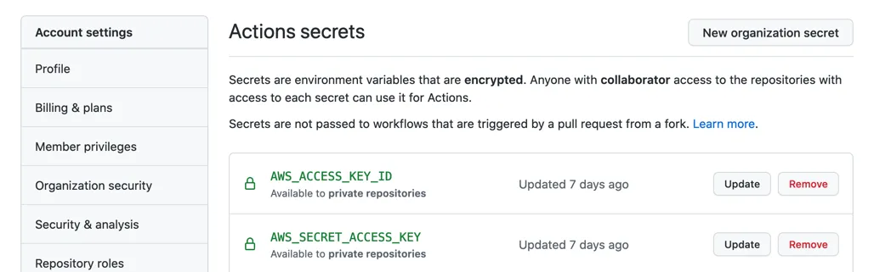
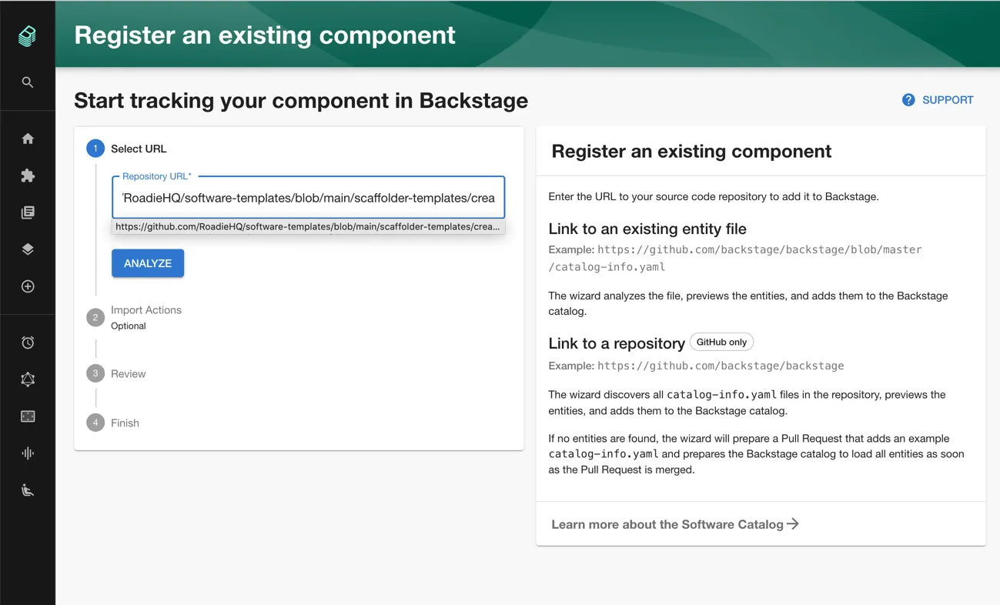

### Getting Started

The template can be found here https://github.com/roadie-demo/scaffolder-examples/blob/main/create-aws-serverless-backend/template.yaml

To Use the template
  1. Create the following secrets in your GitHub Organizations secrets AWS_ACCESS_KEY_ID and AWS_SECRET_ACCESS_KEY 
    
  2. Load the template into Backstage. 
    
  3. Run the template by clicking choose on the Create Component Page 
