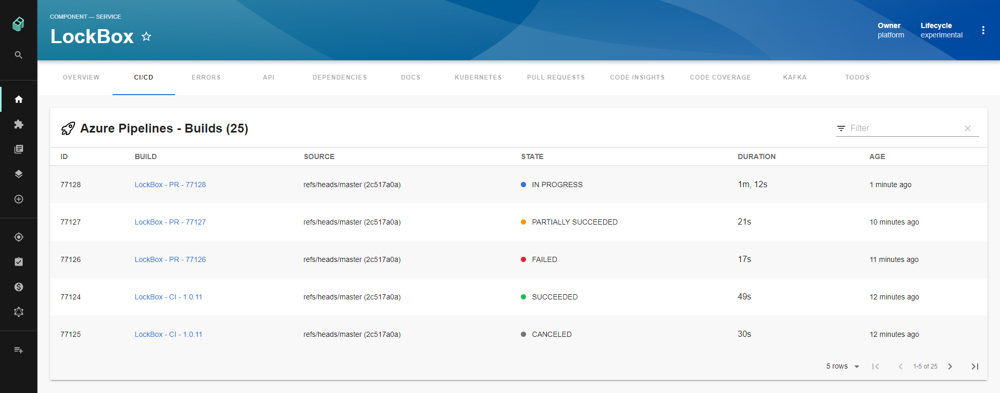
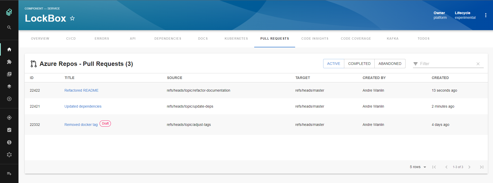

## Features

### Azure Pipelines

Lists the top _n_ builds for a given Azure Repo where _n_ is a configurable value



### Azure Repos

Lists the top _n_ Active, Completed, or Abandoned Pull Requests for a given repository where _n_ is a configurable value



## Setup

The following sections will help you get the Azure DevOps plugin setup and running

### Azure DevOps Backend

#### Configuration

The Azure DevOps plugin requires the following YAML to be added to your app-config.yaml:

```yaml
azureDevOps:
  host: dev.azure.com
  token: ${AZURE_TOKEN}
  organization: my-company
```

Configuration Details:

- `host` and `token` can be the same as the ones used for the `integration` section
- `AZURE_TOKEN` environment variable must be set to a [Personal Access Token](https://docs.microsoft.com/en-us/azure/devops/organizations/accounts/use-personal-access-tokens-to-authenticate?view=azure-devops&tabs=preview-page) with read access to both Code and Build
- `organization` is your Azure DevOps Services (cloud) Organization name or for Azure DevOps Server (on-premise) this will be your Collection name

#### Up and Running

Here's how to get the backend up and running:

1. First we need to add the `@backstage/plugin-azure-devops-backend` package to your backend:

   ```sh
   # From the Backstage root directory
   cd packages/backend
   yarn add @backstage/plugin-azure-devops-backend
   ```

2. Then we will create a new file named `packages/backend/src/plugins/azure-devops.ts`, and add the
   following to it:

   ```ts
   import { createRouter } from '@backstage/plugin-azure-devops-backend';
   import { Router } from 'express';
   import type { PluginEnvironment } from '../types';

   export default function createPlugin(
     env: PluginEnvironment,
   ): Promise<Router> {
     return createRouter({
       logger: env.logger,
       config: env.config,
     });
   }
   ```

3. Next we wire this into the overall backend router, edit `packages/backend/src/index.ts`:

   ```ts
   import azureDevOps from './plugins/azure-devops';
   // ...
   async function main() {
     // ...
     const azureDevOpsEnv = useHotMemoize(module, () => createEnv('azure-devops'));
     apiRouter.use('/azure-devops', await azureDevOps(azureDevOpsEnv));
   ```

4. Now run `yarn start-backend` from the repo root
5. Finally open `http://localhost:7007/api/azure-devops/health` in a browser and it should return `{"status":"ok"}`

### Entity Annotation

To be able to use the Azure DevOps plugin you need to add the following annotation to any entities you want to use it with:

```yaml
dev.azure.com/project-repo: <project-name>/<repo-name>
```

Let's break this down a little: `<project-name>` will be the name of your Team Project and `<repo-name>` will be the name of your repository which needs to be part of the Team Project you entered for `<project-name>`.

Here's what that will look like in action:

```yaml
# Example catalog-info.yaml entity definition file
apiVersion: backstage.io/v1alpha1
kind: Component
metadata:
  # ...
  annotations:
    dev.azure.com/project-repo: my-project/my-repo
spec:
  type: service
  # ...
```

#### Azure Pipelines Only

If you are only using Azure Pipelines along with a different SCM tool then you can use the following two annotations to see Builds:

```yaml
dev.azure.com/project: <project-name>
dev.azure.com/build-definition: <build-definition-name>
```

In this case `<project-name>` will be the name of your Team Project and `<build-definition-name>` will be the name of the Build Definition you would like to see Builds for. If the Build Definition name has spaces in it make sure to put quotes around it

### Azure Pipelines Component

To get the Azure Pipelines component working you'll need to do the following two steps:

1. First we need to add the @backstage/plugin-azure-devops package to your frontend app:

   ```bash
   # From your Backstage root directory
   yarn add --cwd packages/app @backstage/plugin-azure-devops
   ```

2. Second we need to add the `EntityAzurePipelinesContent` extension to the entity page in your app. How to do this will depend on which annotation you are using in your entities:

    1. If you are using the `dev.azure.com/project-repo` annotation then you'll want to do the following:

       ```tsx
       // In packages/app/src/components/catalog/EntityPage.tsx
       import {
         EntityAzurePipelinesContent,
         isAzureDevOpsAvailable,
       } from '@backstage/plugin-azure-devops';
 
       // For example in the CI/CD section
       const cicdContent = (
         <EntitySwitch>
           // ...
           <EntitySwitch.Case if={isAzureDevOpsAvailable}>
               <EntityAzurePipelinesContent defaultLimit={25} />
           </EntitySwitch.Case>
           // ...
         </EntitySwitch>
       ```

    2. If you are using the `dev.azure.com/project` and `dev.azure.com/build-definition` annotations then you'll want to do this:

       ```tsx
       // In packages/app/src/components/catalog/EntityPage.tsx
       import {
         EntityAzurePipelinesContent,
         isAzurePipelinesAvailable,
       } from '@backstage/plugin-azure-devops';
 
       // For example in the CI/CD section
       const cicdContent = (
         <EntitySwitch>
           // ...
           <EntitySwitch.Case if={isAzurePipelinesAvailable}>
             <EntityAzurePipelinesContent defaultLimit={25} />
           </EntitySwitch.Case>
           // ...
         </EntitySwitch>
       ```

**Notes:**

- The `if` prop is optional on the `EntitySwitch.Case`, you can remove it if you always want to see the tab even if the entity being viewed does not have the needed annotation
- The `defaultLimit` property on the `EntityAzurePipelinesContent` will set the max number of Builds you would like to see, if not set this will default to 10

### Azure Repos Component

To get the Azure Repos component working you'll need to do the following two steps:

1. First we need to add the @backstage/plugin-azure-devops package to your frontend app:

   ```bash
   # From your Backstage root directory
   yarn add --cwd packages/app @backstage/plugin-azure-devops
   ```

2. Second we need to add the `EntityAzurePullRequestsContent` extension to the entity page in your app:

   ```tsx
   // In packages/app/src/components/catalog/EntityPage.tsx
   import {
     EntityAzurePullRequestsContent,
     isAzureDevOpsAvailable,
   } from '@backstage/plugin-azure-devops';

   // For example in the Service section
   const serviceEntityPage = (
     <EntityLayout>
       // ...
       <EntityLayout.Route if={isAzureDevOpsAvailable} path="/pull-requests" title="Pull Requests">
         <EntityAzurePullRequestsContent defaultLimit={25} />
       </EntityLayout.Route>
       // ...
     </EntityLayout>
   ```

**Notes:**

- You'll need to add the `EntityLayout.Route` above from step 2 to all the entity sections you want to see Pull Requests in. For example if you wanted to see Pull Requests when looking at Website entities then you would need to add this to the `websiteEntityPage` section.
- The `if` prop is optional on the `EntityLayout.Route`, you can remove it if you always want to see the tab even if the entity being viewed does not have the needed annotation
- The `defaultLimit` property on the `EntityAzurePullRequestsContent` will set the max number of Pull Requests you would like to see, if not set this will default to 10

## Limitations

- Currently multiple organizations are not supported
- Mixing Azure DevOps Services (cloud) and Azure DevOps Server (on-premise) is not supported