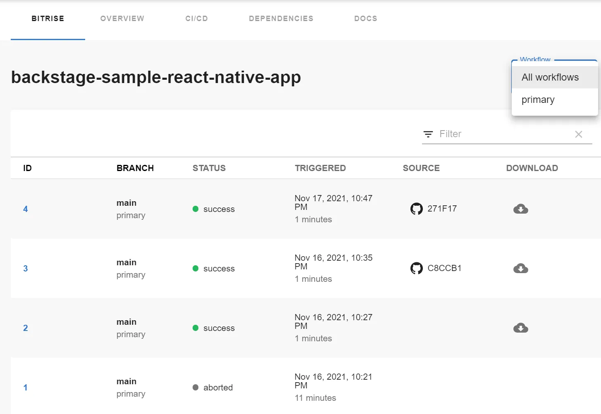
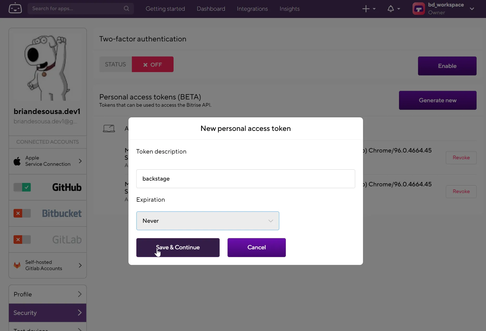

Bitrise is a CI/CD tool that focuses primarily on building and deploying mobile apps. Once a Backstage component is linked to a Bitrise app via the component's catalog-info.yaml, a summary of Bitrise builds are visible on the component's page in Backstage.

Not only can you see a summary of your builds, but you can also:

* view builds for each of your Bitrise workflows if you have multiple workflows defined for your app
* link to the build in Bitrise
* link to the commit in the underlying source control system (ex. GitHub) that triggered the build
* download artifacts produced by the build right from Backstage

Similar to other Backstage plugins, the Bitrise tab can be added to multiple entity types on the entity page.

## Connecting to the Bitrise API

The plugin connects to the Bitrise API using a personal token. The token can be generated from your Bitrise profile:

See [Authenticating with the Bitrise API](https://devcenter.bitrise.io/en/api/authenticating-with-the-bitrise-api.html) for more information.

Once you have generated a personal access token, the token can be defined in an environment variable and referenced from app-config.yaml.
