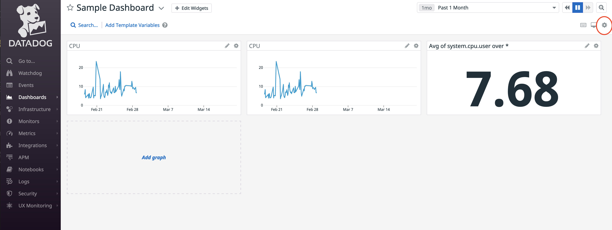
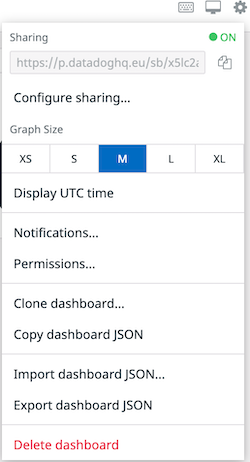
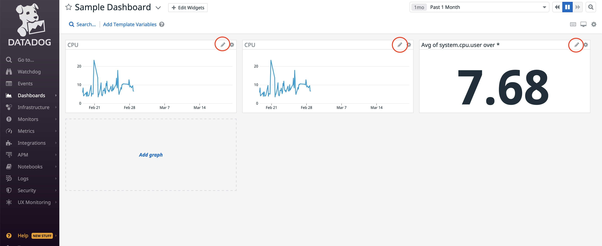

## How to embed a datadog dashboard in Backstage

### Obtain the dashboard URL from Datadog that you will need for your metadata. 

* Login to your Datadog account.

### Get the dashboard URL.

* Navigate to the dashboards list by hovering over dashboards on the page's left-hand side and selecting the dashboard list.

* Select a dashboard from this list.

* Within the dashboard you have chosen, click the settings cog on the screen's right-hand side, circled in red.




* Copy the URL from the Sharing textbox.

* This URL is the value you need for the `datadoghq.com/dashboard-url` annotation.




### Adding the annotations and the values from Datadog to your component's metadata file.

```yaml
apiVersion: backstage.io/v1alpha1
kind: Component
metadata:
  name: sample-service
  description: |
    A sample service
  annotations:
    datadoghq.com/dashboard-url: <<DATADOGURL>>
```

## How to embed a datadog graph in Backstage

* Login to your Datadog account.

### Get the graph token.

* Click on the graph pencil, circled in red, from your dashboard.



* Click on the Share tab, choose a timeframe, graph size and legend. Click generate the embedded code. 

* Copy the token value that is highlighted in the red square.

* this token is the value you need for the `datadoghq.com/graph-token` annotation


### Adding the annotations and the values from Datadog to your component's metadata file.

```yaml
apiVersion: backstage.io/v1alpha1
kind: Component
metadata:
  name: sample-service
  description: |
    A sample service
  annotations:
    datadoghq.com/graph-token: <<TOKEN>
```

## Security

A word of note regarding the security of the datadog dashboards and graphs.

The instructions provided for sharing dashboards and graphs generate a URL.

This URL is public to anyone who bears it.

If obtained by another actor, it is usable by them.

