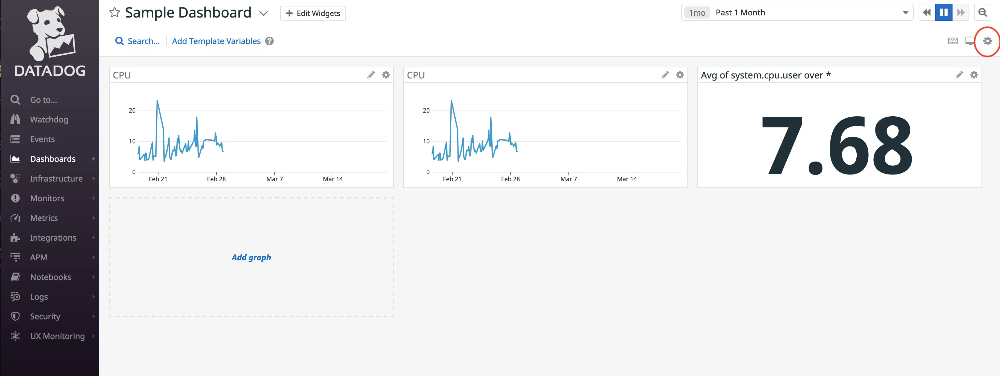
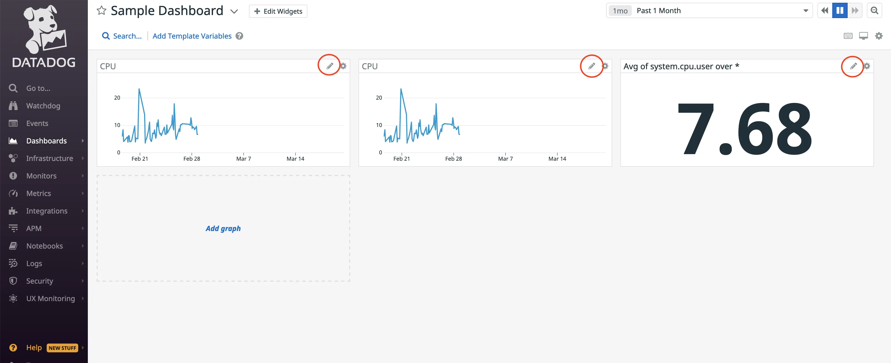
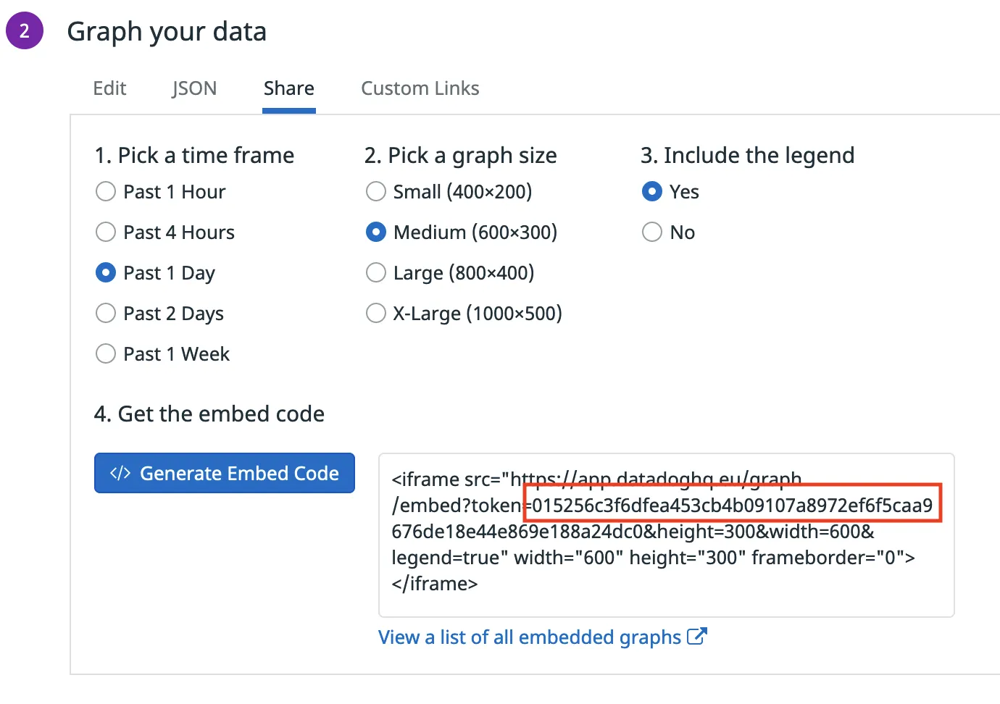

## Specify datadog domain

Datadog embedded graph is using datadoghq.eu as default top-level domain, when other is not specified. If you are using other domain, you must specify it with corresponding annotations datadoghq.com/site.

### Adding the annotations and the values from Datadog to your component's metadata file.

```yaml
apiVersion: backstage.io/v1alpha1
kind: Component
metadata:
  name: sample-service
  description: |
    A sample service
  annotations:
    datadoghq.com/site: datadoghq.com
```

## How to embed a datadog dashboard in Backstage

### Obtain the dashboard URL from Datadog that you will need for your metadata. 

* Login to your Datadog account.

### Get the dashboard URL.

* Navigate to the dashboards list by hovering over dashboards on the page's left-hand side and selecting the dashboard list.

* Select a dashboard from this list.

* Within the dashboard you have chosen, click the settings cog on the screen's right-hand side, circled in red.



* Copy the URL from the Sharing textbox.

* This URL is the value you need for the `datadoghq.com/dashboard-url` annotation.


### Adding the annotations and the values from Datadog to your component's metadata file.

```yaml
apiVersion: backstage.io/v1alpha1
kind: Component
metadata:
  name: sample-service
  description: |
    A sample service
  annotations:
    datadoghq.com/dashboard-url: <<DATADOGURL>>
```

## How to embed a datadog graph in Backstage

* Login to your Datadog account.

### Get the graph token.

* Click on the graph pencil, circled in red, from your dashboard.



* Click on the Share tab, choose a timeframe, graph size and legend. Click generate the embedded code. 

* Copy the token value that is highlighted in the red square.

* this token is the value you need for the `datadoghq.com/graph-token` annotation



### Customize graph size.

In order to customize size of the graph you may specify datadoghq.com/graph-size annotations and specify one of the following options:

* 'small'

* 'medium'

* 'large'

* 'x-large';

If not specified, your graph will be 'medium' size per default.

### Adding the annotations and the values from Datadog to your component's metadata file.

```yaml
apiVersion: backstage.io/v1alpha1
kind: Component
metadata:
  name: sample-service
  description: |
    A sample service
  annotations:
    datadoghq.com/graph-token: <<TOKEN>
```


## Set frame-src in Content Security Policy

```
// app-config.yaml
backend:
  csp:
    frame-src: 
      # Allow your Datadog URL for @roadiehq/backstage-plugin-datadog
      - 'DATADOG_SOURCE'
      - 'DATADOG_DASHBOARD_SOURCE'
```

## Security

Sharing Datadog dashboards and graphs makes them public on the internet and accessible by anyone with the URL. 

Make sure you do not share these URLs with untrusted actors.
