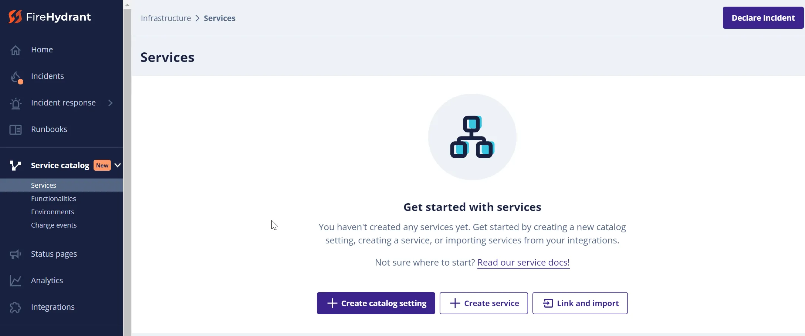
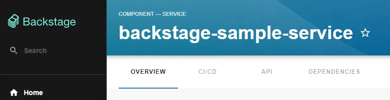
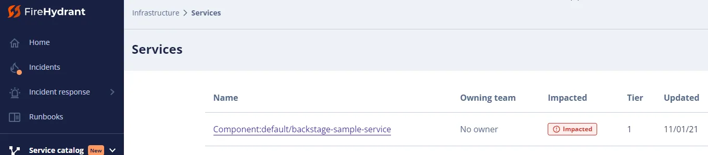
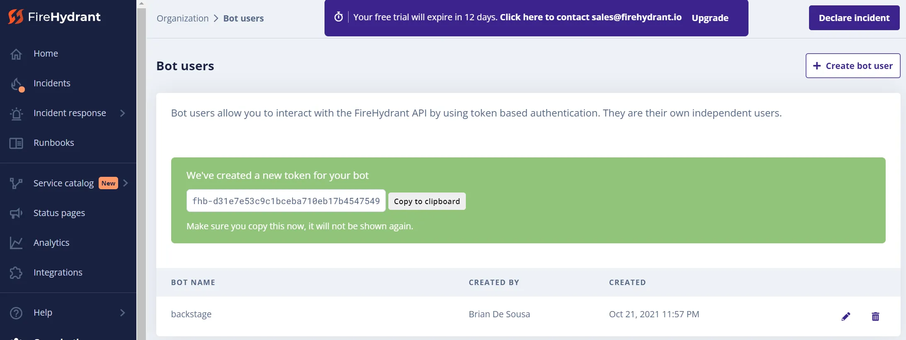

FireHydrant.io is an incident management tool with a variety of reliability management features including its own service catalog. Backstage components can be added to the FireHydrant service catalog.

Typically, Backstage components are linked to external services like FireHydrant.io by adding annotations to the component's `catalog-info.yaml`. The FireHydrant plugin does not require an annotation. Instead, the Backstage component is added to the FireHydrant.io service catalog following a very specific naming convention: `component-type:namespace/component-name`.

For example, a component of type `Component`, in the `default` namespace, named `backstage-sample-service` would need to be added to the FireHydrant.io service catalog as `Component:default/backstage-sample-service`. Here is what that component would loook like in the Backstage catalog:

And here is what the Matching component would look like in the FireHydrant.io service catalog:

## Obtaining a FireHydrant Authorization Token

Backstage needs an authorization token to authenticate to the FireHydrant.io API. This token is obtained by created a new bot configuration on FireHydrant.io:

Add the authorization token directly to `app-config.yaml` or refer to it from an environment variable.
