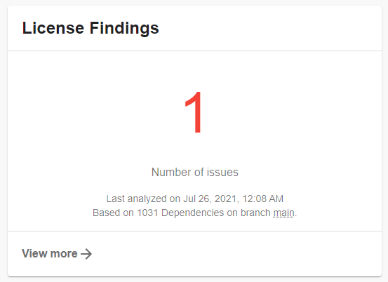
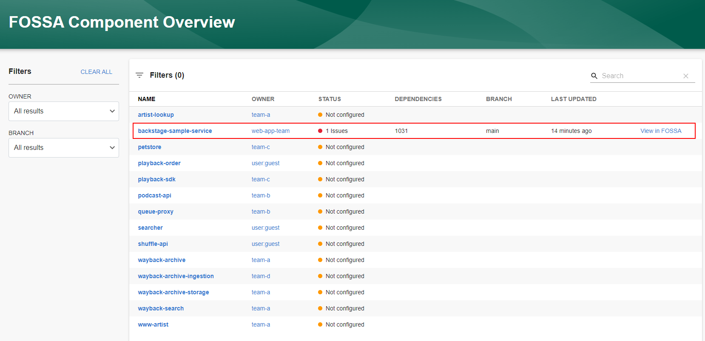
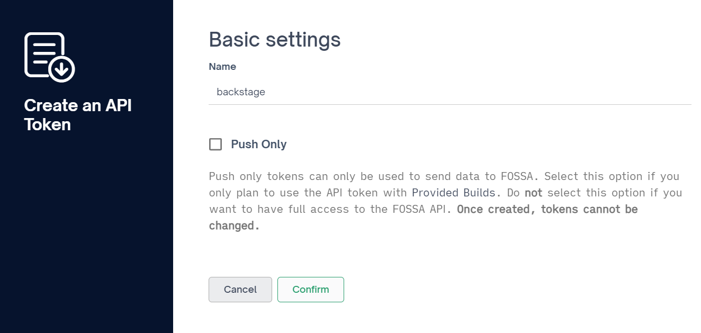
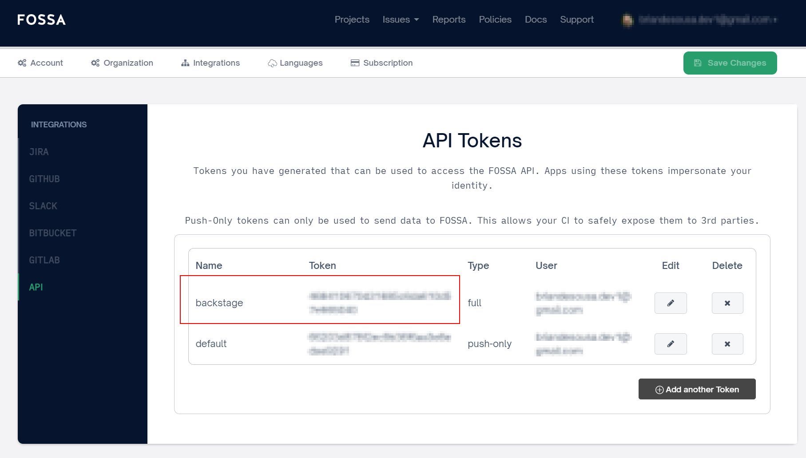

The FOSSA plugin is a frontend plugin that summarizes license findings for components in Backstage. The plugin includes a card component for individual components:



It also includes a page component that displays a summary of findings for all components in Backstage:



Both components include direct links to findings on the FOSSA website.

### Creating a FOSSA API key

A FOSSA API key is required in order for Backstage to connect to the FOSSA API and pull license findings. FOSSA API keys are associated with a specific FOSSA user account.

To create a FOSSA API key:

1. Open [app.fossa.com/account/settings](https://app.fossa.com/account/settings).
1. Navigate to Integrations > API
1. Add a new token. Do not select the "Push Only" option.

    

1. Copy the token value from the API Tokens page and save it to `FOSSA_API_TOKEN` environment variable.

    

### Specifying a FOSSA organization ID

You can optionally provide a FOSSA organization ID in the `app-config.yaml`:

```yaml
fossa:
  organizationId: <your-fossa-organization-id>
```

Organization ID is optional and not currently required by the functionality included with this plugin. FOSSA findings are retrieved using the `fossa.io/project-name` (FOSSA project title) in the component's `catalog-info.yml`. If an organization ID is provided, it is added as an additional filter on the FOSSA API request to retrieve project details but ultimately will not affect the response.