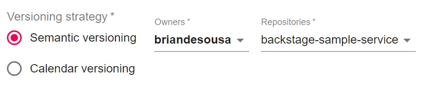
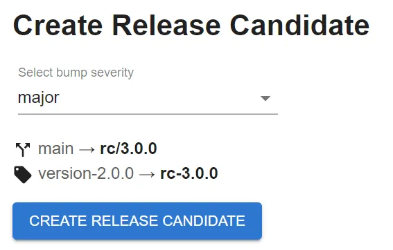
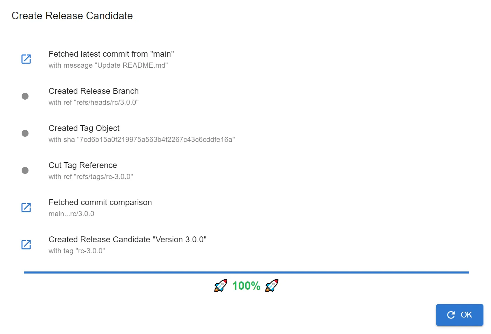
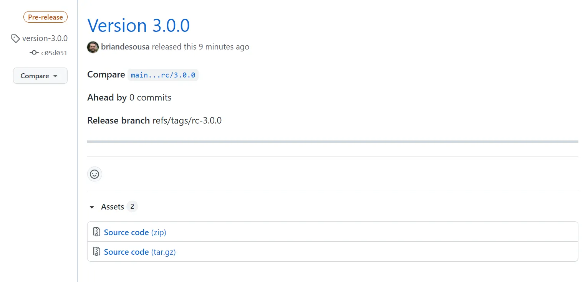
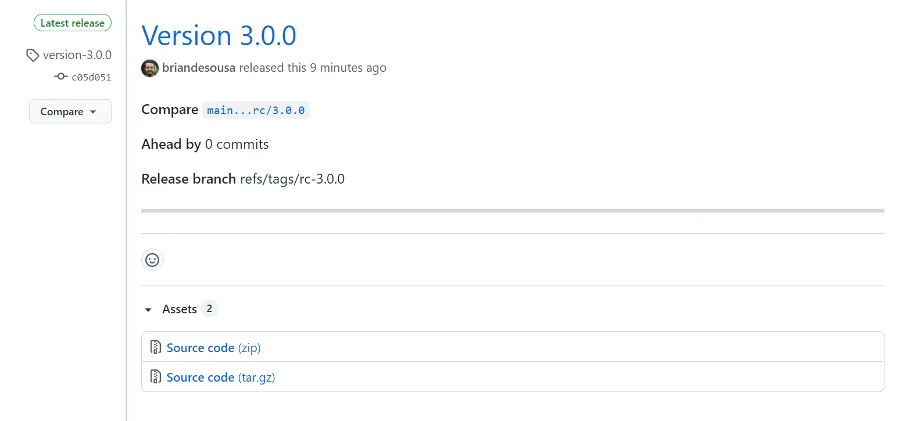
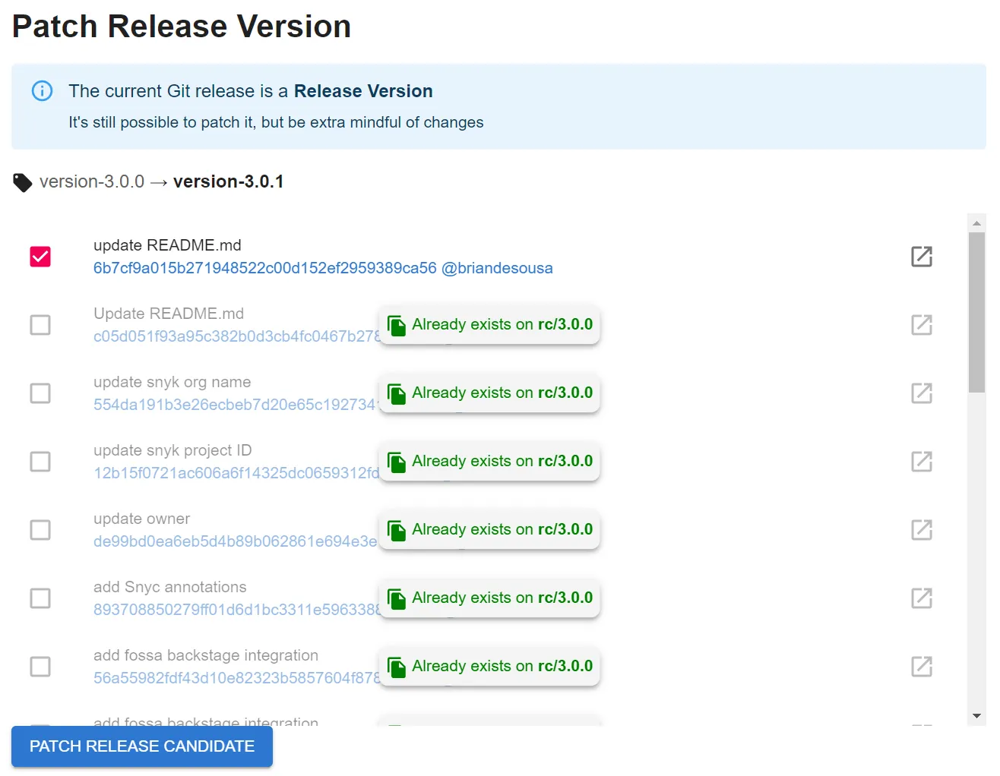
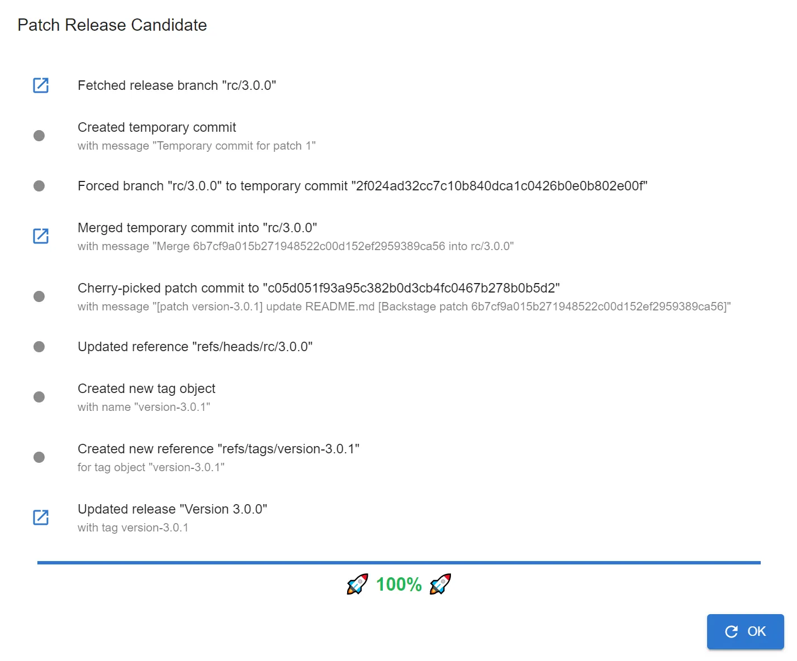
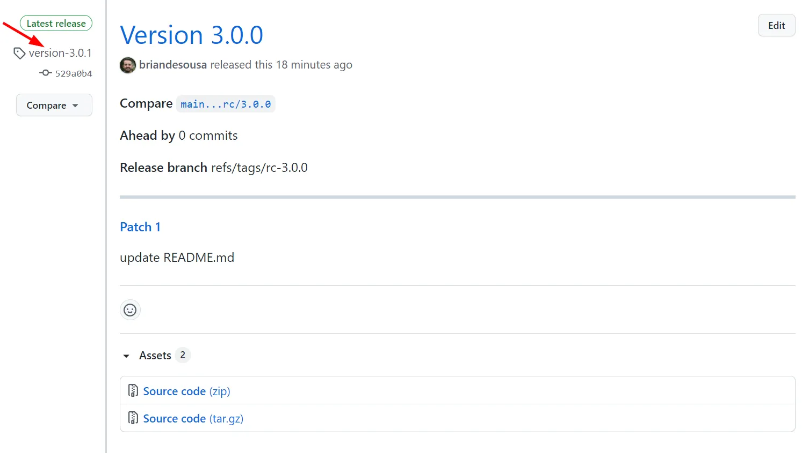
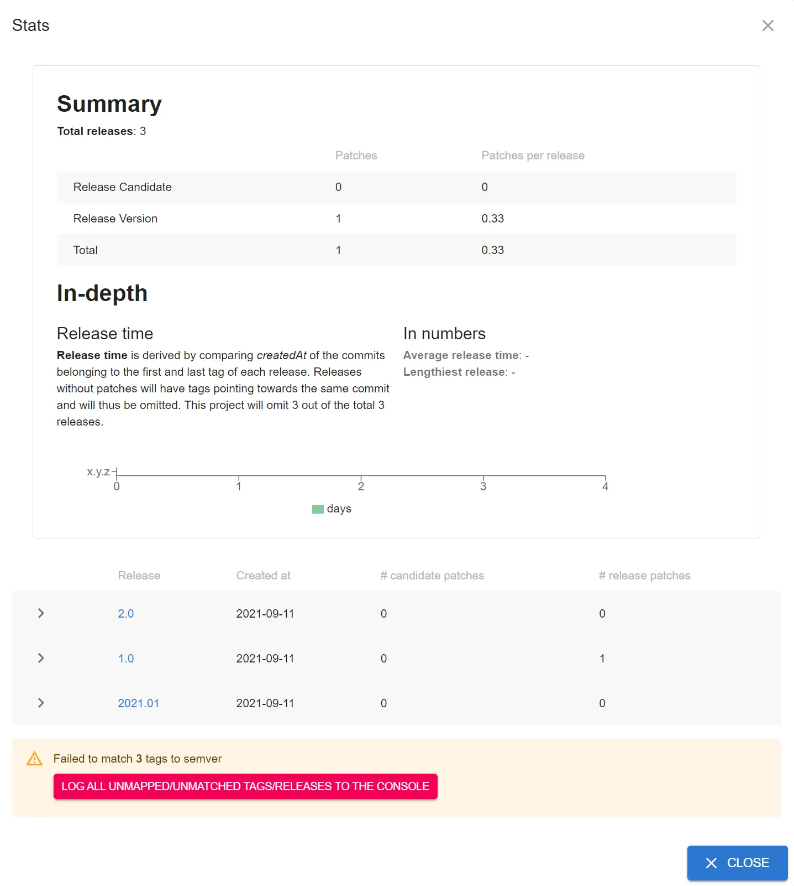

The Git Release Manager plugin is a full page component that can be used to automate the release process for one or more Git repositories hosted on GitHub.

On initial page load, you are prompted to select a versioning strategy, personal or organization account and repository to manage. You can manage releases for your personal Git repositories as well as any repositories owned by organizations for which you are a member and have access.



Once a repository is selected, it is scanned for tags that meet the selected versioning strategy's [naming conventions](#git-tag-naming-convention-requirements). There are 3 features available to help manage the release process:

1. Create a release candidate from an existing Git tag. A new Git branch and tag is created for the release candidate:

    

    

    

    A GitHub release is also created with the pre-release flag enabled:

    

2. Promote a release candidate to a release. A new Git tag is created for the release:

    

    

    The pre-release flag on the GitHub release is also removed:

    

3. Patch a release or release candidate. This feature allows you to create a new patch release by selecting one or more commits that are not present on the latest release version. Selected commits are cherry-picked onto the release branch and then a new Git tag is created for the patch release:

    

    

    The GitHub release is updated as well:

    

<br/>

There is also a helpful **Stats** view that displays a summary of your releases:



## Git Tag Naming Convention Requirements

In order to effectively use this plugin to manage your releases, you will need to follow a specific set of naming conventions. These conventions are documented right on Git Release Manager page itself. In summary:

* If using the *Semantic versioning* strategy, your repository must have Git tags that match the `version-1.0.0` (starting point for release candidates) and `rc-1.0.0` (starting point for release versions) naming conventions. The plugin will only allow you to create a release candidate from tags that follow these conventions.
* If using the *Calendar versioning* strategy, your repository must have Git tags that match the `version-2021.01.30_1` (starting point for release candidates) or `rc-2021.01.30_1` (starting point for release versions) naming conventions. This strategy expects release names to contain a date and incremental build number.

## Customization

The `GitReleaseManagerPage` component can be customized by setting the component's optional props.

You can pre-select the versioning strategy, owner and repository. This will prefill all inputs and make them read-only. This might be useful if you want to expose repository-specific release manager endpoints. Keep in mind that users must have access to the Git repository otherwise they will be presented with a permission error.

```javascript
<GitReleaseManagerPage
  project={{
    owner: 'briandesousa',
    repo: 'backstage-sample-service',
    versioningStrategy: 'semver',
  }}
/>
```
<br/>


<br/>

You can selectively hide sections of the Git Release Manager page:

```javascript
<GitReleaseManagerPage
  features={{
    createRc: {
      omit: true
    },
    promoteRc: {
      omit: true
    },
    patch: {
      omit: true
    }
  }} 
/>
```
<br />

You can build custom behaviors that are triggered after a release candidate, version or patch is created:

```javascript
<GitReleaseManagerPage
  features={{
    createRc: {
      onSuccess: args => console.log('Release candidate created successfully, args: ' + JSON.stringify(args, null, 2))
    },
    promoteRc: {
      onSuccess: args => console.log('Release candidate promoted successfully, args: ' + JSON.stringify(args, null, 2))
    },
    patch: {
      onSuccess: args => console.log('Release patched successfully, args: ' + JSON.stringify(args, null, 2))
    }
  }} 
/>
```
<br/>

You can add your own custom content to the Git Release Manager page too. Use the `args` object to access data about your release.

```javascript
<GitReleaseManagerPage
  features={{
    custom: {
      factory: args => {
        return (
          <Box style={{padding: '20px'}}>
            <Typography variant="h4">Release instructions</Typography>
            <p>Don't forget to do this when releasing this component...</p>
          </Box>
        )
      }
    }
  }}
/>
```

<br/>


