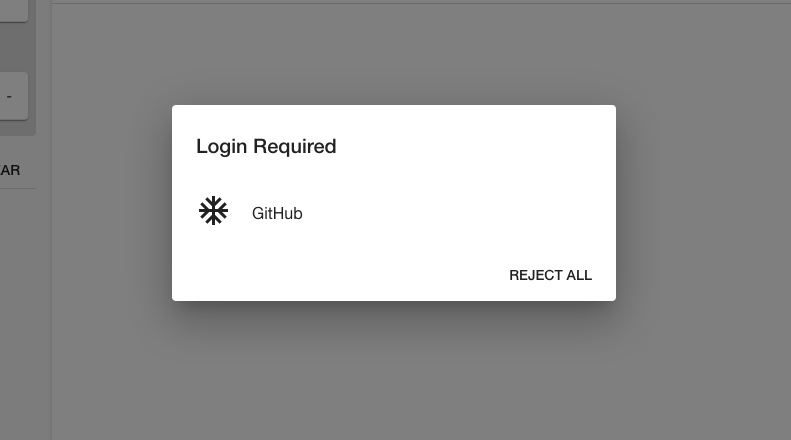

### Authentication

The GitHub actions plugin makes requests to the GitHub API directly from your browser. It
will authenticate as your GitHub user via OAuth. You may see this pop-up periodically
as you browse around Backstage. You must log in via OAuth before GitHub actions can work.



### Multiple CI systems setup

Use the switch pattern to work with multiple CI systems simultaneously in Backstage.

```typescript
// packages/app/src/components/catalog/EntityPage.tsx
import {
  EntityRecentGithubActionsRunsCard,
  isGithubActionsAvailable,
} from '@backstage/plugin-github-actions';

const cicdCard = (
  <EntitySwitch>
    <EntitySwitch.Case if={isGithubActionsAvailable}>
      <Grid item sm={6}>
        <EntityRecentGithubActionsRunsCard limit={4} variant="gridItem" />
      </Grid>
    </EntitySwitch.Case>
  </EntitySwitch>
);

const overviewContent = (
  <Grid container spacing={3} alignItems="stretch">
    ...

    {cicdCard}
  </Grid>
);

```
