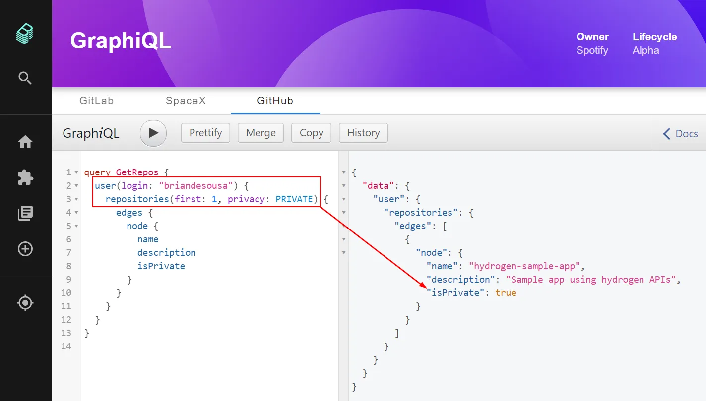

### Adding multiple GraphQL APIs

Multiple APIs can be connected to the GraphiQL page. Each `GraphQLEndpoint` added to the API factory in `apis.ts` is rendered as a seperate tab. For example, let's add a second API:

```typescript
  createApiFactory({
    api: graphQlBrowseApiRef,
    deps: { },
    factory: () =>
      GraphQLEndpoints.from([
        GraphQLEndpoints.create({
          id: 'gitlab',
          title: 'GitLab',
          url: 'https://gitlab.com/api/graphql',
          headers: { 'Some-Key': 'Some-Value' }
        }),
        // add a second API endpoint...
        {
          id: 'spacex',
          title: 'SpaceX',
          fetcher: async (params: any) => {
            return fetch('https://api.spacex.land/graphql/', {
              method: 'POST',
              headers: { 'Content-Type': 'application/json' },
              body: JSON.stringify(params)
            }).then(res => res.json());
          }
        }
      ])
  })
```

Rather than using the `GraphQLEndpoints.create` function to create the `GraphQLEndpoint`, we creating an an object with a custom `fetcher` fucntion. This approach allows for more control over constructing the HTTP request to the API. This may be necessary in special cases where the GraphQL endpoint as unique requirements.

The end result is the same though, a new tab for the 'SpaceX' API:


### Connecting to an authenticated API with GitHub authentication

A special `github` function is available on the `GraphQLEndpoints` class. This function allows you to connect to a GitHub-authenticated GraphQL endpoint using the built-in GitHub auth provider. This assumes that you are using the GitHub auth provider in your Backstage implementation.

Adding a GitHub-authenticated API is quite simple. For example, this is how you would setup a connection to the official GitHub GraphQL API:

```typescript
import {
  AnyApiFactory,
  createApiFactory,
  errorApiRef,
  githubAuthApiRef
} from '@backstage/core';
import {
  graphQlBrowseApiRef,
  GraphQLEndpoints
} from '@backstage/plugin-graphiql'

export const apis: AnyApiFactory[] = [
  createApiFactory({
    api: graphQlBrowseApiRef,
    deps: { errorApi: errorApiRef, githubAuthApi: githubAuthApiRef },
    factory: ({ errorApi, githubAuthApi }) =>
        GraphQLEndpoints.github({
          id: 'github',
          title: 'GitHub',
          url: 'https://api.github.com/graphql',
          errorApi: errorApi,
          githubAuthApi: githubAuthApi
        })
      ])
  })
];
```

The current user logged into Backstage can now access information that is only available to authenticated GitHub users. For example, the user could query for their private repositories:



The `github` function even attempts to request additional API scopes if the current user's authentication token doesn't have the scopes required to execute the GraphQL query or mutation.


