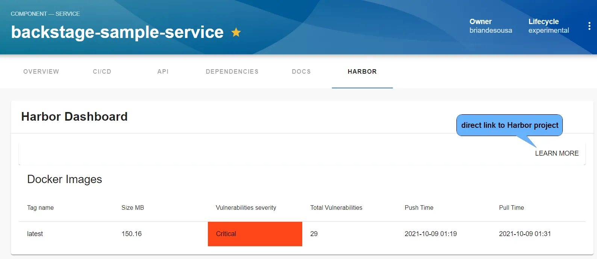
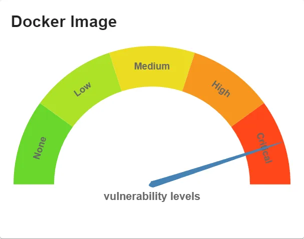
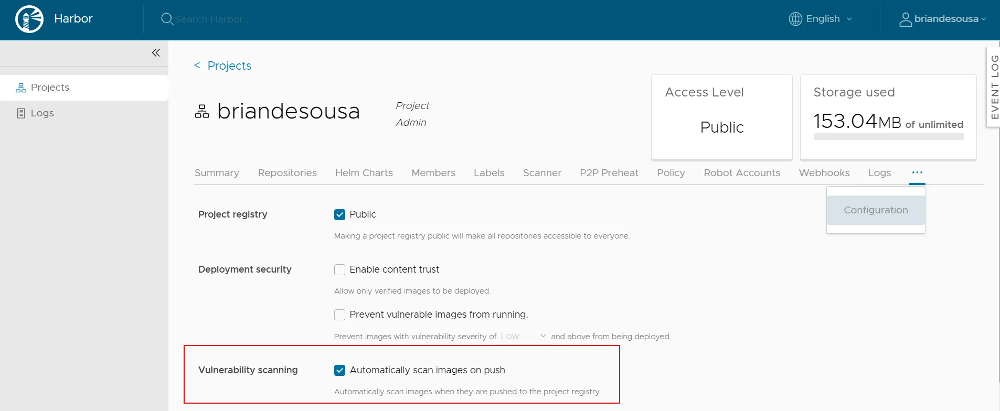

Harbor is an open source registry for Docker images that can be installed on your own infrastructure. It includes many common image registry capabilities including image vulnerability scanning.

The Harbor plugin displays information about Docker images stored in your Harbor registry. Backstage catalog components can be associated to a Harbor repository. The Harbor Dashboard appears as a new tab on the catalog entity page:



A Harbor widget is also available to display a summary of vulnerabilities in your component's Docker image. This widget can be added to any tab on the entity page:



The plugin will only display information about images in Harbor if a vulnerability scan has been run on the image. You can enable automatic scanning on image push in Harbor project settings:



## Authentication

The plugin connects to Harbor with a username and password that is stored in `app-config.yaml`. Credentials can be defined directly in the YAML  file or passed in via environment variables like this:

```yaml
      harbor:
        baseUrl: https://demo.goharbor.io
        username: 
          $env: HARBOR_USERNAME
        password:
          $env: HARBOR_PASSWORD
```

Consider creating a dedicated Harbor user for the connection from Backstage.

## Don't have Harbor setup yet?

A demo of Harbor is available at [demo.goharbor.io](https://demo.goharbor.io). The demo allows you to create an account and push images. All accounts and images are automatically purged on a regular basis. This is a great and easy way to experiement with Harbor in Backstage.

See [Conditions of Use of the Demo Server](https://goharbor.io/docs/master/install-config/demo-server/) on Harbor's website for more information.
