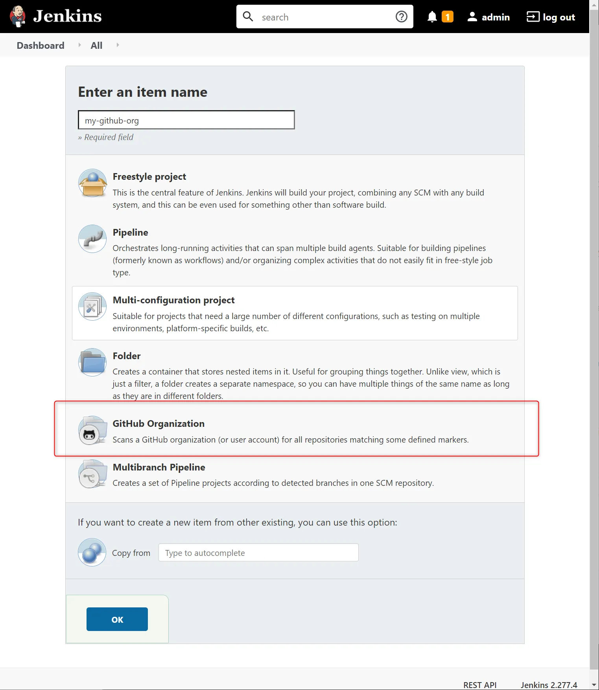
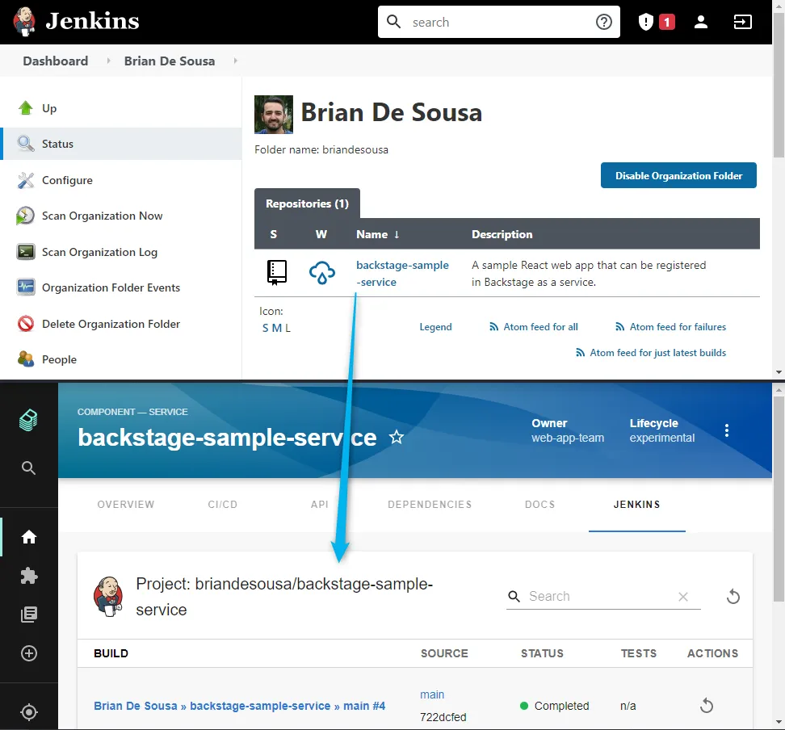

Your Backstage app's backend connects to your Jenkins server using the Jenkins API. A Jenkins API token is required. This token can be obtained from a system environment variable (ex. JENKINS_BASIC_AUTH_HEADER) containing a base64 encoded string.

1. Access the settings page of the Jenkins user for which you want to create an API token. For example, for a user named "admin" on a local Jenkins server: [http://localhost:8080/user/admin/](http://localhost:8080/user/admin/).
2. Add a new token under the 'API Token' section. Copy the token before leaving the page.
3. Construct a base64 encoded basic authorization string using your Jenkins user's name and the API token. For example, in a Bash shell:

    ```
    echo -n admin:1147f3bd451f3c48b8f21fd3aba13e58eb | base64
    ``` 

4. Save the base64 encoded string to an environment variable named `JENKINS_BASIC_AUTH_HEADER`. This variable can be used in the Jenkins proxy configuration in your Backstage app's `app-config.yaml`.


### Setting up a local Jenkins environment

If you want to try out this plugin but you don't have a Jenkins server to test it with, you can quickly setup a local Jenkins server with docker. See the instructions available in the [official Jenkins Docker GitHub repo](https://github.com/jenkinsci/docker/blob/master/README.md).


### Supported types of Jenkins projects

The  plugin can pull build information from a GitHub Organization project in Jenkins. Other Jenkins project types like Freestyle project and Pipeline are not supported yet.



The plugin shows a list of the most recent builds in Backstage. This list includes builds from all projects that are available in the GitHub Organization project in Jenkins.



View additional build information by selecting a build from the list.


