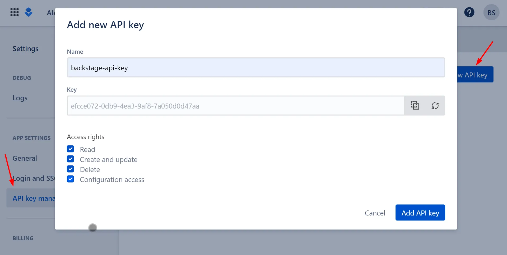
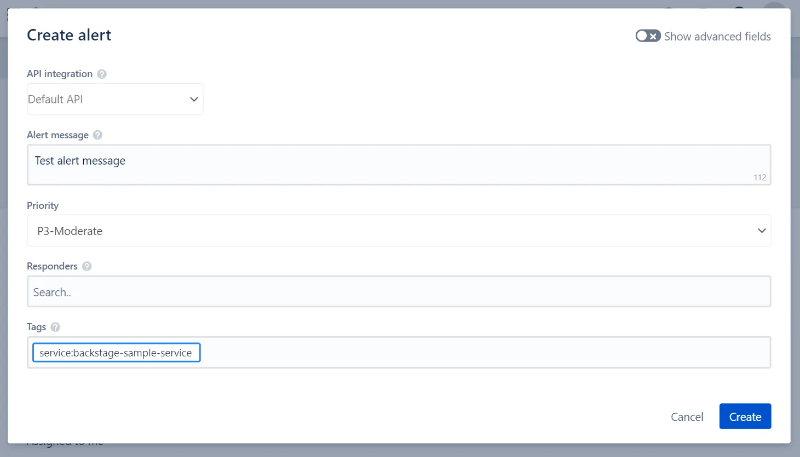
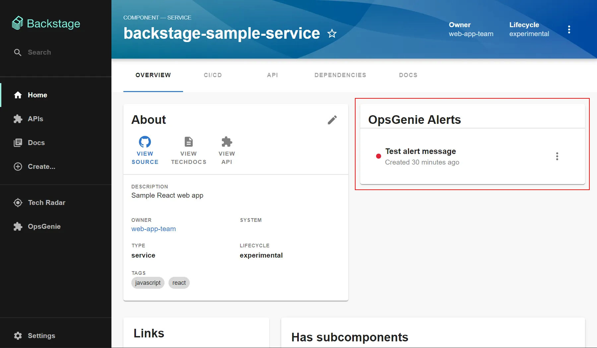

The OpsGenie plugin is a frontend plugin that displays OpsGenie alerts, incidents and on-call information in Backstage. The plugin includes two components that can be integrated into Backstage:

1. The **OpsGeniePage** routable extension component which produces a standalone page with the following capabilities:
    * view a summary of who is currently on call
    * view and search a list of active alerts with the option of acknowledging or closing alerts directly from Backstage
    * view and search a list of incidents
2. The **EntityOpsgenieAlertsCard** component which can display recent alerts for a specific component.

### Creating an OpsGenie API key

An OpsGenie API key with full access rights is required for the plugin to connect to your OpsGenie domain. Write access is required to allow the plugin to make updates, for example to be able to acknowledge an alert directly from Backstage.

An API key can be created within the Settings area of your OpsGenie account:



Save your API key to the `OPSGENIE_API_KEY` environment available to make it available to the plugin.

### Display alerts on the component overview page

The `EntityOpsgenieAlertsCard` component can be added to `EntityPage.tsx` to display a list of the most recent alerts for components that have the an OpsGenie annotation. For example, to add the alert card to the Overview tab:

1. Add the `EntityOpsgenieAlertsCard` component to `EntityPage.tsx`:

    ```typescript
    // packages/app/src/components/catalog/EntityPage.tsx

    import {
      EntityOpsgenieAlertsCard,
      isOpsgenieAvailable
    } from '@k-phoen/backstage-plugin-opsgenie';

    // ...

    const overviewContent = (
      <Grid container spacing={3} alignItems="stretch">
        <Grid item md={6}>
          <EntityAboutCard variant="gridItem" />
        </Grid>
        <Grid item md={6}>
          {/* OpsGenie alert card start */}
          <EntitySwitch>
            <EntitySwitch.Case if={isOpsgenieAvailable}>
              <EntityOpsgenieAlertsCard title="OpsGenie Alerts" />
            </EntitySwitch.Case>
          </EntitySwitch>
          {/* OpsGenie alert card end */}
        </Grid>
        <Grid item md={4} xs={12}>
          <EntityLinksCard />
        </Grid>
        <Grid item md={8} xs={12}>
          <EntityHasSubcomponentsCard variant="gridItem" />
        </Grid>
      </Grid>
    );
    ```

2. Add the OpsGenie annotation to the component's `catalog-info.yaml` file:

    ```yaml
    metadata:
      annotations:
        opsgenie.com/component-selector: 'tag:"service:backstage-sample-service"'
    ```

3. Log into [app.opsgenie.com](https://app.opsgenie.com) and create an alert on the Alerts tab.

    

    Make sure the alert's tag matches the tag in the annotation added in step 2.

4. View the component in Backstage to see the list of alerts:

    
