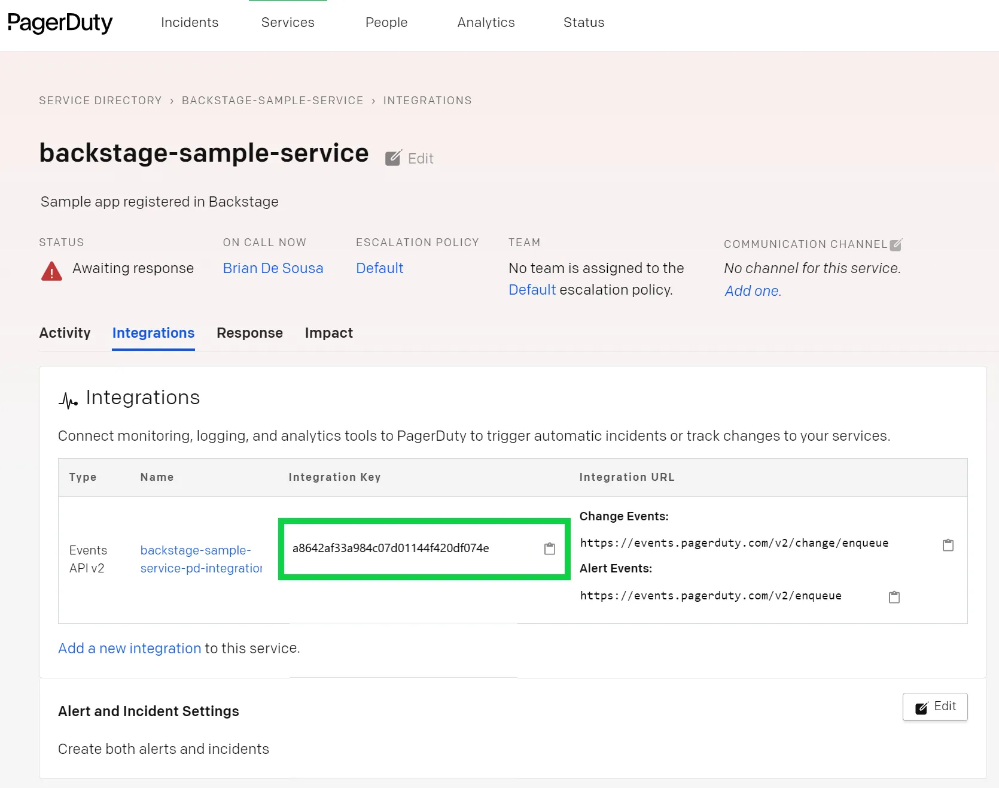

The PagerDuty plugin is a frontend plugin that provides convenient access to frequently used PagerDuty capabilities. Developers see pertinent information and actions for every entity that is connected to a PagerDuty service including:

- who is currently on call for the entity
- whether there are any active incidents for the entity
- raise a new incident for the entity

## Connecting an entity to a PagerDuty service

An entity is connected to a PagerDuty service by adding a `pagerduty.com/integration-key` annotation to the entity's `catalog-info.yaml` file. For example:

```yaml
annotations:
  pagerduty.com/integration-key: a8642af33a984c07d01144f420df074e
```

The integration key can be retrieved from the Integrations tab of the service in the PagerDuty service directory.



## PagerDuty UI placement and rendering

In the example above, the PagerDuty UI was added to the Overview tab for all entities. The PagerDuty panel was conditionally rendered only for entities that are actual connected to a PagerDuty service using the `isPagerDutyAvailable` function.

You are not constrained to displaying the PagerDuty panel on the Overview tab. Where and how you display the PagerDuty panel is completely within your control. For example, what if your organization has a policy that requires all APIs to have on call support? Rather than hiding the PagerDuty panel when an API entity is not connected to a PagerDuty service, you could display a policy reminder. Not only can Backstage provide access to frequently used PagerDuty capabilities but it can also help bring visibility to policy gaps.
