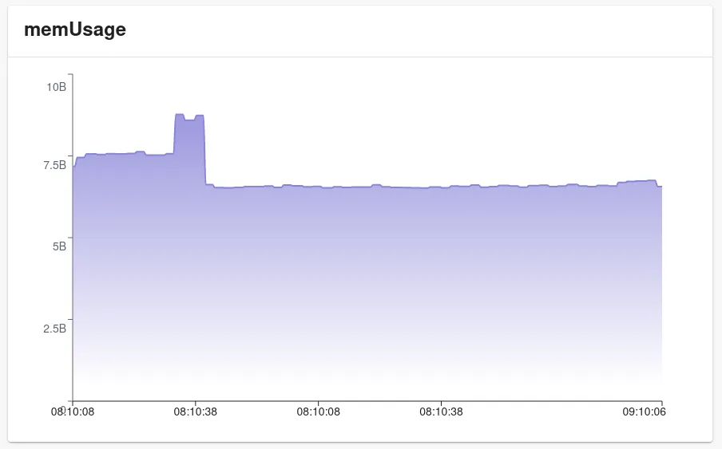
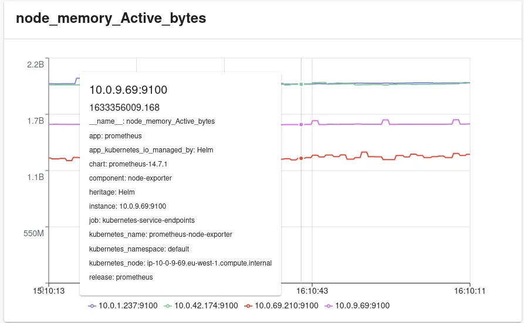
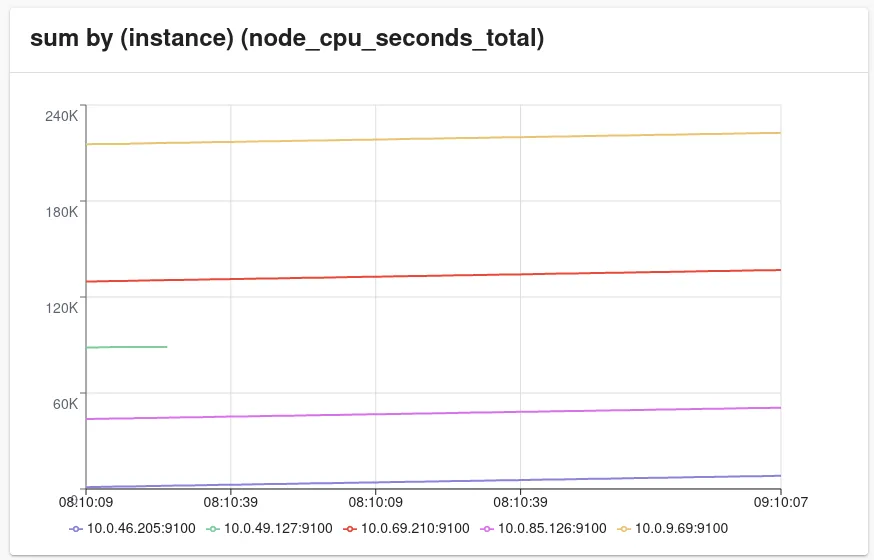
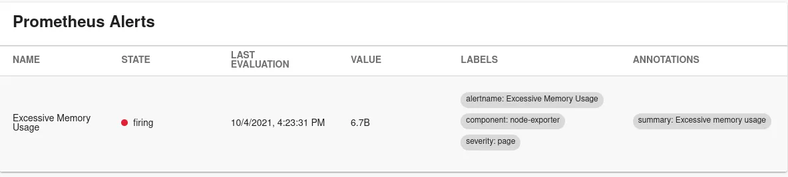

## Features

The Prometheus plugin is a frontend plugin that provides convenient access to frequently used Prometheus capabilities. Developers see pertinent information and actions for every entity that is connected to a Prometheus server.

The plugin provides an entity content page and two additional widgets:
1. Alert table widget
2. Prometheus Graph widget
* Graph widget has two versions, line graph and an area graph


## Entity annotations

The plugin uses entity annotations to determine what data to display. There are two different annotations that can be used:
1. Rule annotation to visualize [Prometheus recording rules](https://prometheus.io/docs/prometheus/latest/configuration/recording_rules/) and queries
2. Alert annotation to display [Prometheus alerting rule](https://prometheus.io/docs/prometheus/latest/configuration/alerting_rules/) in a table format.

### Graphs

#### `prometheus.io/rule`

The 'rule' annotation expects a comma separated list of queries or recording rules and grouping dimension tuples. Dimension is optional and can be omitted which leads to the first label found from the returned data set to be used as the key to group items with.

The annotation supports individual metrics, promQL queries or references to a name of a recording rule. For complex queries a recording rule is the preferred option, since annotation parsing prevents the usage of characters `,` and `|` in queries.

Example annotation:
```prometheus.io/rule: memUsage|component,node_memory_active_bytes|instance,sum by (instance) (node_cpu_seconds_total)```

Produces the following graphs:
1. `memUsage|component`
   (grouping by component, otherwise `__name__` would be the first item on this saved rule. Showed here as an area graph)
   

2. `node_memory_active_bytes|instance`
   (grouping by `instance`, image shows extra data on hover over a line.)
   

3. `sum by (instance) (node_cpu_seconds_total)`
   (`instance` is the grouper label defined in the query --> it is returned on the result set as the first label name, and is therefore used to group data with.)
   

### Alerts

#### `prometheus.io/alert`

The 'alert' annotation expects a comma separated list of predefined alert names from the Prometheus server. These are iterated and displayed in a table, displaying state, value, labels, evaluation time and annotations. To display all alerts configured in Prometheus a magic annotation `prometheus.io/alert: all` can be used.

Example annotation:
```prometheus.io/alert: 'Excessive Memory Usage'```

Produces the following table.



## Custom Graphs and Tables
For more customisability the package exports both `PrometheusGraph` and `PrometheusAlertStatus` as individual components. It is possible to create more customized graphs and/or tables using these directly by dynamically constructing props that these component are expecting.

Type definition for `PrometheusGraph` props is:
```typescript
{
   query: string;
   range ? : {
      hours? : number;
      minutes? : number;
   };
   step ? : number;
   dimension ? : string;
   graphType ? : 'line' | 'area';
}
```

Type definition for `PrometheusAlertStatus' props is:
```typescript
{
  alerts: string[] | 'all';
}
```
