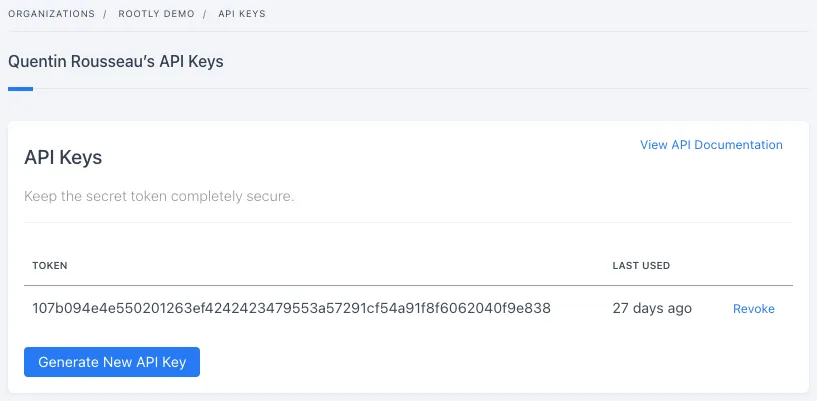
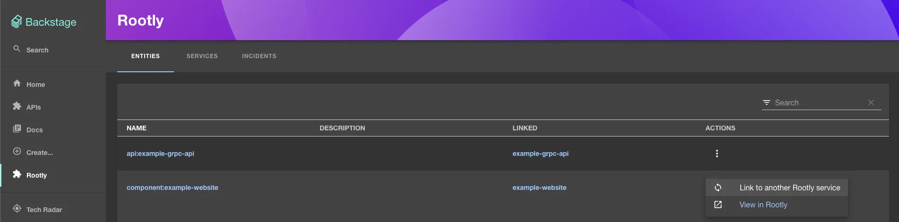
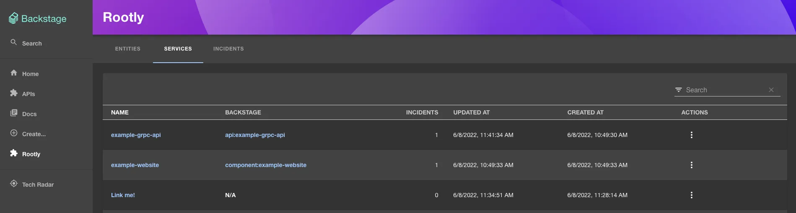
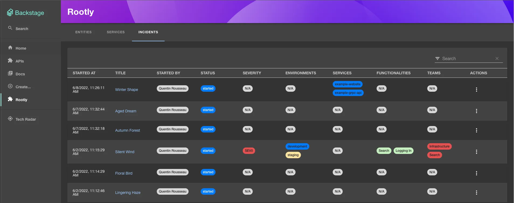
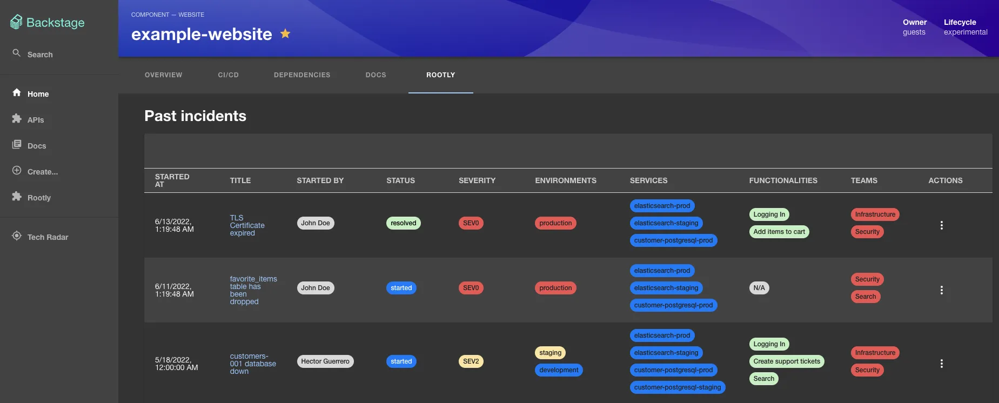

The Rootly backstage plugin is a frontend plugin that displays Rootly services, incidents in Backstage. The plugin includes three components that can be integrated into Backstage:

- The `RootlyPage` routable extension component which produces a standalone page with the following capabilities:
  - View and search a list of entities and import/link them to rootly services
  - View and search a list of services
  - View and search a list of incidents

- The `RootlyOverviewCard` component which produces a summary of your entity with incidents over last 30 days and ongoing incidents.

- The `RootlyIncidentsPage` component which produces a dedicated page within your entity with details about ongoing and past incidents.

## Creating an Rootly API key

Because of the features provided by the plugin, an API key with full access to your Rootly domain is required.
- Read access on services is needed to list services, write access to link entities to services.
- Read access on incidents needed to list incidents.

1. Go to `Profile` -> `Manage API Keys`.

2. Click on `Generate New API Key` button.

3. Copy the key. 

## Screenshots

### `RootlyPage` component

### `RootlyOverviewCard` component

### `RootlyIncidentsPage` component

