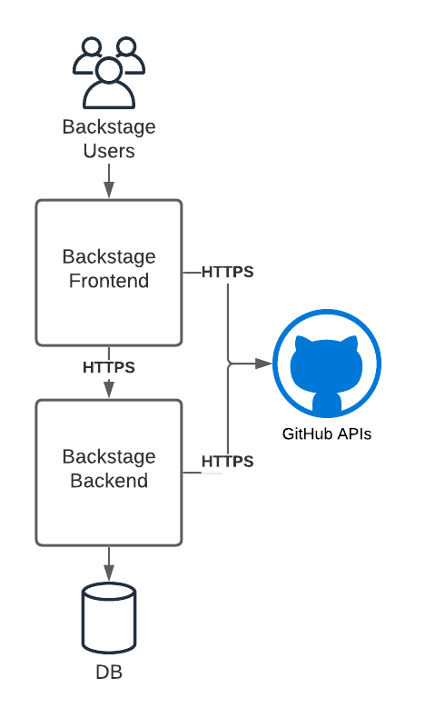
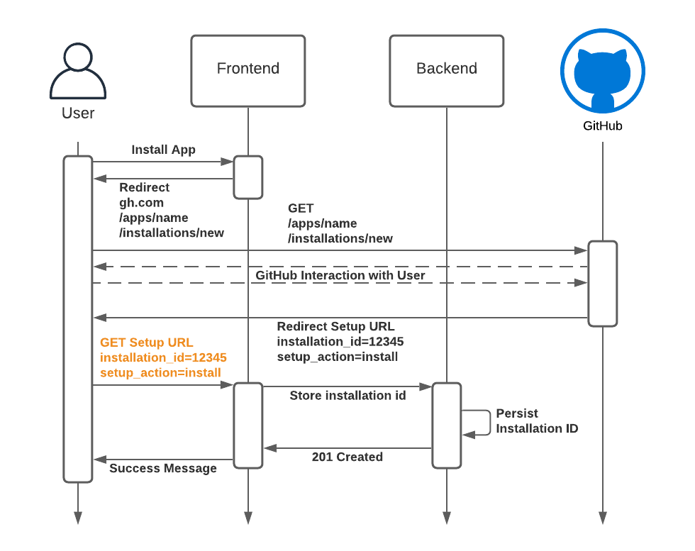
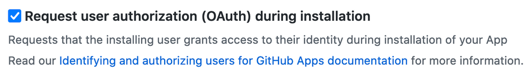
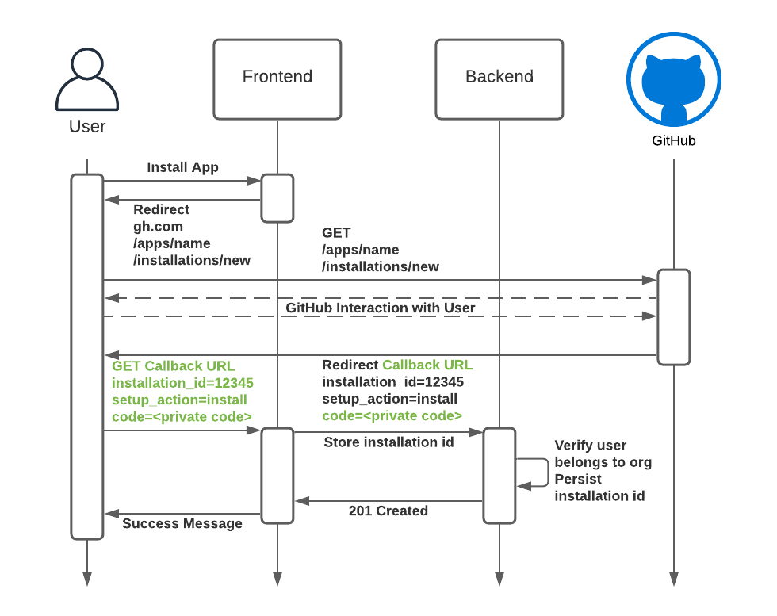

Security, tenant isolation and protecting our customer’s intellectual property is important to us at Roadie. While investigating options for integrating with GitHub APIs we recognized that you have to work hard to do it securely. There are a number of ways to access GitHub APIs. It is quite easy to integrate with them incorrectly and potentially leak data between customers.

In fact we found (and reported) a vulnerability in a handful of major SaaS products that allowed a user to access the resources of an organisation that the user was not a member of.

**Using default settings with GitHub Apps may put you at risk of leaking data between GitHub App installations.**

Roadie provides its customers a hosted and managed Backstage environment. Backstage is a platform that helps you build developer portals on top of a centralised software catalog. Your developers can extend Backstage by creating new or customizing existing frontend and backend plugins in order to build a developer portal that meets your user’s needs.

Backstage is a three tier application. The frontend tier runs in the browser and is built with React. The backend tier is built with Express running on Node.js. This tech stack ensures developers have access to a large community and ecosystem of packages and tools that make it even easier to extend their Backstage implementations.



The Backstage backend includes the *Backstage Software Catalogue* to help bring visibility to your software components. The software catalog is a core component of Backstage. It can discover and index Git repositories hosted on GitHub and GitHub Enterprise using GitHub REST and GraphQL APIs. Indexed data is exposed via backend REST APIs to the frontend.

Backstage plugins can be added to the frontend to extend the core software catalog and integrate with external services. For example, the [GitHub Pull Request plugin](https://roadie.io/backstage/plugins/github-pull-requests/) allows you to see a list of open pull requests associated with an item in the software catalog. Frontend plugins such as this one can use GitHub APIs to retrieve information and render it directly in Backstage. This is just one very specific yet common use of GitHub.

When it comes to integrating with GitHub APIs, there are at least six ways to authenticate. Some of these authentication methods are suitable for the frontend, the backend or both. Let’s go through each.

|Type   | Frontend   | Backend |
|---|---|---|
| Personal Access Token (PAT) | No | Yes |
| GitHub OAuth Apps | Yes | No |
| GitHub Apps acting as a GitHub app itself | No | No |
| GitHub Apps acting as an Installation | No  | Yes |   
| GitHub Apps acting as an OAuth provider | Yes | No |
| Anonymously | Yes | Yes |

## Personal Access Token (PAT)

Any GitHub user can create a Personal Access Token (PAT) via their GitHub developer settings. The user chooses a set of permissions to allow for the token. This token can be used to access any resource from the GitHub API on behalf of that user. It is a sensitive, long-lived token that should not be used in a frontend application. Technically it could be used on a backend application to retrieve data from GitHub APIs. However, this approach is concerning from a security perspective. The backend would essentially be using credentials that allow it to act on behalf of the token’s owner. This is not desirable because the backend, and in turn its token, is shared by all users of the application. In order to mitigate this, you could create a special user in GitHub, and create a PAT for the application. This can be difficult to manage and maintain.

## GitHub OAuth Apps

GitHub provides a way to create an OAuth app that can be used to login application users via a web frontend. Let’s disregard the details about how the OAuth token negotiation works in this article. Effectively, the frontend application sends the user to GitHub to get a token from the OAuth app. The user is then redirected back to the frontend application with a code that can be exchanged for a token. This token can be used by the frontend application to call GitHub APIs on behalf of the user. Any permissions that apply to the user also apply to the API requests made with the token. This is a reasonable mechanism for frontend only uses.

## GitHub Apps

GitHub allows developers to create what is referred to as a GitHub app. A GitHub app can be installed on a GitHub organization or a personal GitHub account. Once installed, the GitHub app can request a new token for each *installation* of the app.

We believe that although it can be difficult to implement correctly, GitHub Apps is the best way to provide GitHub API access to a backend application.

**“GitHub Apps is the best way to provide GitHub API access to a backend application”**

As we mentioned earlier and alluded to in the title, it can be difficult to get GitHub Apps configured in a way that ensures customer isolation between installations of a GitHub App. This is especially true for a multi-tenanted application as is the one we are providing to our customers.

So let’s take a look at the three ways a GitHub app can be used to authenticate to GitHub APIs:

### Acting as a GitHub app itself

The GitHub App has a private key that is used to generate a GitHub App token. This token can be used for a subset of the GitHub APIs. One of the available APIs can be used to retrieve a list of its app *installations* and request GitHub to generate a token for each installation. This GitHub App private key is very sensitive. Suppose your service has two customers, and two installations of the GitHub app. Technically speaking, that private key can be used to retrieve a token for both customers and then read and write data for both customers with GitHub APIs. As such the token should only be used minimally for the purposes of retrieving an installation token.

In order to generate a GitHub App token, the GitHub App encodes a JWT token with the GitHub App ID and signs it with the private key of the GitHub App. Here is what it looks like in Ruby:

```ruby
GITHUB_APP_PRIVATE_KEY_FILE = "private-key.pem"
GITHUB_APP_ID = "12345678"

private_key = OpenSSL::PKey::RSA.new(File.read(GITHUB_APP_PRIVATE_KEY_FILE))

payload = {
  iat: Time.now.to_i - 60,
  exp: Time.now.to_i + (10 * 60),
  iss: GITHUB_APP_ID
}

GITHUB_TOKEN = JWT.encode(payload, private_key, "RS256")
```

The token can then be used to list installations of that GitHub App:

```bash
curl -X GET https://api.github.com/app/installations \
     -H "Authorization: Bearer ${GITHUB_TOKEN}"
```

```json
[
  {
    "id": 12345678,
    "account": {
      "login": "AcmeInc",
      "id": 12345678,
      …
    }
  },
  {
    "id": 12345679,
    "account": {
      "login": "SomeCorporation",
      "id": 12345679,
      …
    }
  }
]
```

And retrieve a token for a specific GitHub App installation:

```bash
curl -X POST https://api.github.com/app/installations/12345678/access_tokens \
     -H "Authorization: Bearer ${GITHUB_TOKEN}"
```

```json
{
  "token": "ghs_<redacted>",
  "expires_at": "2021-08-17T13:16:07Z",
  "permissions": {
    "members": "read",
    "organization_administration": "read",
    "actions": "read",
    "contents": "read",
    "metadata": "read",
    "security_events": "read"
  },
  "repository_selection": "selected"
}
```

Once the GitHub App has retrieved a token for a specific installation, it can call GitHub APIs. The set of APIs that it is allowed to access is configured in the GitHub App and requested during the installation of the app. **This installation-specific token should only be used in a backend.**

It is incumbent upon the GitHub App owner to make sure that the resources retrieved from one installation are only available to members of the organization of the installation.

### Acting as an OAuth provider

The GitHub App can also act as an OAuth provider, so that users of the backend can retrieve a token in a web frontend. The GitHub App’s settings contain the credentials required to allow the web frontend to login users with GitHub in the same way that the GitHub OAuth App does. Once the user’s browser has retrieved the token from GitHub, the web frontend application can gather data and perform actions on behalf of the user in GitHub.

### Acting as an Installation

We saw that the GitHub App’s private key can be used to retrieve an access token for any installation. So how do developers of large multi-tenanted SaaS software make sure that users are only accessing data from installations that they are supposed to? For example, if one of the customers chooses to install the GitHub App, then no other customers should be able to see that customer’s data.

**“Avoid using the Setup URL Callback and validate the ownership of installations ids”**

So how do we make sure that a customer is allowed to use a GitHub App installation?

GitHub Apps allow a developer to provide a URL to which the user is redirected to after installation. The setting is called “Setup URL”. When the GitHub App installation completes the user is redirected to the Setup URL with the id of the installation.

The problem is that GitHub does not provide any means for the installing application to verify the ownership of the installation. Installation ids are 8 digits and not considered secure. They can be guessed easily. Consider the highlighted message in the sequence diagram below. In this setup, it is very easy to bombard the application with any guessed or known installation id.



We found (and reported) this vulnerability in a handful of major SaaS products. This would have allowed us to access other GitHub organizations.

The way to ensure that this does not occur is to verify the user’s identity and organisations and compare whether or not they are allowed to access/install the app. This can be done by setting “Request User Authorization'' and providing a “Callback URL” on your app.



With this setting enabled, users are forced to login and the callback contains a code that can be exchanged for an auth token for the user. The backend should use this code to validate that the user is allowed to access this installation.



So what does this validation look like? Here is what we have done in our backend Express application:

```tsx
router.post('/installations', async (req, res) => {
 const code = req.query.code as string;
 const installationId = req.query.installation_id as string;
 const setupAction = req.query.setup_action as string;

 if ((!setupAction || setupAction !== 'install')) {
   logger.error(`Action is not of type 'install'. Got: ${setupAction}`);
   httpResponse = 400;
 } const userGitHub: Octokit = (await Octokit.auth({
   type: 'oauth-user',
   code: code,
   factory: (options: OAuthAppAuthOptions) => {
     return new Octokit({
       authStrategy: createOAuthUserAuth,
       auth: options,
     });
   },
 })) as Octokit;

 const { data } = await userGitHub.request('GET /user/installations');

 if(data.installations.some(installation => installation.id === installationId)) {
  // The following is sudo-code for storing the installation Id.
  database.saveInstallationId(installationId)
  res.sendStatus(201);
 } else {
  res.sendStatus(403);
 }
}
```

This works because we have ensured that the request contains a code. Only a user who has logged into GitHub could have access to this code, and then we can validate that the user is a member of this organization before persisting the installation.

## In conclusion

If you are rolling out features that require GitHub API access to your customers, be mindful of how you are doing it. We hope you will appreciate how easy it is to unintentionally  and unexpectedly expose a customer’s GitHub data to unauthorized users.
