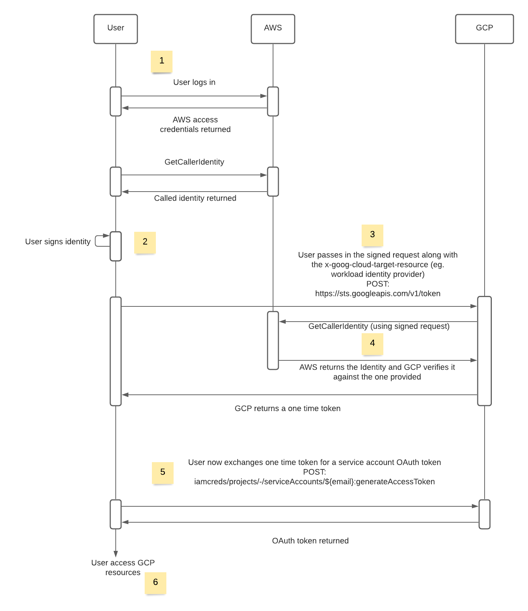

When working with multiple cloud providers, it can often become difficult to manage authentication. Even more so with inter communication. In this blog post, I will talk about my experience with negotiating AWS identity tokens for GCP OAuth tokens.

Normally, when trying to gain access to another AWS account, we use cross federation. With this cross federation, we authorize access to certain AWS principals (roles, users etc). This is done by assuming a "role". This "role" is exclusively controlled by the owner's account. The account owners can determine exactly what access the external account has. With this, we are able to provide a secure way for two (or more) AWS accounts to communicate with each other.

Now between cloud providers, this is a lot more complicated. Each cloud provider has their own method of authentication as well as authorization. This is where the difficulty lies when trying to exchange an AWS role identity token for a GCP token.

Thankfully AWS provides a service that allows us to add authentication to our API requests through HTTP. It adds AWS specific headers/query params, that are then used to confirm the identity of the request.

# GetCallerIdentity

In a lot of cases when working with cloud providers, it is difficult to grasp exactly the identity a service might be using. In many cases an identity may change due to a specific behaviour.AWS provides an easy mechanism for this and it is controlled by the Security Token Service (or STS). More specifically the GetCallerIdentity API. This here returns details on the caller. This includes the unique Identity and Management (IAM) name (ARN). Using this arn, we are able to pinpoint a user and or a service. This can be valuable when trying to confirm the identity of a user.

# GCP

## Service account

Service accounts in GCP is a concept that is shared throughout the GCP ecosystem. They are used to gain access to certain resources and have permissions attached to them. With service accounts, we are able to restrict and regulate actions that a particular user/service is allowed to do. For our investigation, we will be acting on behalf of a service account.

## Creating a service account

For the sake of simplicity, I will be using the gcloud cli although this can very easily be configured through the GCP console.

```bash
$ gcloud iam service-accounts create aws-service-account-demo \
  --description="A service account that AWS can access" \
  --display-name="aws-service-account-demo"
```

## Workload identities

As stated before, using service accounts allows us to restrict access and assign specific permissions to a service or application. In order to gain access to these service accounts, we need some way of verifying our identity. This can be done in two ways, using long term tokens or short lived ones. For this document we will be using the short lived ones. This concept is referred to as workload identities federation.

## Enabling IAM services on your GCP project

For the access token exchange flow to work, we must expose/enable services on our GCP project. This can once again be configured through the console but for simplicity, the gcloud cli is favoured.

```bash
$ gcloud services enable sts.googleapis.com
$ gcloud services enable iamcredentials.googleapis.com
$ gcloud resource-manager org-policies allow constraints/iam.workloadIdentityPoolAwsAccounts \
    <aws-account-id> --organization=<gcp org>
```

Note: you will also need to ensure that you have the Workload Identity Pool Admin (roles/iam.workloadIdentityPoolAdmin) and Service Account Admin (roles/iam.serviceAccountAdmin) roles on the project.

## Creating a workload identity provider

Here we will create a workload identity provider for our token exchange with AWS

First let's create the pool

```bash
$ gcloud iam workload-identity-pools create aws-pool \
    --location="global" \
    --description="Workload identity pool for aws connectivity." \
    --display-name="AWS pool"
```

Then the provider

```bash
$ gcloud iam workload-identity-pools providers create-aws aws-test-account \
    --location="global"  \
    --workload-identity-pool="aws-pool" \
    --account-id="<your account>" \
    --display-name="Test AWS provider"  \
    --description="The Identity Provider for AWS test service"
```

Note: if you would like to be more explicit about what aws role can access this workload identity add the following (replacing the account name and role)

```bash
--attribute-condition="'arn:aws:sts::000000000000:assumed-role/some-role' == attribute.aws_role"  \
```

## Combining workload federation and service accounts

Now that we have the ability to gain an access token using the workload federation, we now need to allow the workload provider to assume the service account role.

```bash
$ gcloud iam service-accounts add-iam-policy-binding aws-service-account-demo@example-project.iam.gserviceaccount.com \
   --role roles/iam.workloadIdentityUser \
   --member "principalSet://iam.googleapis.com/projects/$gcp_project_number/locations/global/workloadIdentityPools/aws-pool/subject/arn:aws:sts::${aws_account_id}:assumed-role/$role_name"
```

Note: if you want to allow all resources in the workload identity pool to assume to the service account replace the --member field with the following

```bash
--member "principalSet://iam.googleapis.com/projects/$gcp_project_number/locations/global/workloadIdentityPools/aws-pool/*"
```

# Token exchange flow

Combining all the steps configured and knowledge above, we are now ready to initiate the token exchange flow. Below is a flow chart of each of the steps.



1. The users logs in to their aws ecosystem and receives a set of aws specific temporary credentials
2. User signs their GetCallerIdenity request with their personal temporary credentials
3. User sends a POST request to GCP; [https://sts.googleapis.com/v1/token](https://sts.googleapis.com/v1/token). This contains all the custom signed credentials in the requested payload. This will be used to verify the user's identity.
4. GCP calls on the AWS STS api to verify the credentials in the payload. If the signed request matches the users identity, GCP will return a federated workload identity token (this is a one time token).
5. User now exchanges the one time token for an ephemeral service account OAuth token. This is done using a POST request to [https://iamcredentials.googleapis.com/v1/projects/-/serviceAccounts/$SA-NAME@$PROJECT-ID.iam.gserviceaccount.com:generateAccessToken](https://iamcredentials.googleapis.com/v1/projects/-/serviceAccounts/$SA-NAME@$PROJECT-ID.iam.gserviceaccount.com:generateAccessToken)
6. User is now able to access all the resources the service account has access to.

The following flow above is also demonstrated here in a POC Javascript project: [https://github.com/RoadieHQ/poc-gke-token-exchange](https://github.com/RoadieHQ/poc-gke-token-exchange)

# Resources:

[https://docs.aws.amazon.com/STS/latest/APIReference/API_GetCallerIdentity.html](https://docs.aws.amazon.com/STS/latest/APIReference/API_GetCallerIdentity.html)

[https://docs.aws.amazon.com/general/latest/gr/signature-version-4.html](https://docs.aws.amazon.com/general/latest/gr/signature-version-4.html)

[https://cloud.google.com/iam/docs/workload-identity-federation#conditions](https://cloud.google.com/iam/docs/workload-identity-federation#conditions)

[https://cloud.google.com/iam/docs/configuring-workload-identity-federation#gcloud](https://cloud.google.com/iam/docs/configuring-workload-identity-federation#gcloud)

[https://cloud.google.com/iam/docs/using-workload-identity-federation#gcloud_1](https://cloud.google.com/iam/docs/using-workload-identity-federation#gcloud_1)
