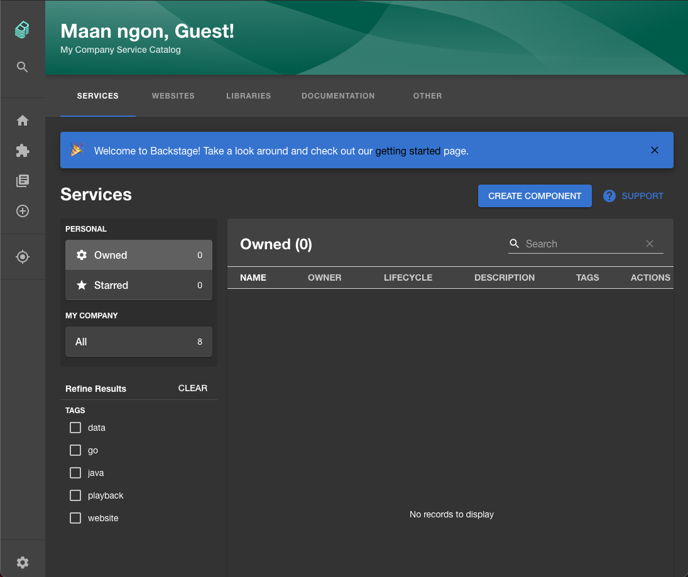

In this tutorial, we're going to build and run a basic Backstage application with Docker Compose. The application will be able to store data in a PostgreSQL database, and connect to GitHub to pull in repositories. We will also make a config change in the Backstage application and re-run it.

**Just want to get started quickly?** Check out our community [Backstage Docker image](/backstage/docker-image/).

## Prerequisites

To complete this tutorial, you will need:

- [Docker](https://docs.docker.com/get-docker/) and [Docker Compose](https://docs.docker.com/compose/) installed and running on your local machine.
- [NodeJS](https://nodejs.org/en/) installed on your local machine.
- The [Yarn package manager](https://classic.yarnpkg.com/en/docs/install/#mac-stable) installed. You can use `npm` if you like, although you will have to modify the shell commands somewhat.

## Step 1 - Scaffold a Backstage application

To run Backstage on Docker Compose, we need to create a Backstage instance to work with. The main Backstage codebase does ship with a sample application we can run, but best practices dictate that we should create our own so we can configure it with our company name and other attributes.

Backstage requires a database to store information about the components, websites and other entities you want to track in the catalog. There are two built in database options, Sqlite and PostgreSQL. We're going to use PostgreSQL for this tutorial.

Backstage comes with a CLI for creating Backstage instances. Let's use it to scaffold a new instance and configure it for PostgreSQL. We'll call this instance `scaffolded-app`, but you can choose a name that makes more sense for you.

This tutorial uses version `0.3.2` of the Backstage CLI to create this application. You may see different results if you're using a different version.

```bash
» npx @backstage/create-app --version
0.3.2

» npx @backstage/create-app
npx: installed 68 in 14.197s
? Enter a name for the app [required] scaffolded-app
? Select database for the backend [required] PostgreSQL

Creating the app...

 Checking if the directory is available:
  checking      scaffolded-app ✔

 Creating a temporary app directory:
  creating      temporary directory ✔

 Preparing files:
  copying       README.md ✔
  copying       .npmignore ✔
  copying       lerna.json ✔
  templating    app-config.yaml.hbs ✔
  templating    package.json.hbs ✔
  copying       tsconfig.json ✔
  copying       .eslintrc.js ✔
  copying       cypress.json ✔
  templating    package.json.hbs ✔
  copying       .eslintrc.js ✔
  copying       android-chrome-192x192.png ✔
  copying       favicon-16x16.png ✔
  copying       apple-touch-icon.png ✔
  copying       favicon-32x32.png ✔
  copying       favicon.ico ✔
  copying       manifest.json ✔
  copying       index.html ✔
  copying       safari-pinned-tab.svg ✔
  copying       robots.txt ✔
  copying       App.tsx ✔
  copying       App.test.tsx ✔
  copying       index.tsx ✔
  copying       apis.ts ✔
  copying       plugins.ts ✔
  copying       sidebar.tsx ✔
  copying       setupTests.ts ✔
  copying       .eslintrc.json ✔
  copying       app.js ✔
  copying       .eslintrc.js ✔
  copying       Dockerfile ✔
  copying       README.md ✔
  templating    package.json.hbs ✔
  copying       index.ts ✔
  copying       types.ts ✔
  copying       index.test.ts ✔
  copying       auth.ts ✔
  copying       catalog.ts ✔
  copying       identity.ts ✔
  copying       proxy.ts ✔
  copying       scaffolder.ts ✔
  copying       techdocs.ts ✔

 Moving to final location:
  moving        scaffolded-app ✔

 Building the app:
  executing     yarn install ✔
  executing     yarn tsc ✔
  executing     yarn build ✔

🥇  Successfully created scaffolded-app
```

If we `cd` into the `scaffolded-app` directory which was just created, we can see the directory structure which was created for us.

```bash
» ls -al                                                                                                                                                                                                                                                                                                                            146 ↵
total 1776
drwxr-xr-x    19 myuser  staff     608  9 Jan 20:20 .
drwxr-xr-x     3 myuser  staff      96  9 Jan 19:17 ..
-rw-r--r--     1 myuser  staff      36  9 Jan 19:17 .eslintrc.js
-rw-r--r--     1 myuser  staff     420  9 Jan 19:17 .gitignore
-rw-r--r--     1 myuser  staff      93  9 Jan 19:17 README.md
-rw-r--r--     1 myuser  staff     184  9 Jan 19:17 app-config.production.yaml
-rw-r--r--     1 myuser  staff    3250  9 Jan 19:17 app-config.yaml
-rw-r--r--     1 myuser  staff     399  9 Jan 19:17 catalog-info.yaml
drwxr-xr-x     4 myuser  staff     128  9 Jan 19:19 dist-types
-rw-r--r--     1 myuser  staff     116  9 Jan 19:17 lerna.json
drwxr-xr-x  1698 myuser  staff   54336  9 Jan 19:19 node_modules
-rw-r--r--     1 myuser  staff    1339  9 Jan 19:17 package.json
drwxr-xr-x     4 myuser  staff     128  9 Jan 19:17 packages
-rw-r--r--     1 myuser  staff     272  9 Jan 19:17 tsconfig.json
-rw-r--r--     1 myuser  staff  829904  9 Jan 19:19 yarn.lock
```

The main bulk of the application is in the `packages` directory. This contains two subdirectories.

```bash
» ls -al packages
total 0
drwxr-xr-x   4 myuser  staff  128  9 Jan 19:17 .
drwxr-xr-x  19 myuser  staff  608  9 Jan 22:23 ..
drwxr-xr-x  10 myuser  staff  320  9 Jan 19:40 app
drwxr-xr-x   9 myuser  staff  288  9 Jan 19:50 backend
```

The `app` subdirectory contains the frontend UI of Backstage and the `backend`, as you might expect, contains the API layer and parts that connect to the database.

## Step 2 - Building a Docker image

Backstage comes with a built in command to help you build a Docker image which you can run with Docker Compose.

For simple deployments, the Backstage `backend` has the ability to serve the frontend `app` to the browser, so you only have to build one Docker image.

```bash
» yarn workspace backend build-image
yarn workspace v1.22.10
yarn run v1.22.10
$ backstage-cli backend:build-image --build --tag backstage
# Lots of output omitted...
=> => naming to docker.io/library/backstage                                                                                                                                                                                                                                                                                                                                           0.0s
✨  Done in 114.02s.
```

Check the image has been built successfully.

```bash
» docker images                                                                                                                                                                                                                                                                                                                                                                                                                                       1 ↵
REPOSITORY         TAG       IMAGE ID       CREATED         SIZE
backstage          latest    7b452013e713   3 minutes ago   1.1GB
```

Now that we have a Docker image, let's try to run it.

```yaml
» docker run backstage
2021-01-09T19:51:13.883Z backstage info Loaded config from app-config.yaml, app-config.production.yaml
2021-01-09T19:51:13.887Z backstage info Created UrlReader predicateMux{readers=azure{host=dev.azure.com,authed=false},bitbucket{host=bitbucket.org,authed=false},github{host=github.com,authed=false},gitlab{host=gitlab.com,authed=false},fallback=fetch{}}
Backend failed to start up, Error: connect ECONNREFUSED 127.0.0.1:5432
```

This fails because the Backstage backend cannot connect to port `5432`. Backstage needs to connect to the database in order to store catalog items and other data. It expects to find PostgreSQL running on port `5432`. When it can't, it fails and bails out.

To fix this, let's use Docker Compose to make PostgreSQL available to our Backstage backend.

## Step 2 - Adding PostgreSQL

Below is a simple `docker-compose.yaml` file which runs the Backstage image we just created and a default PostgreSQL database. Create this file inside your Backstage application and save it.

```yaml
version: '3'
services:
  backstage:
    image: backstage
    environment:
      # This value must match the name of the postgres configuration block.
      POSTGRES_HOST: db
      POSTGRES_USER: postgres
    ports:
      - '7000:7000'

  db:
    image: postgres
    restart: always
    environment:
	# NOT RECOMMENDED for a production environment. Trusts all incomming
      # connections.
      POSTGRES_HOST_AUTH_METHOD: trust
```

Once you've done that, you can use Docker Compose to start both of these Docker images.

```bash
» docker-compose up
Creating network "blog-post-test_default" with the default driver
Creating blog-post-test_db_1        ... done
Creating blog-post-test_backstage_1 ... done
Attaching to blog-post-test_backstage_1, blog-post-test_db_1
# Lots of output omitted...
backstage_1  | Backend failed to start up, Error: Failed to initialize github scaffolding provider, Missing required config value at 'scaffolder.github.token'
blog-post-test_backstage_1 exited with code 1
```

It still fails, but we've made progress. Backstage has successfully connected to the database and then failed because of a missing GitHub token.

## Step 3 - Configuring GitHub

Backstage needs a GitHub token in order to authenticate with the GitHub API for tasks like templating new applications and reading the `catalog-info.yaml` files it uses to store metadata.

Head over to the GitHub docs to learn how to [create a Personal Access Token](https://docs.github.com/en/free-pro-team@latest/github/authenticating-to-github/creating-a-personal-access-token). If you don't want to use GitHub, you can use a nonsense value like `abc` in place of the GitHub token value.

Once you have your token, pass it into Backstage via the environment variables.

```yaml
version: '3'
services:
  backstage:
    image: backstage
    environment:
      POSTGRES_HOST: db
      POSTGRES_USER: postgres
      # Add your token here
      GITHUB_TOKEN: <your-github-token>
    ports:
      - '7000:7000'

  db:
    image: postgres
    restart: always
    environment:
      POSTGRES_HOST_AUTH_METHOD: trust
```

Once that's done, let's give it one more go.

```bash
» docker-compose up
Creating network "blog-post-test_default" with the default driver
Creating blog-post-test_db_1        ... done
Creating blog-post-test_backstage_1 ... done
Attaching to blog-post-test_backstage_1, blog-post-test_db_1
# Lots of output omitted...
backstage_1  | 2021-01-09T22:42:27.061Z backstage info Initializing http server
backstage_1  | 2021-01-09T22:42:27.065Z backstage info Listening on :7000
```

Hurray! 🎉 Now, if you visit `localhost:7000`, you should see Backstage.



## Step 4 - Making a change

Our Backstage instance isn't quite as perfect as it could be. You'll notice the header says "My Company Service Catalog". Let's change that to include the name of our company, Roadie.

This is a simple change to make. Fire up your text editor and open the `app-config.yaml` file.

In there, you'll see the following two lines

```yaml
organization:
  name: My Company
```

Simply change "My Company" to something like "Roadie", rebuild the docker image, run `docker-compose up` and refresh your browser window to see the change.

## Conclusion

In this tutorial you learned how to get Backstage running locally and change it's configuration. As a next step, you may wish to try [adding the Lighthouse plugin](https://roadie.io/blog/backstage-docker-compose/) to the deployment.
