In this tutorial, we're going to deploy a basic Backstage application to AWS. The application will be using a stack of AWS resources to its advantage. We'll set up a database to run PostgreSQL on AWS RDS, store our environment variables to AWS SSM Parameter Store, route our traffic through an AWS Application Load Balancer and last but not least, run our Backstage application on AWS Fargate compute engine.

We'll be using the AWS console for most of the actions to scaffold the application, but all steps can be done using either `aws-cli` or infrastructure as code tools like Terraform or Pulumi.

## Prerequisites

To complete this tutorial, you will need:

- [Docker](https://docs.docker.com/get-docker/) installed and running on your local machine.
- [NodeJS](https://nodejs.org/en/) and [Yarn](https://classic.yarnpkg.com/en/docs/install/#mac-stable) installed on your local machine.
- [AWS account](https://aws.amazon.com/console/) with permissions to create IAM policies, RDS databases, Load Balancers, ECS Fargate Clusters and managed ECR repositories.
- [AWS CLI](https://docs.aws.amazon.com/cli/latest/userguide/install-cliv2.html) set up locally with your AWS credentials.

## Step 1 - Spinning up your RDS Database instance

To run properly, Backstage needs a database to store and handle data. In AWS environment we can spin up an RDS PostgreSQL database to handle that for us. 

Let's navigate to the [AWS RDS console](https://eu-west-1.console.aws.amazon.com/rds/home) and do just that. We'll start of by clicking the big orange button, saying 'Create database'.

We select the standard create option and select PostgreSQL as our database engine. For templates, we can for now go with the free tier one if it is still available for your AWS account. 

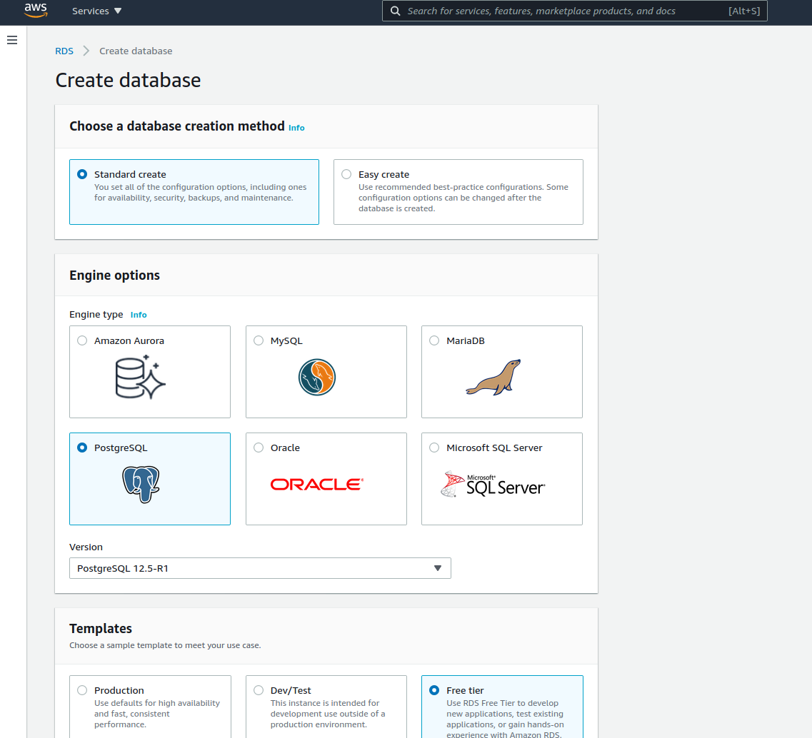


On the settings section we will set up our database name and master username, and finally generate a password using our favorite password manager. These are good items to temporarily store somewhere, because we will be needing them later. For this deployment the database instance does not yet have to be big and beefy so we will go with the free tier `T2.micro` instance. 

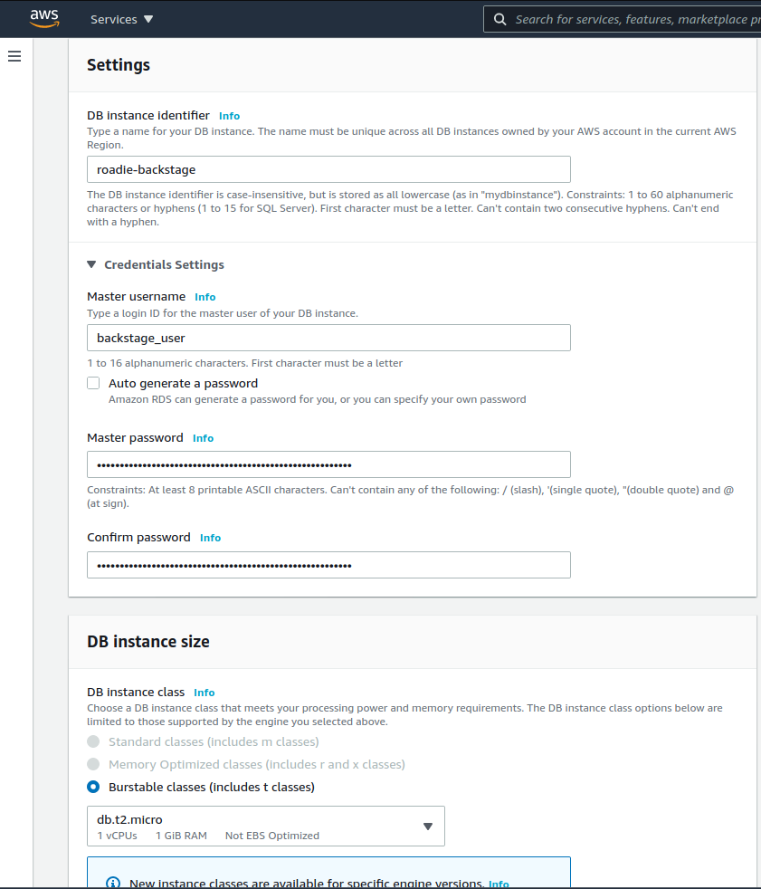


We can leave Storage, Availability & durability as well as Database authentication sections to their default values and focus our attention to the Connectivity section. In this section we will select our preferred VPC and subnets. If nothing special is needed, you can use the default VPC for now as well as the default subnet group. Ideally you don't need your database subnet to be able to accessible from the internet, or even access the internet itself but securing networking within AWS is out of scope for this tutorial.

We do want to create a new security group to our instance though. We'll name it `backstage_rds_SG` and select 5432 as our port. AWS will automatically create a new security group for us that grants access to the database port from our IP address. We will later change this IP to point to the security group of our Fargate service.

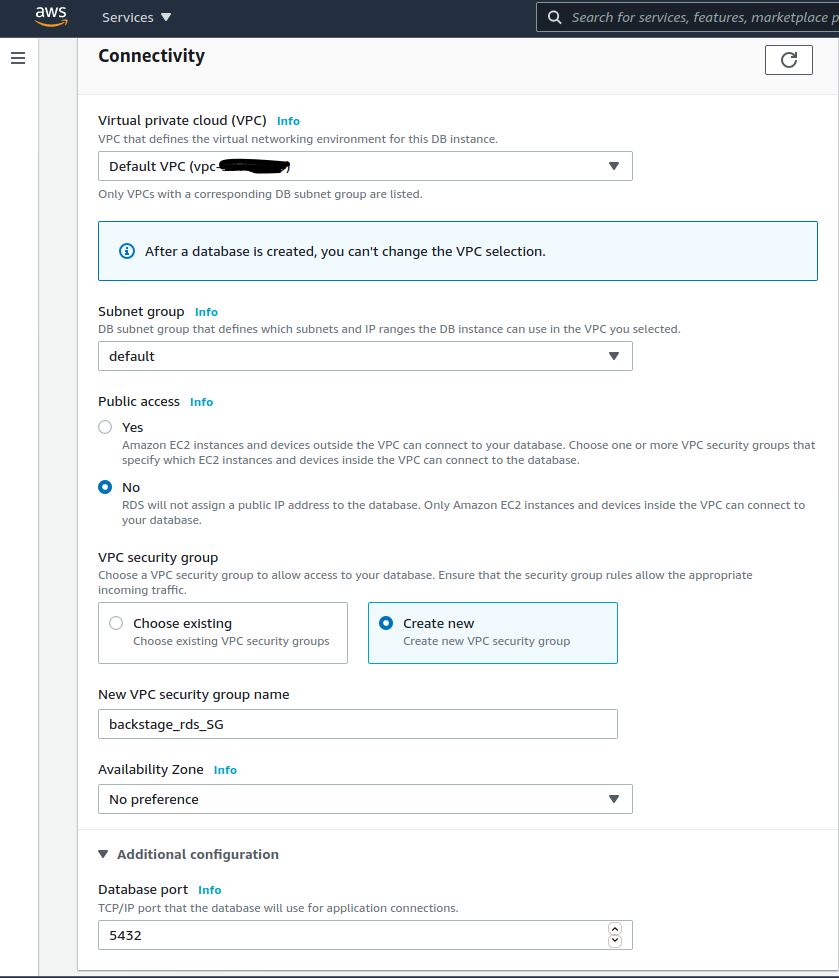


After these selections we can click `Create database` and wait for it to become available.


## Step 2 - Setting up proper policies to run Fargate containers

Before we can start shipping our Backstage container to AWS we need to have few prerequisites set up for the task to be able to run properly. We'll want good logging so we'll give the task permissions to write to CloudWatch. We also want to be able to read environment variables stored in System Manager Paramater Store, so we'll create a policy to do just that as well. Additionally we are creating a private repository for our container images so we'll create a policy to be able to pull those down. All of these policies will be attached to the AWS IAM Role that we will assign to the running container. 

To set up these policies and roles, let's go to [AWS IAM Management Console](https://console.aws.amazon.com/iam/home). In there we will first go to the Policies section and click create a new Policy. The policy json to read SSM Parameters is the following: 

```json
{
  "Version": "2012-10-17",
  "Statement": [
    {
      "Effect": "Allow",
      "Action": [
        "ssm:GetParameters"
      ],
      "Resource": "*"
    }
  ]
}
```
We should additionally restrict the star-scoped resource to match only needed parameters for this application. That could be something like `arn:aws:ssm:[REGION]:[ACCOUNT_ID]:parameter/roadie/backstage/*`, depending on the namespace we choose to use in later steps.


We also want our logs from Fargate to go to some place where we can see them so we'll create another policy:

```json
{
  "Version": "2012-10-17",
  "Statement": [
    {
      "Effect": "Allow",
      "Action": [
        "logs:CreateLogGroup",
        "logs:CreateLogStream",
        "logs:PutLogEvents",
        "logs:DescribeLogStreams"
      ],
      "Resource": [
        "arn:aws:logs:*"
      ]
    }
  ]
}
```

Again, if we want to write into just some predefined log stream, so we should scope the resource section to match that. We can also leave `CreateLogGroup` out in that case since the Fargate task doesn't need permissions to create it.


The last policy we want to create is to allow Fargate to download the Docker images we have pushed to our private ECR. 
```json
{
  "Version": "2012-10-17",
  "Statement": [
    {
      "Effect": "Allow",
      "Action": [
        "ecr:BatchCheckLayerAvailability",
        "ecr:BatchGetImage",
        "ecr:GetDownloadUrlForLayer",
        "ecr:GetAuthorizationToken"
      ],
      "Resource": "*"
    }
  ]
}
```


Finally, now that we have our policies set up, we can create a Role that we can attach to the running Fargate task.

We'll jump into the Roles section of IAM console and click the 'Create role' button. We select trusted entity type to be 'Elastic Container Service' and our use case to be 'Elastic Container Service Task'. On the next page where a list of permissions are displayed we select the three policies we created above. 
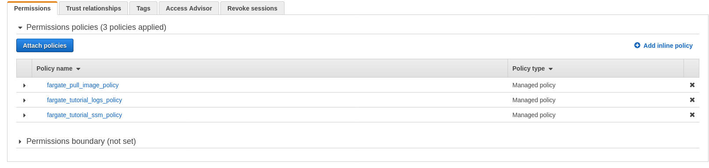 

When we navigate to the role we should make sure that the correct trust policy JSON has been assigned to it. We don't want to use this same role to be used by our running tasks, only the ECS service itself, so out trust policy is pointing to ecs.amazonaws.com only.
```json
{
  "Version": "2012-10-17",
  "Statement": [
    {
      "Sid": "",
      "Effect": "Allow",
      "Principal": {
        "Service": [
          "ecs.amazonaws.com"
        ]
      },
      "Action": "sts:AssumeRole"
    }
  ]
}
```


Now we have all the prerequisites on IAM side ready for our deployment.


## Step 3 - Defining our environment in System Manager Parameter Store

We know what the connection string is to connect to our database so next we will move on to set up those. We'll also set up our  Github token in the same way as an environment variable (make sure you have created a Github token explained [here](https://docs.github.com/en/free-pro-team@latest/github/authenticating-to-github/creating-a-personal-access-token), if you want to use Github with your Backstage). There are few different ways to pass in environment variables to running containers in AWS ECS. We will be using AWS System Manager Parameter Store to save those in a safe place where they can be then loaded to the running container. AWS ECS also provides the possibility to load environment variables from a flat file stored in S3 or pass them in directly (unsecured) to the task definition. 

Let's navigate to the [Parameter Store](./https://eu-west-1.console.aws.amazon.com/systems-manager/parameters/?region=eu-west-1&tab=Table) and populate the needed values in there.
By clicking Create Parameter we can create values for our database credentials for the RDS instance we created previously as well as the Github token we have created.

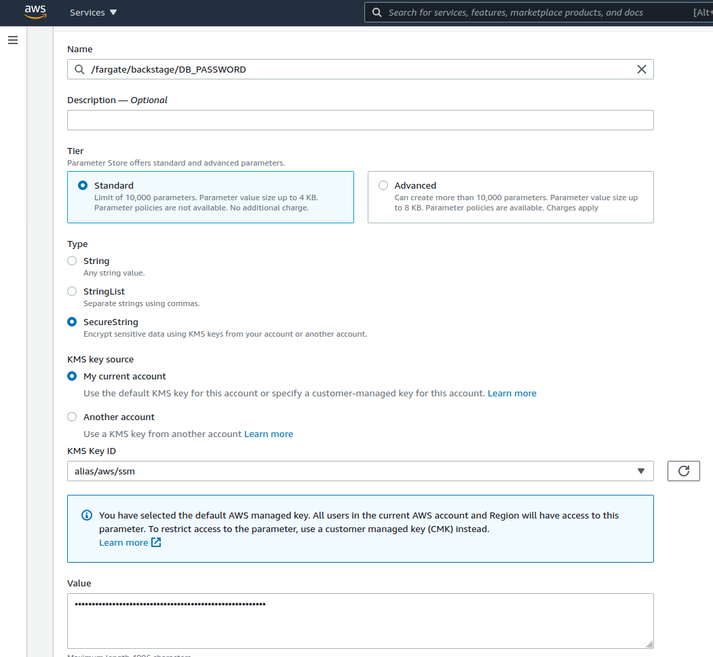

At least the `DB_PASSWORD` and `GITHUB_TOKEN` should be of type SecureString, so they are encrypted. We'll be using just the default KMS Key in this case to encrypt the values, but it might be worthwhile to generate a specific key for these parameters. 


In the end we should be ending up with a list of few parameters that we can use later. 

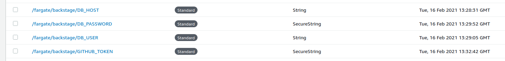

Note that we have not defined the database port to be retrieved from parameter store here. That might be something you want to do if the ports change regularly or are non-standard, but is not really necessary. 


## Step 4 - Creating a Load Balancer for our Backstage service

The last scaffolding bit we want to do to support our Fargate Backstage is to set up a load balancer in standby to wait for our Fargate service to attach itself to it. We do this step a bit prematurely just to have a good static URL available to point to when we eventually start building the actual Backstage application. 

Let's navigate to [AWS Load Balancer section](https://eu-west-1.console.aws.amazon.com/ec2/v2/home?region=eu-west-1#LoadBalancers) in the console and spin one up. 

We want to create an Application Load balancer that is internet facing. It is a good idea to select all subnets, so the load balancer is able to target our containers even if they are spread out across different AWS Availability Zones. For now the only listener we attach to the load balancer is listening to HTTP traffic through port 80, but if you have a domain that you control and can create certificates for, you should be using HTTPS and port 443.  
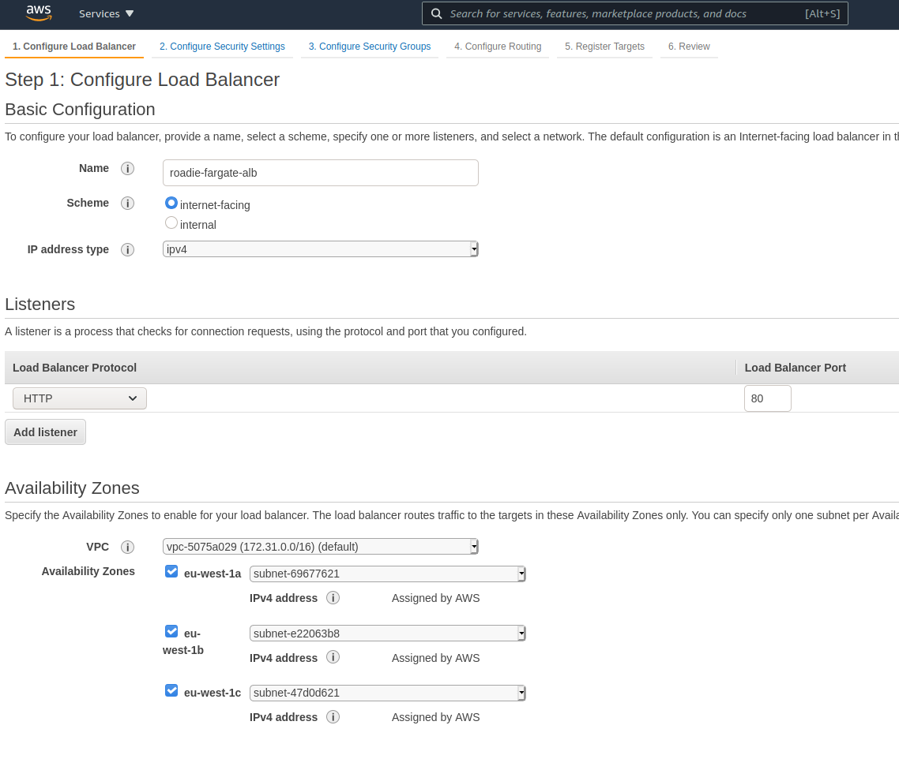


On the next step we configure the security of our balancer. If you didn't choose to use HTTPS protocol, AWS will show you a little warning to do so. If you did, you should be putting in your certificate details for the domain name you have available.

We'll continue onwards to setting up our security groups. In this case we want create a new one for the load balancer. The only thing we need to listen (in this setup without HTTPS) is to configure this group to allow traffic to port 80 from everywhere (0.0.0.0/0, ::/0). If you want to restrict access to your Backstage instance, you can define an IP range of your office network or VPN, or your personal public IP. 

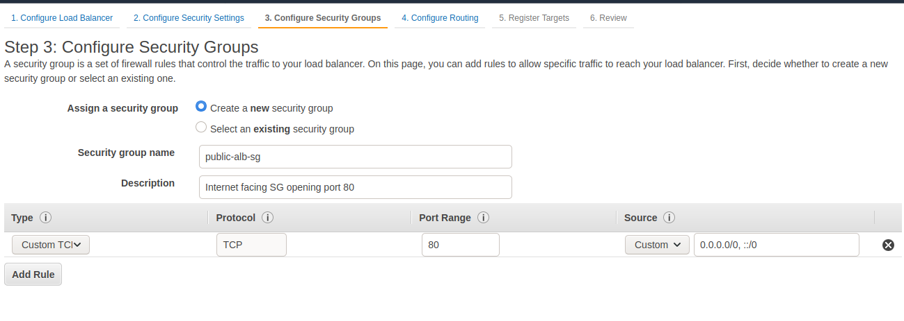

For target groups we just change the port to 7000, which will be the one our Backstage instance will be using and give the target group a name. We will not be registering any actual targets yet. That will be handled when we spin up our Fargate services. 


The load balancer will take few a minutes to spin up. While waiting for that we will take note of the DNS name of the balancer, this will be the entry we'll modify our application configuration with. Of course, if you have added an CNAME/Alias entry of your own domain to point to the load balancer, you should use that instead. 


## Step 5 - Creating your Backstage image

To deploy the Backstage application we want to have it packaged into a docker image with configurations best suitable for our environment. We'll start this journey in the Backstage repository. For more information how to scaffold the initial application you can take a look at the post to get [Backstage running with Docker compose](https://roadie.io/blog/backstage-docker-service-catalog/).
For this post we start the same way and scaffold a new fresh Backstage application by running `npx @backstage/create-app`. After we have figured out a good name for the app and selected PostgreSQL as our database provider, we are ready to massage our configuration files to match what we want our environment to look like.

If we take a look at the default `app-config.yaml` file we see few environment variables that are needed to get the app running properly. These environment variables, for our use case, based on the default `app-config.yaml` file are:
```
POSTGRES_HOST
POSTGRES_PORT
POSTGRES_USER
POSTGRES_PASSWORD
GITHUB_TOKEN
```
These happen to be the same items we created in AWS Parameter Store previously so looks like we are on the right track.

A lot of the values in the default configuration file are not necessary and can be removed. Things like default catalog locations can be removed since that section depends a lot on the way you want to configure your Backstage instance. For this tutorial, we will leave the whole configuration file as is. 


Previously we created a load balancer to have a more stable DNS entry we can use as the application entrypoint. We'll add that in to our application configuration by modifying the `app-config.production.yaml`. We'll also turn off HTTP->HTTPS redirection from our Content-Security-Policy for now since our Load Balancer only supports port 80. This would be something that can be omitted for more secure environments where HTTPS is set up.

The whole file would eventually look something like this:
```yaml
app:
  baseUrl: http://roadie-fargate-loadbalancer-123456789.eu-west-1.elb.amazonaws.com

backend:
  baseUrl: http://roadie-fargate-loadbalancer-123456789.eu-west-1.elb.amazonaws.com
  listen:
    port: 7000
  csp:
    upgrade-insecure-requests: false # For tutorial purposes only
```

That is all configuration needed to build an image we can run on Fargate. To create the actual deployable we can rely on the built-in `build-image` command that produces a Docker image with the current content of our workspace. We run `yarn build-image` and wait for Backstage-CLI to do its thing. By running `docker images` we can see that the previous command has created a Docker image for us with the repository name `backstage` and tag `LATEST`.


To run containers in Fargate we need to store the Docker image somewhere where the ECS service can download it from. For that we will create a new repository in ECR which we can use as the home for our container. The easiest way to do this is to use the `aws-cli` tool. Note that we are using `eu-west-1` region throughout this tutorial, so be sure to change to your preferred region accordingly.

```bash
aws ecr create-repository --repository-name fargate-backstage --region eu-west-1
```

AWS responds to us with the configuration of the repository which we can then use to tag and push our image to. Here is the json output from the command:

```json
{
    "repository": {
        "repositoryArn": "arn:aws:ecr:eu-west-1:123456789012:repository/fargate-backstage",
        "registryId": "123456789012",
        "repositoryName": "fargate-backstage",
        "repositoryUri": "123456789012.dkr.ecr.eu-west-1.amazonaws.com/fargate-backstage",
        "createdAt": "2021-02-16T13:56:38+01:00",
        "imageTagMutability": "MUTABLE",
        "imageScanningConfiguration": {
            "scanOnPush": false
        },
        "encryptionConfiguration": {
            "encryptionType": "AES256"
        }
    }
}

```

From that configuration we grab the `repositoryUri` and use that to tag our Backstage image with the correct repository path and version number. We'll trust that this first iteration of our image is production ready, so we bravely start versioning from number 1.0.0.

```bash
docker tag backstage:latest 123456789012.dkr.ecr.eu-west-1.amazonaws.com/fargate-backstage:1.0.0
```

Now we are ready to push our image to our newly created repository and move to scaffold other AWS resources.
First, let's login to ECR:

```bash
aws ecr get-login-password --region eu-west-1 | docker login --username AWS --password-stdin 123456789012.dkr.ecr.eu-west-1.amazonaws.com
```

and then push the image up to AWS ECR
```bash
docker push 123456789012.dkr.ecr.eu-west-1.amazonaws.com/fargate-backstage:1.0.0
```


## Step 6 - Defining our Fargate tasks

All the supporting configuration should now be done, and we can finally move to define the actual container, service and task that will be running our Backstage instance.

We'll start of by creating a new cluster in [AWS ECS](https://eu-west-1.console.aws.amazon.com/ecs/home?region=eu-west-1#/clusters). Clusters in ECS are mostly just for namespacing purposes, but they are tied to a specific VPC, so make sure you choose the same VPC where the load balancer and RDS database are.


The next step is to create a task definition. This will contain the settings for our Fargate instance, our container definitions and the configuration on how we pass in our environment variables. We'll select Fargate as the type of task and fill in the needed values. The role for the task itself as well as the task execution role should be the one we created earlier for this purpose. We'll select half a vCPU and 1GB of memory for this first iteration and see how the service behaves. These can be updated later if there is need for more resources.

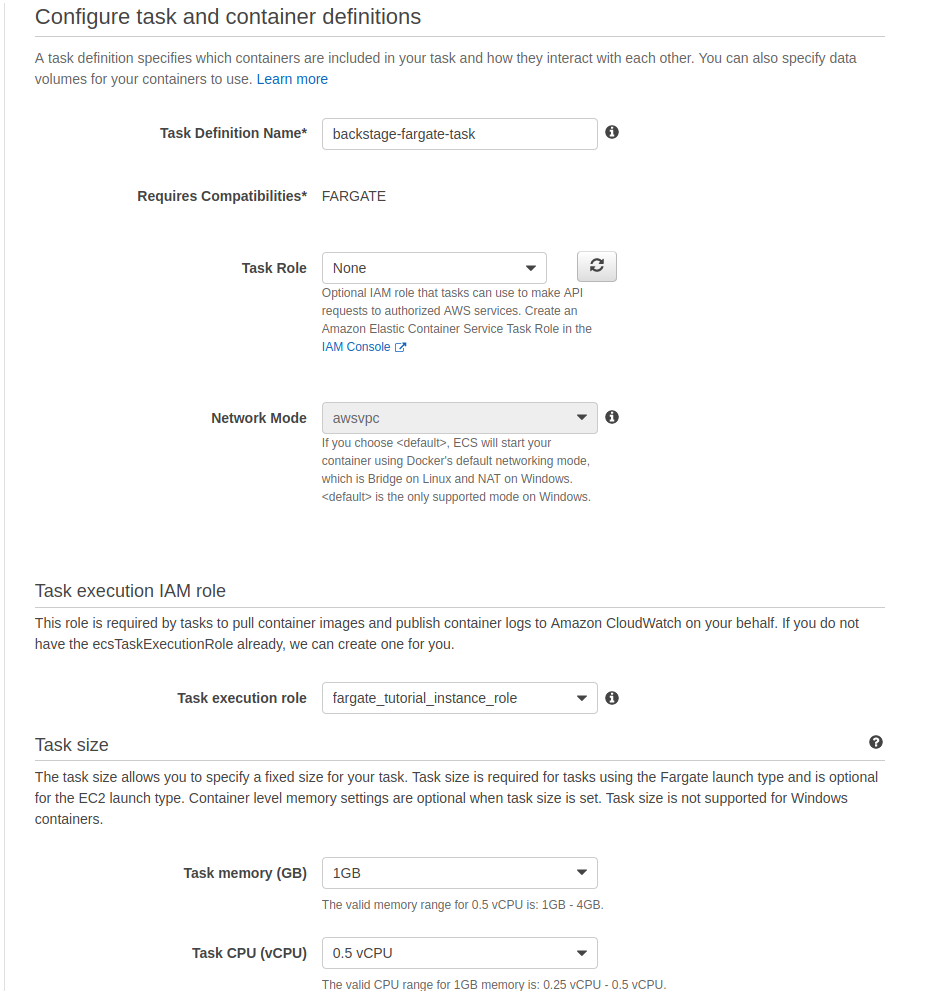


Our task of course needs a container, so we will create a new container definition by clicking 'Add container'. We'll give our container a descriptive name and on the image textfield add our freshly created and pushed `123456789012.dkr.ecr.eu-west-1.amazonaws.com/fargate-backstage:1.0.0` Docker image. For port mappings we'll add a single item, exposing port `7000` from the container. Other values on this section can be left as default.

A little bit further down in the environment section we will add few lines to retrieve our env variables from Parameter store. The environment variable names came from our `app-config.yaml` file and were:
```
POSTGRES_HOST
POSTGRES_PORT
POSTGRES_USER
POSTGRES_PASSWORD
GITHUB_TOKEN
```

Most of the environment variables we define will use the 'ValueFrom' type to retrieve needed information. For these we add the key and point the value to the ARN of the corresponding parameter in Parameter Store. The port value alone is passed in as plain text.

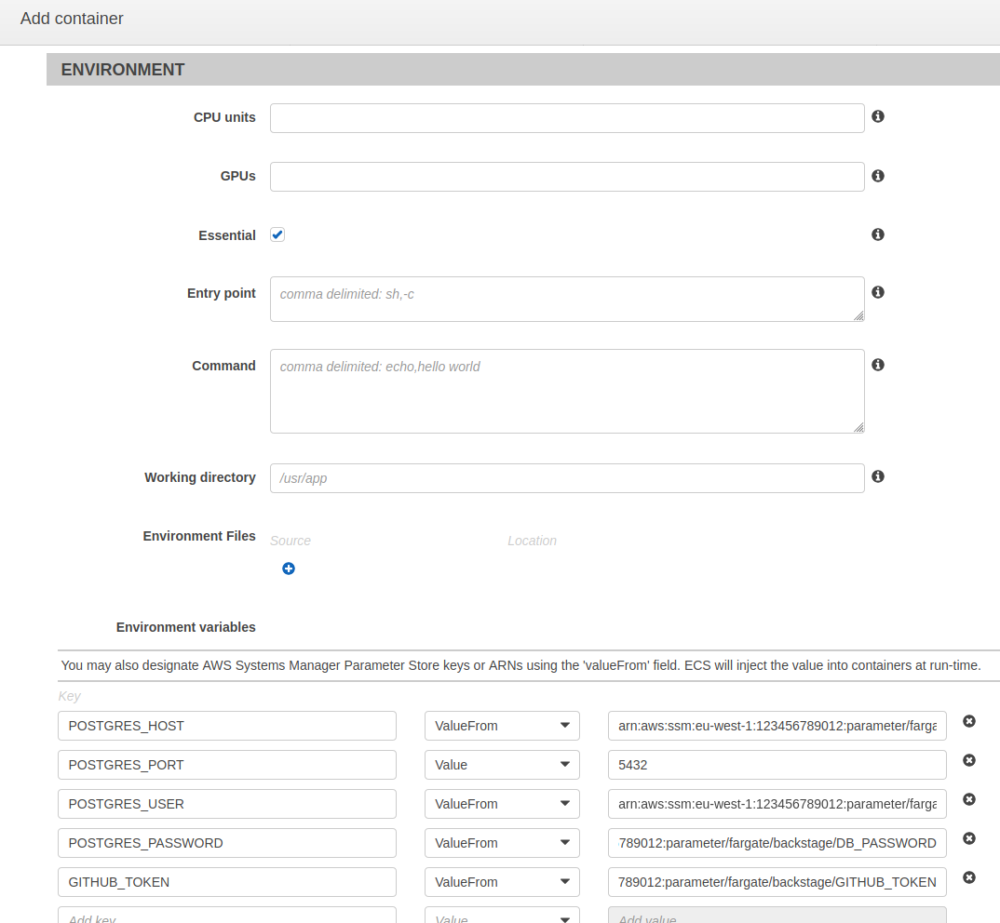


We'll also click on autoconfigure CloudWatch Logs to be able to see the logs from the running container.

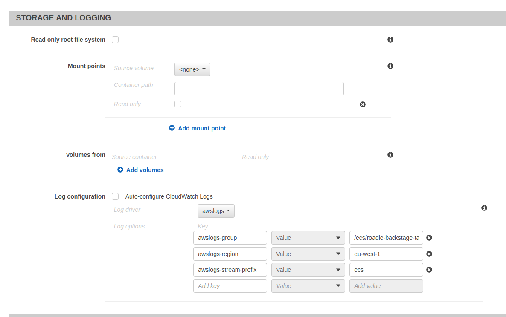


That is all the configuration needed for the task definition for now. 


Final step to start up these tasks is to create an ECS service within our cluster that points to the task definition we have created. We'll navigate back to the cluster we have created and on the services tab click Create.

We'll select Fargate launch type and pick our just created task definition. The Platform Version is good to set as 1.4.0 since 'Latest' counterintuitively  actually points to '1.3.0'. We can leave deployments to be a rolling update for now and Task Tagging config to be their default values.

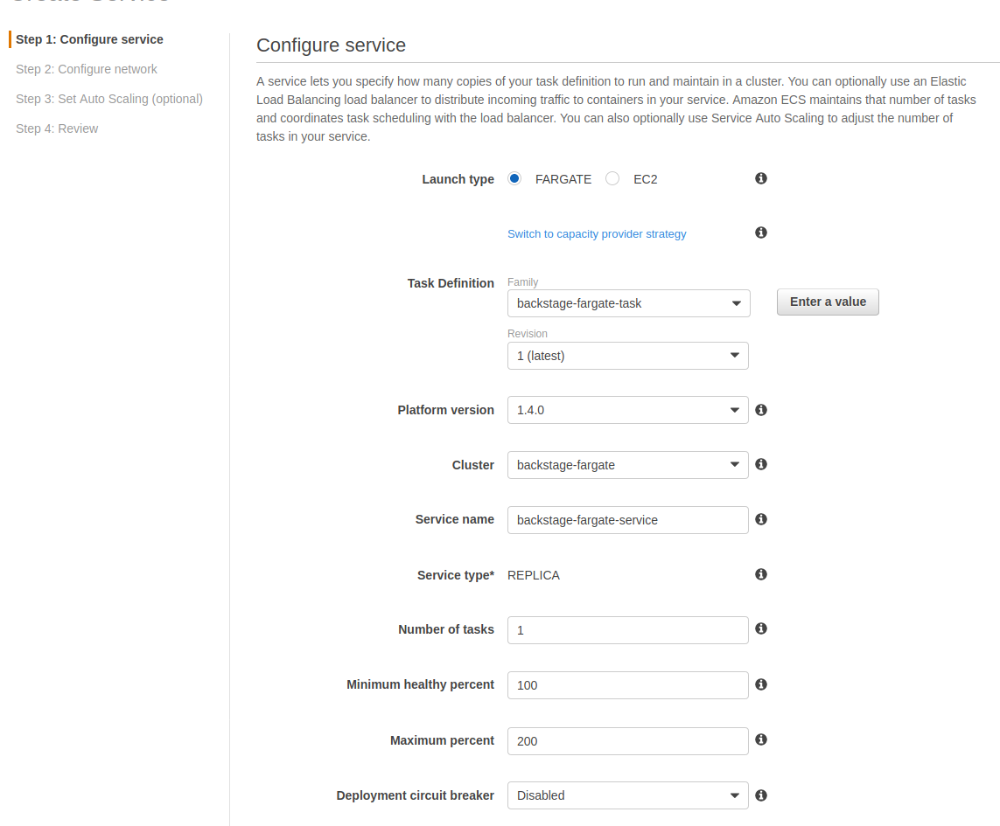


Next step on the wizard is the networking configuration. We'll choose our same VPC that our cluster, RDS and load balancer are and select few (or all, our LB supports all of them) of the subnets from the dropdown. We want to assign a public IP to the service in this case because we are accessing a regional AWS service, SSM Parameter Store and we don't have a VPC endpoint set up for it. 

We will create one more security group for this service. The security group doesn't really need to accept traffic from anywhere else than our load balancer. It is good a practice to keep the firewall as secure as possible, so we'll configure the new security group only to allow access to port 7000 and from only one source group, our load balancer security group.

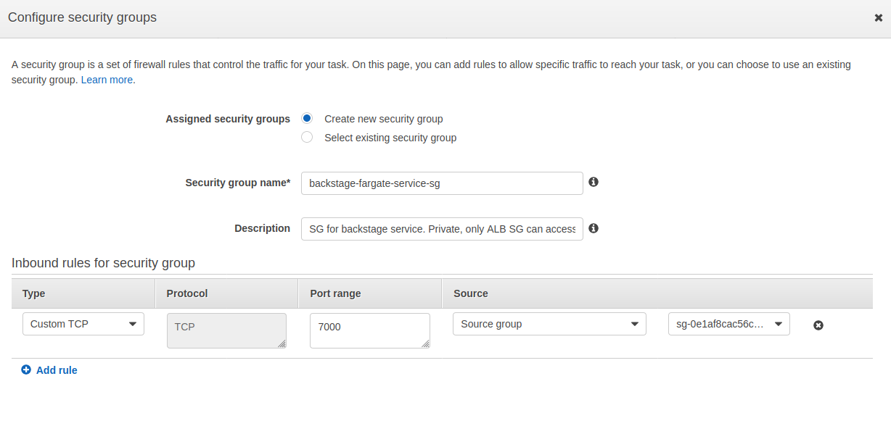

Note that AWS doesn't really make UX around this too easy by deciding to display security group ids only. You need to navigate to either security groups in the VPC console or directly to your Load Balancer to see what the id of the security group is.


Now that our security group allows access from our load balancer, we can click the radio button selection on the Load Balancing section to be Application Load Balancer. We select our load balancer from the drop down, select our container from the second drop down and add that to be balancer. Most of the values are autopopulated for us. We'll choose our created target group and let ECS to register the service as a target to it.

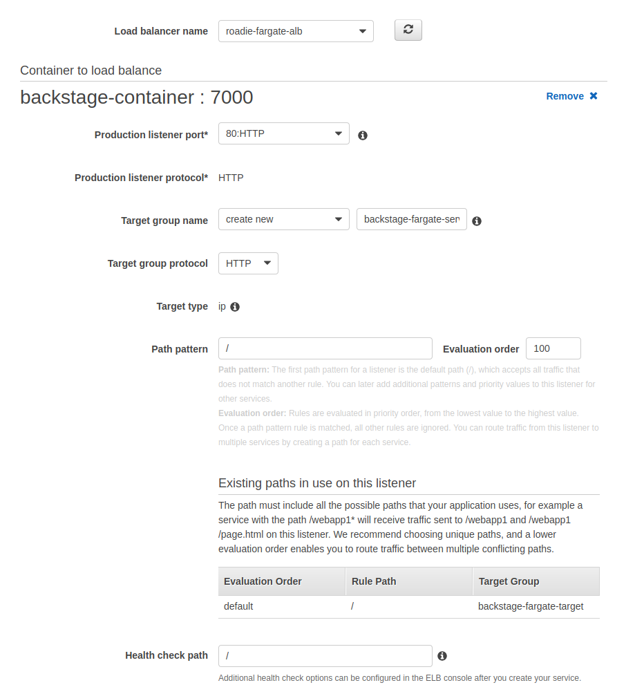


The rest of the settings we can leave as defaults and just click through the wizard. ECS will automatically start spinning up our service. When we can navigate to our ECS service and tasks tab we should be able to see ECS trying hard to provision our containers. 

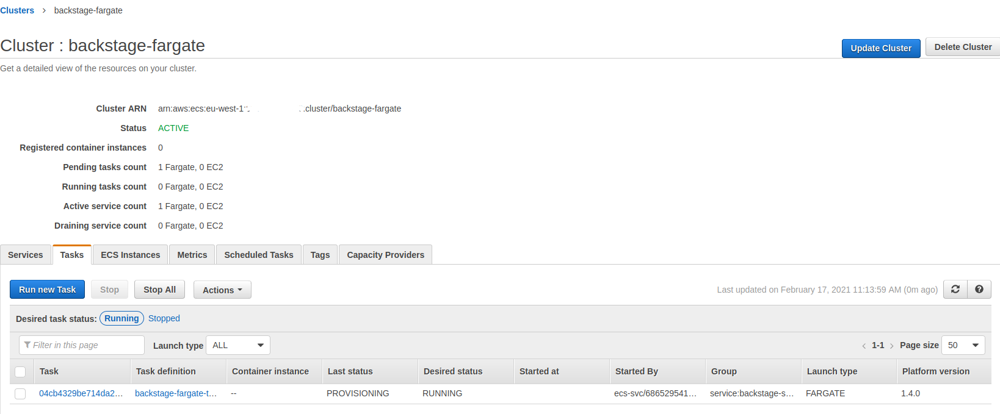

It will take few minutes before it reaches 'RUNNING' status. Unfortunately it doesn't seem to stay in 'RUNNING' status for too long and instead ends up in a loop of starting a new task and failing one after another. 

We can investigate and debug why the running container fails to stay up by checking [CloudWatch logs](https://eu-west-1.console.aws.amazon.com/cloudwatch/home?region=eu-west-1#logsV2:log-groups) that our task has written. In cases where the task doesn't start at all we can take a look at the task itself from the ECS pages to see what prevents it from starting. These could be something like IAM policy issues or perhaps a wrong URL to the image that we have defined.

When we take a look at the logs we can see that the container starts up and Backstage itself within the container tries its best to start up. It fails on Knex timeout error, telling us that Knex is unable to connect to the database.
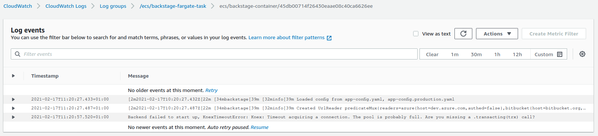

There is one thing we want to do to fix that. In the first step we spun up an RDS database and created a new security group for it. This security group does not allow our container to access the database, so we need to make some modifications to it. We can navigate to the security group via RDS and modify the inbound rules of it. We will add a new line allowing traffic to port `5432` from security group that we have created to our Fargate service. After clicking save, the change to the firewall is immediate, and the next task ECS spins up for us should be able to connect to the database and stay up and running.

And that should be it! 

We can now navigate to our load balancer URL and we should be seeing a running Backstage instance with default data scaffolded for us. 

## Conclusion


Setting Backstage up and running on AWS Fargate requires multiple steps and configurations but provides a secure and manageable Backstage instance after the initial configuration is done. 

