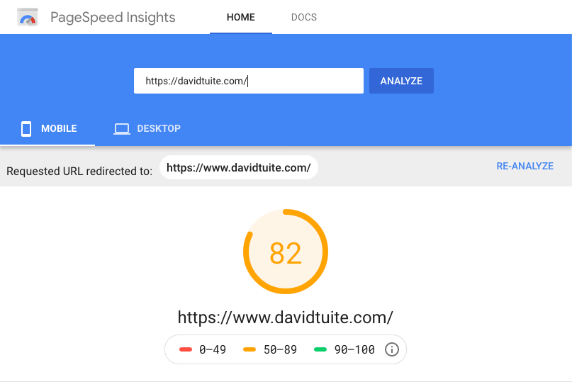
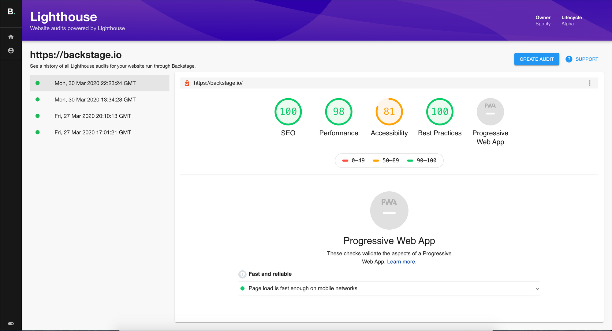
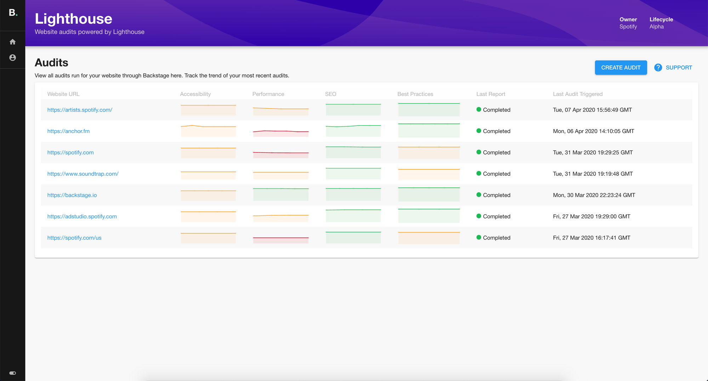
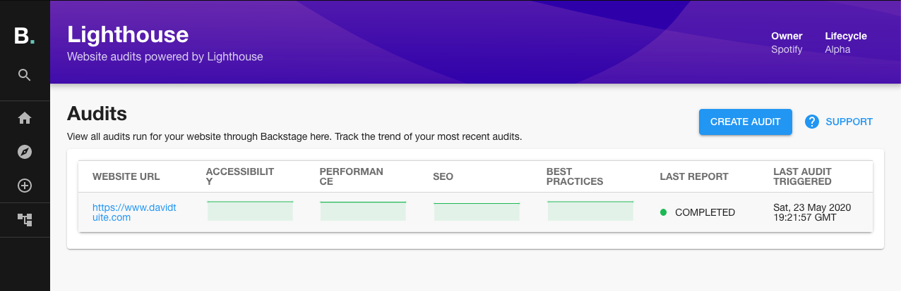

Lighthouse is an open-source, automated tool for improving the quality of web pages. You give it the URL of a web page, it loads the page and runs tests to check the page's quality.

You can use it via [the PageSpeed Insights website](https://developers.google.com/speed/pagespeed/insights/). Simply enter a URL in the box, hit Analyze, and a few seconds later you will have a quality score for the website behind the URL, information about how long the page took to load and some suggestions about what to do better.



You can also use Lighthouse via the Chrome DevTools, the command line and as a NodeJS module.

```shell
» npm install -g lighthouse
» lighthouse https://www.davidtuite.com/
```

## Lighthouse with Backstage

In your company, there may be many teams making websites for different purposes. It is useful to track the quality of these websites over time to ensure that code changes are not hurting performance or accessibility.

If customers complain that your website is slow, it can be helpful to look back over Lighthouse results to figure out if and when the performance drop occurred. You can then look at commits around this time to pinpoint the cause of the slowness.

Backstage has a Lighthouse plugin available which makes it easy to run tests against the websites your company produces.



You can track the results of Lighthouse tests over time to see if your site is performing better or worse as you make changes.



## Running Lighthouse with Backstage

To use Lighthouse with Backstage, you need three things:

1. A Backstage instance you can run locally with [the Lighthouse Plugin](https://github.com/spotify/backstage/tree/master/plugins/lighthouse) installed.
2. A running [Lighthouse microservice](https://github.com/spotify/lighthouse-audit-service) which actually executes the Lighthouse tests before sending the results back to the plugin.
3. A PostgreSQL database for the Lighthouse microservice to talk to.

Let's set them up in reverse order.

### PostgreSQL

Assuming you already have posgresql installed and running, you can easily create a database for Lighthouse with the following command. The database this creates will have no password but it's fine for local development.

```shell
» createdb -O [username] -U [username] -w lighthouse_audit_service
```

You can verify this database by logging into it with `psql`.

```shell
» psql -h localhost -p 5432 -U [username] -d lighthouse_audit_service
psql (11.5)
Type "help" for help.

lighthouse_audit_service=#
```

Fantastic.

### Lighthouse microservice

We're going to run the Lighthouse microservice with docker. We'll have to pass a few environment variables to our Docker run command. The easiest way to do this is by putting them in a file.

Create a file called `development.env` with the following variables.

```bash
LAS_PORT=3003
LAS_CORS=true
PGUSER=[username]
PGDATABASE=lighthouse_audit_service
PGHOST=host.docker.internal
```

- `LAS_PORT` tells the Lighthouse microservice which port to expose to incoming HTTP requests. It's important that this port matches the one defined in the Backstage Lighthouse plugin. Otherwise the plugin will never receive a response to its Lighthouse testing requests.
- `PGHOST` is important because our Lighthouse microservice is running inside Docker but our PG database is exposing a port on localhost. We have to use a [special Docker DNS name](https://docs.docker.com/docker-for-mac/networking/#use-cases-and-workarounds) to allow this.

With that file defined, we should now be able to run the Lighthouse microservice like this:

```shell
» docker run -p 3003:3003 -p 5432:5432 --env-file development.env spotify/lighthouse-audit-service:latest                                              130 ↵
yarn run v1.22.0
$ node ./cjs/run.js
info: building express app... {"service":"lighthouse-audit-service","timestamp":"2020-05-23T19:03:00.202Z"}
info: running db migrations... {"service":"lighthouse-audit-service","timestamp":"2020-05-23T19:03:00.290Z"}
info: listening on port 3003 {"service":"lighthouse-audit-service","timestamp":"2020-05-23T19:03:00.320Z"}
```

It might take a few seconds to start up when you run it for the first time because it will have to download the Docker container from the internet. When it starts, it automatically runs some database migrations to prepare your database.

### Backstage with the Lighthouse Plugin

Luckily for us, Backstage comes with the Lighthouse Plugin installed and enabled so it's easy to try it out.

Follow the [Getting Started Guide](https://github.com/spotify/backstage/blob/master/docs/getting-started/development-environment.md) to get Backstage installed.

If you open `packages/app/src/plugins.ts` in your favorite code editor you should see that the Lighthouse plugin is already installed.

```typescript
export { plugin as LighthousePlugin } from '@backstage/plugin-lighthouse';
```

In `packages/app/src/apis.ts` you should see that the Lighthouse plugin is configured to send requests to port `3003`.

```type
builder.add(lighthouseApiRef, new LighthouseRestApi('http://localhost:3003'));
```

Now, run Backstage with `yarn start` and visit `http://localhost:3000/lighthouse` and you should see the Backstage Lighthouse interface.



Awesome! If you run an audit a few times on the same website you can see the trend over time. Perfect for ensuring that your websites are staying responsive and accessible.
