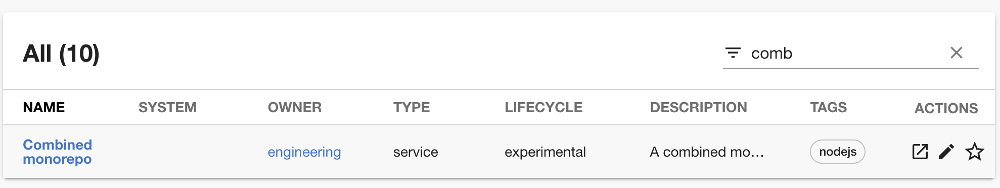
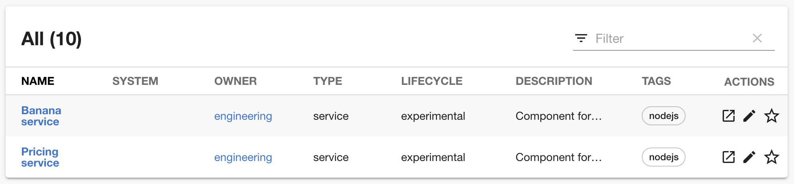
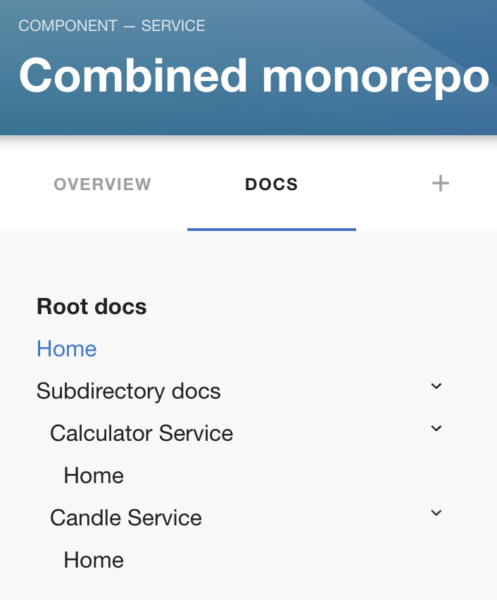
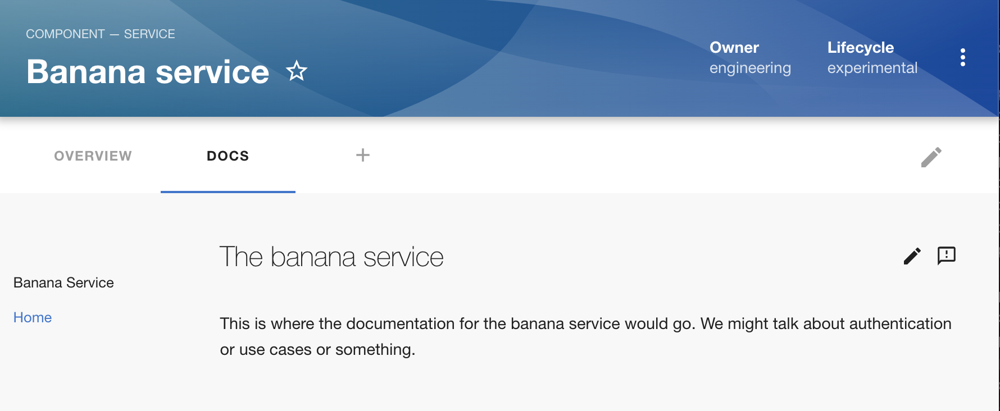

We've been onboarding an increased number of awesome engineering organisations to our SaaS Backstage platform recently, and one question comes up again and again... "Does Backstage support monorepos?"

The good news is that Backstage does support monorepos. In fact, there are multiple different ways to represent monorepos in Backstage, each with its own setup, benefits and drawbacks. This post will teach you everything you need to know to get your monorepo code loaded and represented the way you want.

This post will be applicable whether you're using the Roadie hosted Backstage platform or self-hosted Backstage.

## Combined vs Split monorepo representations

There are two approaches to treating monorepos in Backstage. Combined and Split monorepos. 

### Combined monorepos

Combined monorepos present as a single entity in Backstage. When you look at your Backstage catalog, you'll see one row to represent the monorepo, regardless of the number of sub-components contained within.

 It will only have one Backstage metadata file and one set of TechDocs which describe the entire monorepo.



### Split monorepos

Split monorepos treat each component of the monorepo as an individual Backstage entity. A split monorepo will have multiple associated catalog entries, one for each sub-component within the monorepo. It will contain many Backstage metadata files and many sets of TechDocs.



## Which option should I use?

Combined monorepos make sense when the entire monorepo is owned by a single team. The Backstage project itself is perhaps a good example of this. It's a relatively large monorepo but it's owned by a single team of maintainers. 

The combined monorepo has a single place in Backstage to find the documentation for all of the sub-components. if the components are tightly coupled or frequently used together, this approach might make it easier to browse all of the docs at once.

Split monorepos make sense when different components within the monorepo are owned by different teams. For example, a monorepo which co-locates many different backend services which expose different HTTP APIs and are owned by different teams within a company.

Split monorepos also make more sense when each component in the monorepo exposes its own HTTP API spec. 

#### Summary

- Use combined monorepos when the monorepo contains tightly coupled components, all which expose one or zero HTTP APIs, and are owned by a single team.
- Use split monorepos when the monorepo contains loosely coupled components which each have their own HTTP API and their own owners.

## Setting up your YAML files

### Combined monorepo setup

The combined monorepo representation is easier to set up in Backstage because it requires less YAML configuration.

Simply create a top level `catalog-info.yaml` file, of the `Component` kind, in the root of the monorepo. Name it after the monorepo.

```yaml
---
apiVersion: backstage.io/v1alpha1
kind: Component
metadata:
  name: combined-monorepo
  description: All our components represented as a monorepo
  annotations:
    github.com/project-slug: RoadieHQ/sample-combined-monorepo
spec:
  type: service
  owner: engineering
  lifecycle: production
```

Here's a [public GitHub repository](https://github.com/RoadieHQ/sample-combined-monorepo) which demonstrates this setup.

### Split monorepo setup

The split monorepo setup uses a single metadata file with the `Location` kind in the root of the monorepo, and many metadata files with `Component` kind in the subdirectories. The `Location` acts as a pointer to each of the components in the sub-directories, insuring they can be managed from a single location.

Assuming we have a monorepo structure something like this:

```
.
└── services
    ├── banana-service
    │   └── src
    └── pricing-service
        └── src
```

Then we would create one metadata file for each component and co-locate it with the component code. In this example they are called `backstage.yaml` files.

```
.
└── services
    ├── banana-service
    │   ├── backstage.yaml
    │   └── src
    └── pricing-service
        ├── backstage.yaml
        └── src
```

Then we would create a metadata file containing a `Location` at the root of the repo:

```yaml
---
apiVersion: backstage.io/v1alpha1
kind: Location
metadata:
  name: split-monorepo
spec:
  type: url
  targets:
    - ./services/pricing-service/backstage.yaml
    - ./services/banana-service/backstage.yaml
```

Using this setup, each team can independently manage their own `backstage.yaml` files and individual components can be added or removed from the Backstage catalog simply by updating the `catalog-info.yaml` file in the root of the monorepo.

Here's an example of a [monorepo set up with the split monorepo representation](https://github.com/RoadieHQ/sample-split-monorepo).

## Using TechDocs in monorepos

TechDocs is used slightly differently in each of the two possible representations, and the results can be quite different.

### Combined monorepo representation

The combined monorepo representation makes use of the [mkdocs-monorepo-plugin](https://github.com/backstage/mkdocs-monorepo-plugin) created by Spotify. This plugin supports having multiple sets of MkDocs TechDocs within one monorepo. 

Within Backstage, the TechDocs automatically render with a nested sidebar so the reader can browse through the documentation for each component in one place. Here we can see two services, the calculator and candle service, represented in the documentation of the Combined monorepo.

<div class="max-w-xs">



</div>

To set up TechDocs in the combined monorepo fashion, create a `docs` directory and `mkdocs.yml` file in the sub-directory of each component.

```
├── services
    ├── calculator-service
    │   ├── docs
    │   ├── mkdocs.yml
    │   └── src
    └── candle-service
        ├── docs
        ├── mkdocs.yml
        └── src
```

The markdown documentation files live in each `docs` directory and the `mkdocs.yml` file points to them as normal.

```yaml
# Note: Whitespace is not currently supported in this site_name
site_name: calculator-service

nav:
  - Home: index.md

plugins:
  - techdocs-core
```

To create the nested sidebar effect, create one more `mkdocs.yml` file in the root of the monorepo, at the same level as the `catalog-info.yaml`.

In it, include the `monorepo` plugin and use the `!include` directive to pull in each of the `mkdocs.yml` files in the sub-directories.

As a bonus, you can also reference mardown files in a `docs` directory at the root of your monorepo, as we are doing below. These root level might be a good place to talk about the nature of the monorepo and the components contained within.

```yaml
site_name: Root docs

nav:
  - Home: index.md
  - Subdirectory docs:
    - Calculator Service: '!include ./services/calculator-service/mkdocs.yml'
    - Candle Service: '!include ./services/candle-service/mkdocs.yml'

plugins:
  - monorepo
  - techdocs-core
```

Lastly, add the `techdocs-ref` annotation to the `catalog-info.yaml` file in the monorepo.

```yaml
---
apiVersion: backstage.io/v1alpha1
kind: Component
metadata:
  name: combined-monorepo
  description: A combined monorepo
  annotations:
    # ..
    backstage.io/techdocs-ref: dir:.
spec:
  type: service
  owner: engineering
  lifecycle: experimental
```

### Split monorepo representation

As we saw in the introduction, the split monorepo representation results in each monorepo component having its own entity in Backstage. As you can imagine, each component gets its own set of TechDocs, just like a non-monorepo component would.



To set up docs in the split monorepo fashion, simply create an `mkdocs.yml` file and `docs` directory in the sub-directory of each component.

```
.
└── services
    ├── banana-service
    │   ├── backstage.yaml
    │   ├── mkdocs.yml
    │   ├── docs
    │   └── src
    └── pricing-service
        ├── backstage.yaml
        ├── mkdocs.yml
        ├── docs
        └── src
```

The markdown documentation files live in each `docs` directory and the `mkdocs.yml` file points to them as normal.

```yaml
site_name: Pricing Service

nav:
  - Home: index.md

plugins:
  - techdocs-core # required to style your docs like Backstage
```

Don't forget to add the `techdocs-ref` annotation to each `backstage.yaml` file.

```yaml
apiVersion: backstage.io/v1alpha1
kind: Component
metadata:
  name: pricing-service
  title: Pricing service
  description: Component for Pricing service
  annotations:
    # ...
    backstage.io/techdocs-ref: dir:.
spec:
  type: service
  owner: engineering
  lifecycle: production
```

## Conclusion

Whether you end up using the combined or split monorepo representation, Backstage can certainly support your needs.

Have you got other tips for using monorepos with Backstage? We'd love to mention them here and credit you. Please email [support@roadie.io](mailto:support@roadie.io) with your ideas.
