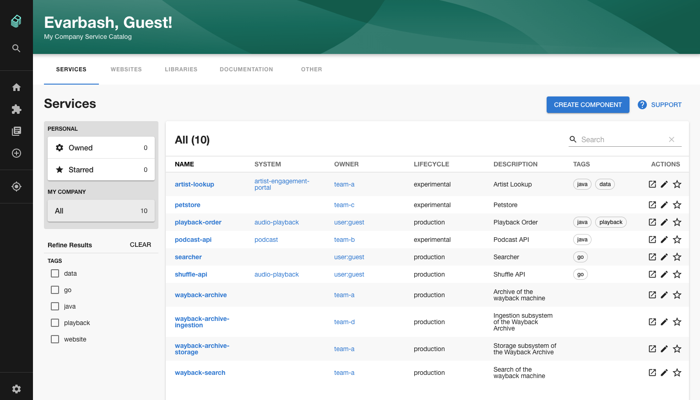

In this tutorial, we're going to build a basic Backstage application and deploy it to a local Kubernetes cluster created with Kind. The application will be able to store data, such as the services in the Backstage catalog, in an in-memory Sqlite3 database.

## Prerequisites

To complete this tutorial, you will need:

- [Docker](https://docs.docker.com/get-docker/) and installed and running on your local machine.
- [NodeJS](https://nodejs.org/en/) installed on your local machine.
- The [Yarn package manager](https://classic.yarnpkg.com/en/docs/install/#mac-stable) installed. You can use `npm` if you like, although you will have to modify the shell commands somewhat.
- The [KIND](https://kind.sigs.k8s.io/docs/user/quick-start/) Kubernetes cluster manager installed. You can skip this requirement if you already have a Kubernetes cluster which you wish to install Backstage into.
- The Kubernetes `kubectl` command line tool, for interfacing with the cluster we will create.

## Step 1 - Scaffold a Backstage application

To run Backstage on Kuberentes, we first need to scaffold a Backstage application to work with. The main Backstage codebase does ship with a sample application we can run, but best practices dictate that we should create our own so we can customize it with our company name and other attributes.

Backstage requires a database to store information about the components, websites and other entities you want to track in the catalog. There are two built in database options, Sqlite and PostgreSQL. We're going to use Sqlite3 for this tutorial.

It is simpler and quicker to get set up with Backstage and Sqlite3. The downside is that our data will be stored in memory, and will be lost if we upgrade or restart our Backstage instance or Kubernetes pod.

This tutorial uses version `0.3.7` of the Backstage CLI to create this application. You may see different results if you're using a different version.

```bash
npx @backstage/create-app --version
npx: installed 67 in 5.094s
0.3.7

npx @backstage/create-app
npx: installed 67 in 4.944s
? Enter a name for the app [required] scaffolded-app-sqlite
? Select database for the backend [required] SQLite

Creating the app...

 Checking if the directory is available:
  checking      scaffolded-app-sqlite ✔

 Creating a temporary app directory:
  creating      temporary directory ✔

 Preparing files:
  templating    .gitignore.hbs ✔
  copying       .eslintrc.js ✔
  copying       app-config.production.yaml ✔
  templating    app-config.yaml.hbs ✔
  templating    catalog-info.yaml.hbs ✔
  copying       README.md ✔
  copying       lerna.json ✔
  templating    package.json.hbs ✔
  copying       tsconfig.json ✔
  copying       .eslintrc.js ✔
  copying       Dockerfile ✔
  copying       README.md ✔
  templating    package.json.hbs ✔
  copying       index.test.ts ✔
  copying       index.ts ✔
  copying       types.ts ✔
  copying       app.ts ✔
  copying       auth.ts ✔
  copying       catalog.ts ✔
  copying       proxy.ts ✔
  copying       scaffolder.ts ✔
  copying       techdocs.ts ✔
  copying       .eslintrc.js ✔
  copying       cypress.json ✔
  templating    package.json.hbs ✔
  copying       apple-touch-icon.png ✔
  copying       android-chrome-192x192.png ✔
  copying       favicon-16x16.png ✔
  copying       favicon-32x32.png ✔
  copying       favicon.ico ✔
  copying       index.html ✔
  copying       manifest.json ✔
  copying       robots.txt ✔
  copying       safari-pinned-tab.svg ✔
  copying       .eslintrc.json ✔
  copying       app.js ✔
  copying       App.test.tsx ✔
  copying       App.tsx ✔
  copying       LogoFull.tsx ✔
  copying       LogoIcon.tsx ✔
  copying       apis.ts ✔
  copying       index.tsx ✔
  copying       plugins.ts ✔
  copying       setupTests.ts ✔
  copying       sidebar.tsx ✔
  copying       EntityPage.tsx ✔

 Moving to final location:
  moving        scaffolded-app-sqlite ✔

 Building the app:
  executing     yarn install ✔
  executing     yarn tsc ✔

🥇  Successfully created scaffolded-app-sqlite

See https://backstage.io/docs/tutorials/quickstart-app-auth to know more about enabling auth providers
```

## Step 2 - Building a Docker image

Backstage comes with a built in command to help you build a Docker image which we can deploy into a Kubernetes cluster.

Change into the `scaffolded-app-sqlite` directory which we just created, and use `yarn` to run a command which will build the Docker image.

```bash
yarn build-image
yarn run v1.22.10
$ yarn workspace backend build-image
$ backstage-cli backend:build-image --build --tag backstage
# Lots of output omitted...
=> => naming to docker.io/library/backstage                                                                                                                                                                                                                                                                                                                                            0.0s
✨  Done in 177.33s.
```

We should now see that an image has been built successfully.

```bash
docker images                                                                                                                                                                                                                                                                                                                                                                                                                                       1 ↵
REPOSITORY         TAG       IMAGE ID       CREATED         SIZE
backstage          latest    7b452013e713   3 minutes ago   1.1GB
```

And we can run it using Docker directly.

```bash
docker run -p 7000:7000 backstage
2021-01-31T16:41:18.319Z backstage info Initializing http server
2021-01-31T16:41:18.322Z backstage info Listening on :7000
```

Open [http://localhost:7000](http://localhost:7000) in your browser to check that Backstage is working correctly.



## Step 3 - Create a KIND Kubernetes cluster

Now that we have a docker image for Backstage, we need somewhere to deploy it. In this tutorial, we are going to deploy our image to a local development cluster created with [KIND](https://kind.sigs.k8s.io/docs/user/quick-start/).

Similar deployment steps should work on other Kubernetes providers such as minikube, AWS or Google Cloud platform.

Use `kind` to create a Kubernetes cluster to work with. We need some special settings on our cluster so we can configure ingress in the cluster with Nginx. Use [this snippet from the KIND docs](https://kind.sigs.k8s.io/docs/user/ingress/).

```bash
kind create cluster
Creating cluster "kind" ...
 ✓ Ensuring node image (kindest/node:v1.19.1) 🖼
 ✓ Preparing nodes 📦
 ✓ Writing configuration 📜
 ✓ Starting control-plane 🕹️
 ✓ Installing CNI 🔌
 ✓ Installing StorageClass 💾
Set kubectl context to "kind-kind"
You can now use your cluster with:

kubectl cluster-info --context kind-kind
```

Once this completes, your `kubectl` command line utility should be automatically configured to use this newly created cluster.

```bash
» kubectl config get-contexts                                                                                                                                                                                                                                                            130 ↵
CURRENT      NAME           CLUSTER        AUTHINFO       NAMESPACE
*            kind-kind      kind-kind      kind-kind
```

The backstage Docker image we built previously is not automatically shared with our KIND kubernetes cluster. Before we can use it, we have to load it into the cluster. This is covered in [the Kind docs](https://kind.sigs.k8s.io/docs/user/quick-start/#loading-an-image-into-your-cluster).

```
kind load docker-image backstage:latest
Image: "backstage:latest" with ID "sha256:fe0c8bf5323b46fc145cab5832e6df4d7871d1cfd230e497d025e5bb5bdd2c05" not yet present on node "kind-control-plane", loading...
```

Now that the image is loaded, we can create a Backstage deployment and a service to expose it on an IP inside the cluster. Save the following YAML into a file called `manifest.yaml`.

```yaml
apiVersion: apps/v1
kind: Deployment
metadata:
  name: backstage
spec:
  replicas: 1
  selector:
    matchLabels:
      app: backstage
  template:
    metadata:
      labels:
        app: backstage
    spec:
      containers:
        - name: backstage
          imagePullPolicy: Never
          image: docker.io/library/backstage:latest
          ports:
            - containerPort: 7000
---
kind: Service
apiVersion: v1
metadata:
  name: backstage-service
spec:
  selector:
    app: backstage
  ports:
    - port: 7000
```

You'll notice that we have set the `imagePullPolicy` to `Never`. This prevents a problem where kubernetes will attempt to find a new version of the backstage docker image on the network, instead of using the one we loaded onto the cluster earlier. This cluster has no network access and thus, without setting `imagePullPolicy: Never`, our deployment would fail.

We apply this change to the cluster with the following command.

```bash
kubectl apply -f manifest.yaml
```

We can double-check that the change was applied successfully by inspecting our backstage Kubernetes pod.

```bash
kubectl get pods
NAME                         READY   STATUS    RESTARTS   AGE
backstage-64d46b7886-r7l7r   1/1     Running   0          8m14s
```

We know this is running successfully because the STATUS is `Running`.

## Step 4 - Access Backstage in the browser

Our local KIND kubernetes cluster doesn't provide a way to access Backstage from our local machine, which is outside the cluster.

To work around this, we will have to forward a port inside the cluster, to one on our local machine. To do this, we will use the built in port forwarding feature of `kubectl`.

```
kubectl port-forward backstage-64d46b7886-4rdtp 7000:7000
```

As before, open [http://localhost:7000](http://localhost:7000) in your browser to view Backstage. It looks like nothing has changed, but this page is being rendered inside our Kubernetes cluster and exposed to the browser.


## Conclusion

In this tutorial you learned how to get Backstage running in a local Kubernetes cluster and expose it to your browser.
