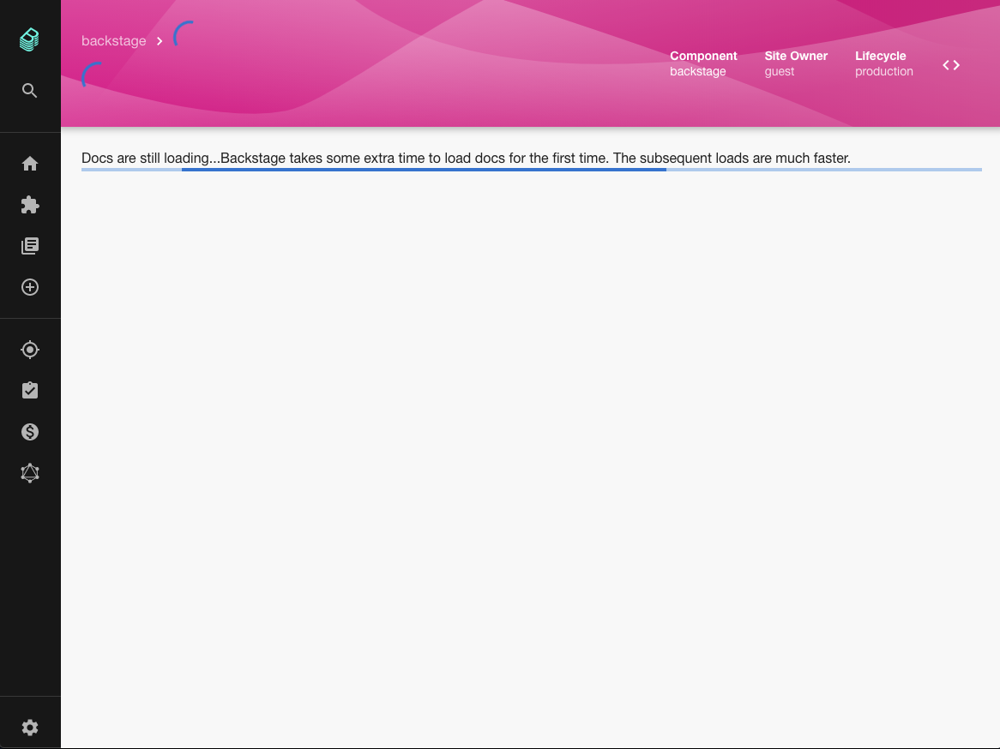
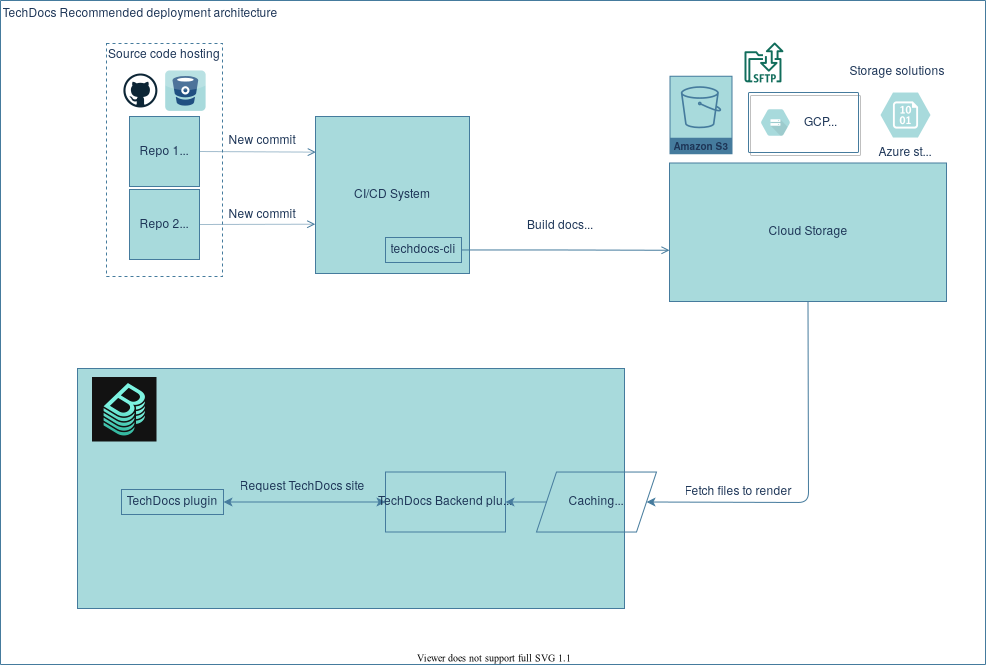

The TechDocs team have produced a [useful document](https://backstage.io/docs/features/techdocs/architecture) which discusses the pros and cons of various TechDocs generation architectures and explains their roadmap for the next 6 months.

Currently, only a development setup for TechDocs is available but the team are working to productionize it and the improvements they have in the pipeline look great.

Documentation served by Backstage is generated from markdown files which [live in the code repository along side your code](https://backstage-weekly.roadie.io/issues/roadie-s-backstage-weekly-internal-docs-that-actually-help-290463). In the standard development setup these docs are served from the local filesystem of the Backstage instance. This works, but isn't ideal for a production setup because it leads to slow page loads for end users. 🐌

That first-pass conversion of docs from markdown to HTML can take quite a bit of time. In the development setup, markdown to HTML conversion happens when the first request to view the docs is sent to the Backstage server. For one anecdotal data point, my demo Backstage instance takes 1 minute and 22 seconds to render the Backstage docs in Backstage.

If your docs see frequent changes, your users will spend a lot of your time staring at loading spinners on this page:

The development TechDocs setup also prevents the efficient usage of multiple Backstage backend instances. Generating docs and storing them on the local filesystem of instance 1 will not help any requests that happen to be routed to instance 2. Instead, the first request for the docs which hits the second instance will re-generate the docs and store them again. Of course, this results in the end user waiting on the loading page above for longer than they would like.

### Recommended production setup 🏃

To speed up docs loads, the TechDocs team is recommending that production Backstage setups generate docs by CI on each build and push them to a cloud storage solution like S3 or Azure storage. From there they can be more quickly retrieved by Backstage and served to users.

The Spotify TechDocs team are working hard to make this vision a reality. The main GitHub issues to follow if you want to keep up to date are:

1. Add support for different storage options [#3096](https://github.com/backstage/backstage/issues/3096)
2. Move techdocs build-processes out of the backend [#3400](https://github.com/backstage/backstage/issues/3400)
3. Add support for different CI providers [#3097](https://github.com/backstage/backstage/issues/3097)

By the way, the TechDocs team are collecting feedback about your use of docs in Backstage. Please help them help the community by filling out [this quick survey](https://docs.google.com/forms/d/e/1FAIpQLSdn5Vn3MQhCdyYRuW8cMzZkMQF0bFxXYN168gZRvESLfJWVVg/viewform).

### How Roadie can help

We believe that this is an area where Roadie can add a lot of value to Backstage. In total, a production TechDocs setup requires something like the following:

1. A CI job to be created for every code repo which wants to use the docs-in-code approach that Backstage supports.
2. Cloud storage set up with the correct permissions for security.
3. A caching layer near your Backstage instances for fast docs retrieval.
4. Elasticsearch for searching across docs ([like they do in Spotify](https://github.com/backstage/backstage/issues/1499)).

We're not there yet, but when you use Roadie, this should simply be a matter of installing our GitHub app in your repo. A webhook can then pick up docs changes and we'll handle the rest.

## Merged this week...

58 PRs were merged this week, here are the highlights...

### Automatic version bumping

The Backstage core team added 2 commands to the Backstage CLI last week - versions:bump and versions:check. These two CLI commands should really help out people who were having trouble keeping up with the fast pace of development on the Backstage project.

bump will automatically bump the versions of all Backstage dependencies in your application or plugin to latest. It can be used to easily stay on top of the latest releases without having to manually sift though `package.json` files.

The check command will detect duplicates of Backstage packages versions and them remove them if you pass the `--fix` flag.

### OIDC Auth Provider

[Brian Leathem](https://github.com/bleathem) from Netflix improved the auth story in Backstage by contributing a generic OpenID Connect provider. This improves on the existing Oauth2 authentication provider by adding the ability to retrieve the logged in users profile information from a dedicated endpoint. This allows Netflix to avoid the two-stage profile retrieval problem as described in [#1984](https://github.com/backstage/backstage/issues/1984).

### A new release went live

A fairly chunky release went out this week with search UX improvements, an improved CircleCI build table (thanks [Andrew Thauer](https://github.com/andrewthauer) from Wealthsimple) and the [Microsoft Graph API ingestor that we mentioned last week](https://roadie.io/blog/backstage-weekly-10-catalog-importer/).

## Roadie news

Our [JIRA plugin for Backstage](https://github.com/RoadieHQ/backstage-plugin-jira) has been released and already has a bunch of GitHub issues opened against it. 😆 Try it out if you want to quickly get an overview of the status of development on your services.

Our [catalog importer](https://github.com/backstage/backstage/pull/3121) has been merged to Backstage and should land in the next release. We think this is going to really help companies who are onboarding to Backstage. Look out for a post on [the Backstage blog](https://backstage.io/blog/) about this soon.
