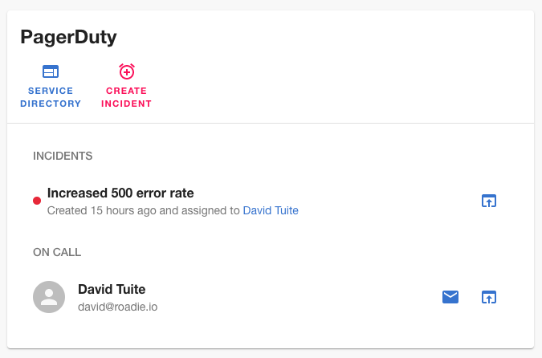
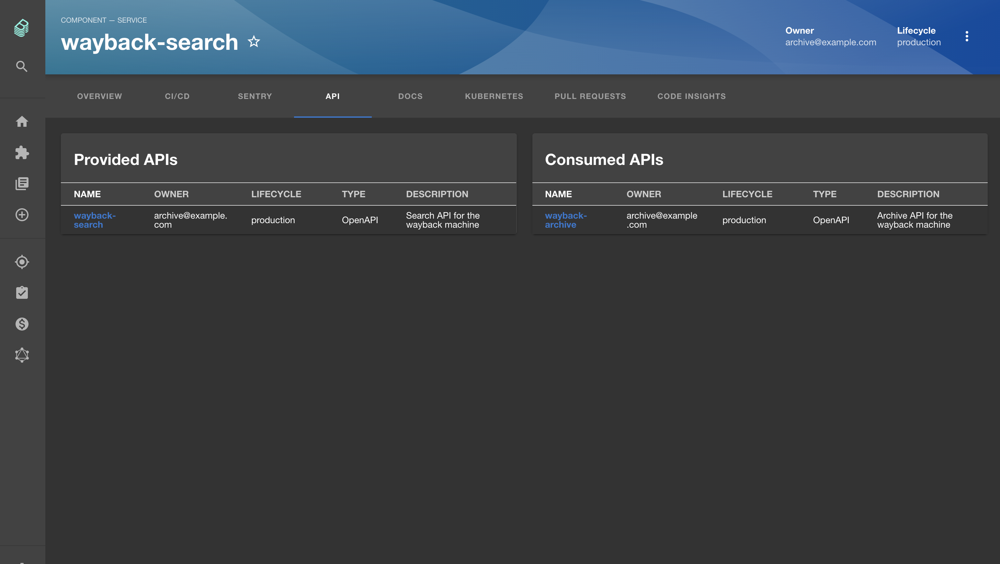
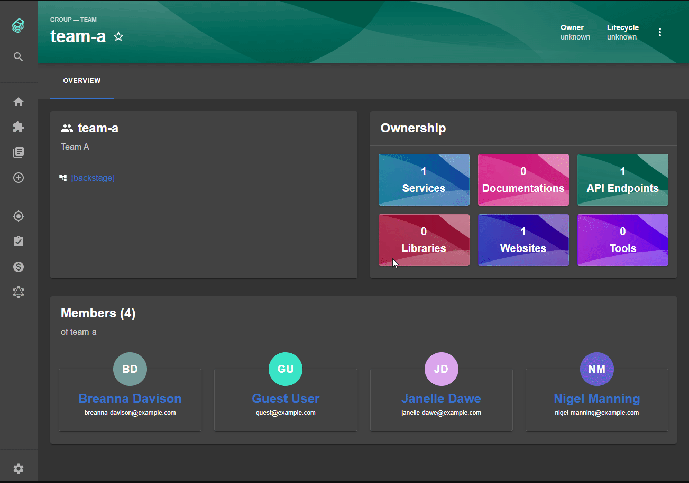
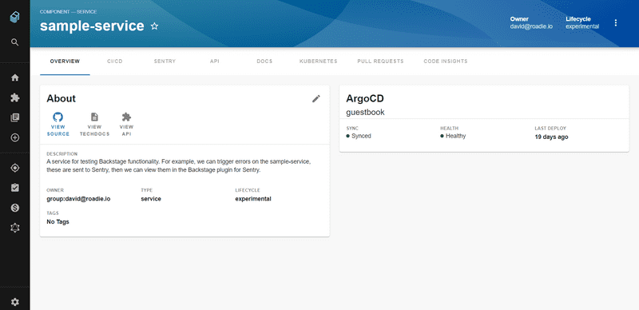

146 pull requests were merged in the last 2 weeks. Here are the highlights.

### Pagerduty plugin

One Backstage application which isn't often mentioned is its ability to help reduce Mean Time to Resolve (MTTR). When something goes down in production, frontline responders need to quickly determine what it is, who owns it and how to get their attention.

Spotify have open sourced a Pagerduty plugin to help with this. Once installed, anyone in the company can quickly search Backstage for a service and find out who is on call.

See the Pagerduty pull request for more info [#3317](https://github.com/backstage/backstage/pull/3317). We'll do a deeper dive into Backstage for ops in a future issue. 🚨

### API consumers and providers

Continuing with the scenario from above, once you've determined what is down and who owns it, the next question is often "what are the downstream dependencies of this thing?".

Backstage Weekly regular Oliver Sand has contributed some code which displays the consumers (and providers) of an API on the component page [#3479](https://github.com/backstage/backstage/pull/3479).

There are ongoing discussions about ways that this feature can be expanded to show a full graph of service dependencies.

### Org plugin

Of course, services and components are only half the story in Backstage. The other important aspect is... humans!

Last week, Roadie contributed some baby steps towards being able to visualize teams (aka. groups), their members, and the components they own inside Backstage.

In future, this will become the place to go to get the pulse of any team in your organization so you can easily understand who they are and what they're into.

### TechDocs external storage

We talked about production TechDocs architecture in [a previous issue](https://roadie.io/blog/backstage-weekly-11-techdocs-arch/) and explained that TechDocs would, in future, be able to store HTML docs in external storage such as S3 instead of the local filesystem.

Well... the future is now! Pull request [#3432](https://github.com/backstage/backstage/pull/3432) adds support for docs stored in Google Cloud Storage and lays the foundation for other solutions like AWS S3.

The Backstage docs have been updated so you can learn how to use this feature. See the updates to the [configuration docs](https://backstage.io/docs/features/techdocs/configuration) and the brand new docs for [using cloud storage](https://backstage.io/docs/features/techdocs/using-cloud-storage) to learn more.

### Sentry plugin updates

The Sentry plugin was long overdue an update and [Dominik Henneke](https://github.com/dhenneke) from SDA-SE delivered it in [#3532](https://github.com/backstage/backstage/pull/3532). The plugin now uses the standard backend proxy instead of a custom backend and just generally bring it inline with current best practices for Backstage plugins.

When you realize that the Jenkins plugin also got some love recently ([#3553](https://github.com/backstage/backstage/pull/3553)) you start to see the power of the open source community and understand the pace of development which occurs when we all work together.

## Roadie news

We've published an [open source ArgoCD plugin](https://roadie.io/backstage/plugins/argo-cd) which shows you the health of your deployments and the date of the most recent deployment. A number of enhancements like support for [multiple ArgoCD instances](https://github.com/RoadieHQ/backstage-plugin-argo-cd/issues/1) and [AppProjects](https://github.com/RoadieHQ/backstage-plugin-argo-cd/issues/2) are already planned.

