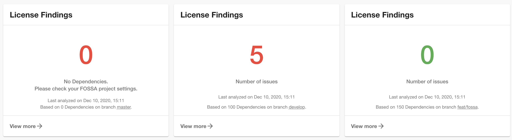

> This content was originally published on Roadie's Backstage Weekly newsletter. [Sign up here](https://backstage-weekly.roadie.io).

Backstage development slowed but didn't stop over the holidays so there is a lot to get through in our first week back.

A new year brings [an updated roadmap](https://backstage.io/docs/overview/roadmap) which covers development work through H1 2021.

Four items are currently in progress:

1. **API Stability and production readiness**. Once the APIs have matured a little, Backstage plugins should require less ongoing maintenance than they currently do.
2. **Native support for Kubernetes.** A developer oriented Kubernetes experience in Backstage will make it easier to see and manage your deployed services.
3. **Global search** will introduce a standardised API for indexing and retrieval so that users can bring their own search solution to Backstage.
4. **Scaffolder V2** will expand on the current functionality of the Scaffolder and Software Templates MVP to add composability and custom logic like webhooks and authorization. [Read the RFC here.](https://github.com/backstage/backstage/issues/2771)

There is also going to be an increased level of community engagement. 🤗 I'm especially looking forward to the new monthly Backstage meetup and Backstage hackathons which are due to kick off.

The year of Backstage is upon us!

## Merged over the holidays...

150 pull requests were merged in total. Here are the highlights.

### New inductions to the Hall of Fame

3 community members have been recorded as Friends of Backstage and given write access to the repo. [#3759](https://github.com/backstage/backstage/pull/3759)

1. [Dominik Henneke](https://github.com/dhenneke) from SDA-SE has been a consistent contributor for months now and has been mentioned multiple times in this newsletter.
2. [Adam Harvey](https://github.com/adamdmharvey) has been an absolute force in the community since he joined. Hardly a PR or GitHub issue goes by where Adam doesn't have something valuable to contribute to the conversation.
3. [Your humble newsletter author](https://github.com/dtuite) 👋 has been included in recognition of various code contributions, community engagement and plugin authorship.

### AWS integration wins

Two important integrations for AWS were merged recently.

[Rémi Doreau](https://github.com/ayshiff) has integrated Backstage with S3 storage so that generated documentation files can be stored there for rendering inside Backstage. It has only been a month or so since the core team delivered support for GCP storage. Backstage is cloud agnostic so other cloud providers are never far behind. [#3794](https://github.com/backstage/backstage/pull/3794)

[Jonah Back](https://github.com/backjo) from LegalZoom added the ability to automatically ingest a list of AWS accounts which are associated with your your organization. In future, Backstage could use this integration to slurp in data about the various AWS resources your company uses. [#3874](https://github.com/backstage/backstage/pull/3874)

### FOSSA Plugin

[Dominik Henneke](https://github.com/dhenneke) from SDA-SE has open-sourced their [FOSSA](https://fossa.com/) plugin. FOSSA is a service that scans dependencies for Open Source licensing issues. This plugin contains an API and a widget that shows the latest compliance status. [#3674](https://github.com/backstage/backstage/pull/3674)
(Image credit: @dhenneke on GitHub)

## Roadie news

We've had a 🚀 start to 2021 with two new people joining the team.

[Padraig O'Brien](https://github.com/padraigobrien) joins us as Director of Engineering to help co-ordinate our efforts to deliver an excellent SaaS Backstage experience.

[Jussi Hallila](https://github.com/Xantier) was previously a software architect and Head of Frontend engineering and will help to beef up our engineering team.

With these two new hires we'll be looking to increase our contribution rate so you can expect to see us around GitHub and Discord a lot.
