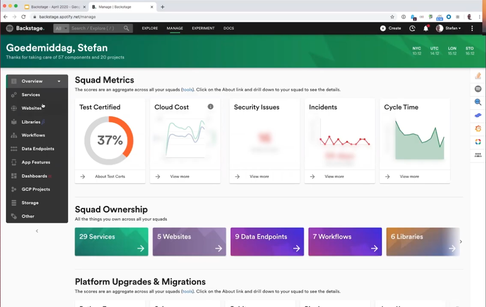
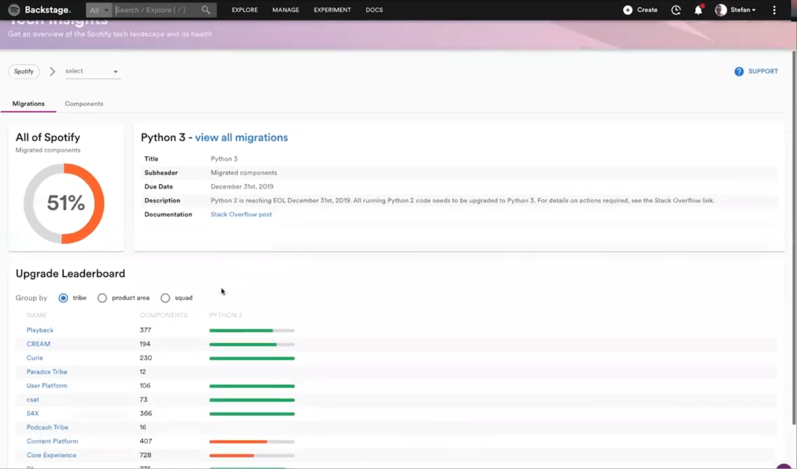

The one year anniversary of the first commit to open source Backstage is next week so I thought it would be fun to explore the remaining delta between Spotify's internal Backstage deployment and the OSS version we all know and love.

I went back through [this demo of the internal version](https://youtu.be/1XtJ5FAOjPk) from May 2020 and picked out 3 exciting features that the open source community hasn't yet delivered. Perhaps this will prophesize good things to come in 2021 🙏.

If you want to contribute a major feature to Backstage, some of these ideas could be a good place to start. Check out the [contributing guidelines](https://github.com/backstage/backstage/blob/master/CONTRIBUTING.md) to learn how to take that first step.

### Feature 1: The manage page

The manage page in internal Backstage is your personalized homepage where key information is displayed about the teams you are on and the services they own.

In the internal Backstage you can easily look up any squad (aka. team) in the company and get a sense of what they own and how they are tracking against important KPIs like Cloud Cost and Incident rate.

Work has started on [the ownership model](https://github.com/backstage/backstage/issues/4089) which supports this page and [parts of the UI layer](https://github.com/backstage/backstage/pull/3448) are merged. The bulk of the work is still ahead of us in OSS Backstage. 🔨

### Feature 2: Tech migrations

Sometimes it can feel like tech migrations are just never done. Internally, Spotify have used Backstage to gamify tech migrations so you can easily see what migrations are in progress and what's left to do.

Back in May 2020 it appears the Python 3 migration was 51% done. The Curie tribe had completed their part of the migration but the Core Experience tribe were lagging behind.

### Feature 3: Data & ML support

One thing that's clear from internal Backstage is that data is front and centre in Spotify. Backstage is the frontend into data pipelines and has features for creating data pipelines, health checking and even dependency mapping. They've even [built in their new experiment platform](https://engineering.atspotify.com/2020/10/29/spotifys-new-experimentation-platform-part-1/) on Backstage.

So far in OSS Backstage, data doesn't get much of a mention at all. Given the pace with which the importance of data skills is growing, there is huge potential for Backstage to play in this area.

## Merged last week..

78 pull requests were merged last week. Here are the highlights...

### Kubernetes plugin launch

The Backstage Kubernetes plugin got a big refresh and relaunch last week. The new UI brings a fresh take to the space by treating service teams, rather than infrastructure teams, as the primary customer. You can read [the official blog post](https://backstage.io/blog/2021/01/12/new-backstage-feature-kubernetes-for-service-owners) on the Backstage blog.

Congratulations to [Matthew Clarke](https://github.com/mclarke47) from Spotify who delivered this big milestone. [#3918](https://github.com/backstage/backstage/pull/3918)

### Systems, domains and resources

New types of catalog entities were added last week to help you accurately map your stuff.

- **Resources** are the infrastructure a component needs to operate at runtime like S3 buckets or CDNs. Modelling them alongside the components that use them allows for easier resource footprint visualization.
- **Systems** are collections of resources and components that expose one or more public APIs. Backstage itself is a system comprised of a frontend, backend, database and other components.
- **Domains** are collections of systems which share business purpose, KPIs or form some other type of bounded context. For example, the Payments domain likely exits inside many SaaS companies.

Learn more in [the docs](https://backstage.io/docs/features/software-catalog/system-model). The implementation was added by Oliver Sand in [#4033](https://github.com/backstage/backstage/pull/4033).

### Composability API docs

The plugin API is changing for the better and some docs have been merged to show us the path forward in [#4072](https://github.com/backstage/backstage/pull/4072). The purpose of the change is to provide clear boundaries and connections for plugins, isolate crashes within a plugin, and allow navigation between them.

These new docs cover the purpose of the change, the new API, migration steps and other interesting notes. Check them out [here](https://backstage.io/docs/plugins/composability).

## Roadie news

We have refreshed our most popular blog post to date. This tutorial walks you through [all the steps needed to get Backstage running with Docker Compose](/blog/backstage-docker-service-catalog/).
