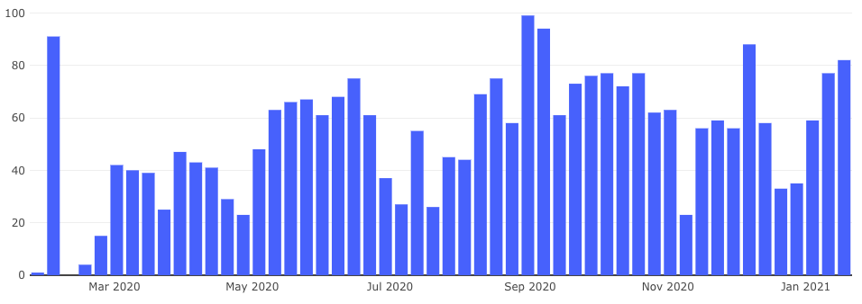
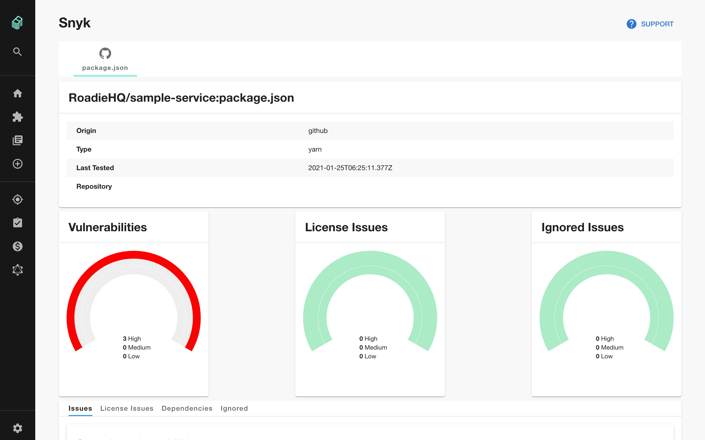
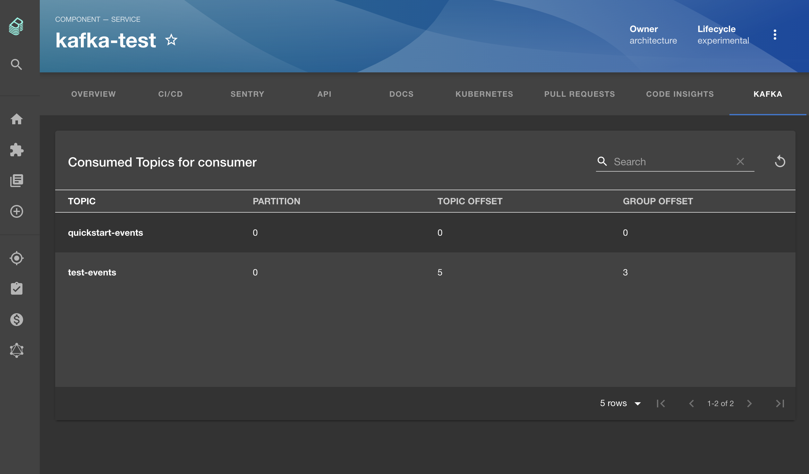

Today marks the one year anniversary of the [very first commit](https://github.com/backstage/backstage/commit/1a19a01c4beee7d869765a43d1b57b1b450017a7) to open source Backstage 🍾 Since then it has been... _busy_, with as many as 99 pull requests merged each week.

With more adoption, a bigger community and a strong direction, 2021 looks set to be an even bigger year. We can't wait to see what this awesome community produces.

## Merged last week...

82 pull requests were merged last week. Here are the highlights.

### New plugins: Snyk, Kafka and Opsgenie

This was a big week for new plugins with three additions to the plugin directory. Interestingly, all three plugins were contributed by non-Spotify engineering teams. More evidence that this community has critical mass.

[Snyk](https://snyk.io), the developer-first security company, released [their own Backstage plugin](https://github.com/snyk-tech-services/backstage-plugin-snyk/tree/main) this week. As far as I can tell, this is the first official corporate plugin to be built for Backstage.

The Snyk plugin lets you quickly see the number of vulnerabilities present in your services so you can start to understand the security story across your fleet. [#4213](https://github.com/backstage/backstage/pull/4213)

[Nir Gazit](https://github.com/nirga) from [Fiverr](https://www.fiverr.com/) merged the first parts of a [Kafka plugin](https://github.com/backstage/backstage/tree/master/plugins/kafka). The functionality is simple for now, the plugin lists the offset status of consumer groups for services that have a Kafka annotation. It's a welcome start and it provides a good foundation for others to build on. [#3985](https://github.com/backstage/backstage/pull/3985)

Last, but not least, [Kévin Gomez](https://github.com/K-Phoen) from electric scooter sharing company [VOI Technology](https://www.voiscooters.com/) contributed an [Opsgenie plugin](https://github.com/K-Phoen/backstage-plugin-opsgenie/). It supports tabs for alerts and incidents and an overview widget to show the latest alerts for a particular service. [#4227](https://github.com/backstage/backstage/pull/4227)

### New starts: GitHub Apps, Scaffolder V2 and Search roadmap

This week also brought some exciting new beginnings in the Backstage codebase.

GitHub Apps will make most GitHub <> Backstage integrations simpler and support more granular permissions. Thankfully, [Johan Haals](https://github.com/jhaals) from Spotify has begun the work in [#4058](https://github.com/backstage/backstage/pull/4058).

One of the Backstage features I'm most frequently asked about is the Scaffolder and the functionality it supports for creating new services. In [#3900](https://github.com/backstage/backstage/pull/3900), some parts of the existing Backstage Scaffolder have been deprecated to lay groundwork for Scaffolder V2. It's a small step but definitely pointed in the right direction.

A new [roadmap for Search in Backstage](https://backstage.io/docs/features/search/search-overview) has been added to the docs along with a proposal for production ready search architecture. Search improvements feature on the core roadmap for Backstage so we're expecting big improvements in this area [#4030](https://github.com/backstage/backstage/pull/4030).

## Roadie news

We got a shoutout on a recent episode of the [Kubernetes Podcast](https://kubernetespodcast.com/episode/134-cncf-and-linux-foundation/) thanks to friend of Roadie and CTO of the CNCF, Chris Aniszcyzk.

In the episode, Chris shares his technology journey and Cloud Native predictions for 2021.

<blockquote class="twitter-tweet">
Chris Aniszczyk (<a href="https://twitter.com/cra?ref_src=twsrc%5Etfw">@cra</a>) is the CTO of <a href="https://twitter.com/CloudNativeFdn?ref_src=twsrc%5Etfw">@CloudNativeFdn</a>, the Executive Director of <a href="https://twitter.com/OCI_ORG?ref_src=twsrc%5Etfw">@OCI_ORG</a>, and VP of DevRel at the <a href="https://twitter.com/linuxfoundation?ref_src=twsrc%5Etfw">@LinuxFoundation</a> .  Learn how he got into open source and what he foresees 🔮 for Cloud Native in 2021:  📃 <a href="https://t.co/aJBN85IOFs">https://t.co/aJBN85IOFs</a> 🔊 <a href="https://t.co/WMJExlQBuc">https://t.co/WMJExlQBuc</a> <a href="https://t.co/7EiROQMIoO">pic.twitter.com/7EiROQMIoO</a>
&mdash; Kubernetes Podcast from Google (@KubernetesPod) <a href="https://twitter.com/KubernetesPod/status/1351645570100822016?ref_src=twsrc%5Etfw">January 19, 2021</a></blockquote>

Roadie is hiring a remote JavaScript engineer who will work on our Backstage plugins and on Backstage directly. If you or someone you know would like to be paid to work on open source software then please, [apply here](https://roadie.io/careers/javascript-engineer/).
