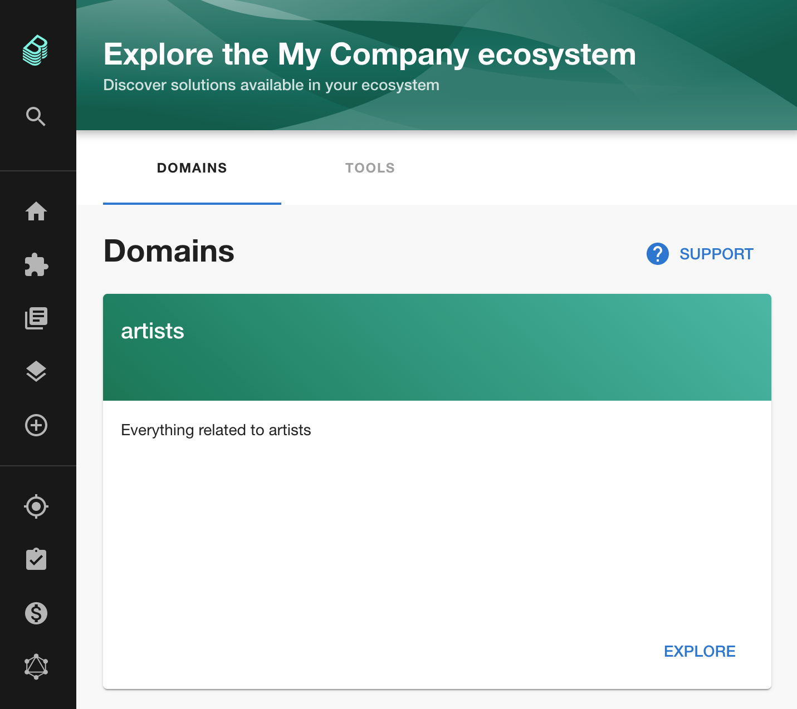
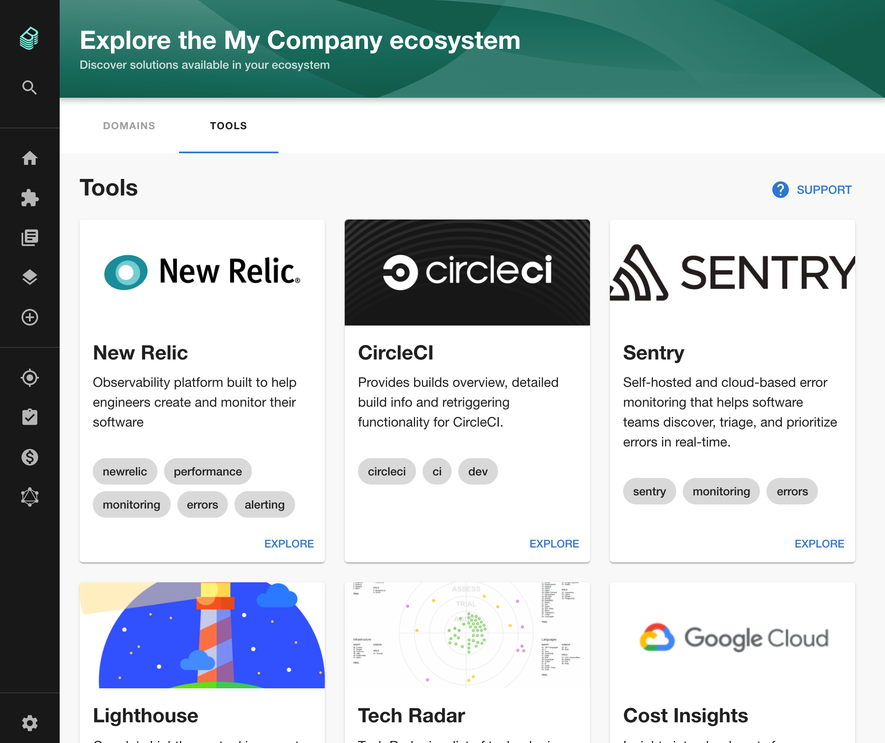
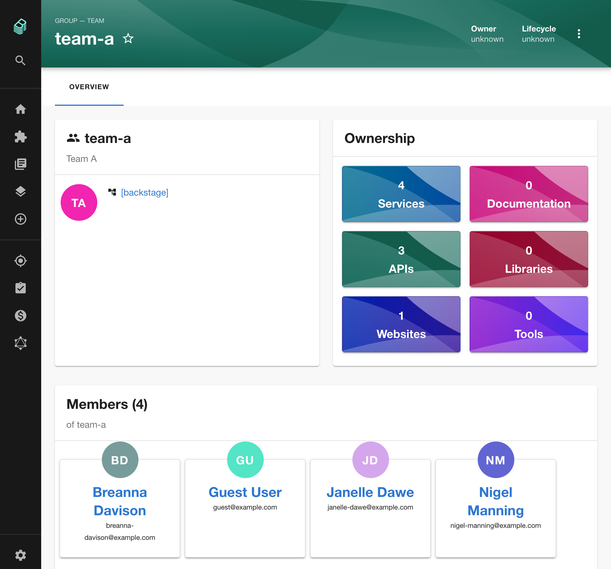

The first Backstage community meetup of 2021 has been announced on the new [Backstage community GitHub repo](https://github.com/backstage/community).

The meetup will take place on February 17th (just over a week from now) at 15:00 GMT on Zoom.

So far over 20 people have indicated their intention to come along. You can find Calendar links, the zoom meeting URL and other information on [this GitHub issue](https://github.com/backstage/community/issues/2). You can also suggest and vote on agenda items.

Roadie will be there in force and we'd ❤️ to see you there too.

## Merged last week

111 pull requests were merged in the past two weeks (there was no newsletter last Monday). Here are the highlights.

### Ecosystem explorer

[In mid-January we mentioned](https://roadie.io/blog/backstage-weekly-14-inernal-features/) that Systems, Domains and Resources had been added to Backstage as kinds of entities which could be modeled.

Last week, Oliver Sand from SDA-SE expanded on this feature to make Domains accessible through the Backstage UI. When you group your services into business domains, you should be able to step through them from this page to understand which services contribute to each business function. [#4165](https://github.com/backstage/backstage/pull/4165)

This PR also brings back the old Explore page in the form of Tools. Backstage users can use this to understand the various plugins that are available.

### Azure Storage support for TechDocs

[Vitor Grenzel](https://github.com/vitorgrenzel) from SSYS Sistemas added [#4017](https://github.com/backstage/backstage/pull/4017) to allow Backstage users to back their technical documentation off to Azure Storage. All the major cloud providers are now supported, Google, AWS and Azure.

Using external storage for TechDocs, rather than the local filesystem, means you can move towards a compile on write (rather than read) architecture and unlocks faster load times for documentation in Backstage.

### Team page is integrated

This may have happened at some point in the past and I just didn't notice it 😳 . Regardless, this is worth mentioning.

Catalog item ownership is now linked to groups of Backstage users, so you can click the owner of an entity to get some information about the team that created it.

In the screenshot below, you can see that team-a owns 4 services, 3 APIs and 1 website. There are 4 people on the team and their parent organisation is the Backstage org.

## Roadie news

We published a new blog post which runs though a [simple deployment of Backstage on Kubernetes.](https://roadie.io/blog/backstage-service-catalog-kubernetes/)

I demoed an upcoming Roadie feature in this tweet. We're building the ability to dynamically add and remove plugins to Backstage (this will include bespoke custom plugins in the future). Our goal is to make it possible to get set up with Backstage in less than 5 minutes. As the tweet says, feedback and suggestions are welcome.

<blockquote class="twitter-tweet">
Here&#39;s a quick demo of a Backstage feature we&#39;re working on at Roadie. Dynamic plugin installation and arrangement.  Feedback welcome! <a href="https://t.co/jNDHlwkMMa">pic.twitter.com/jNDHlwkMMa</a>
&mdash; Roadie HQ (@roadiehq) <a href="https://twitter.com/roadiehq/status/1356644531832250369?ref_src=twsrc%5Etfw">February 2, 2021</a></blockquote>
