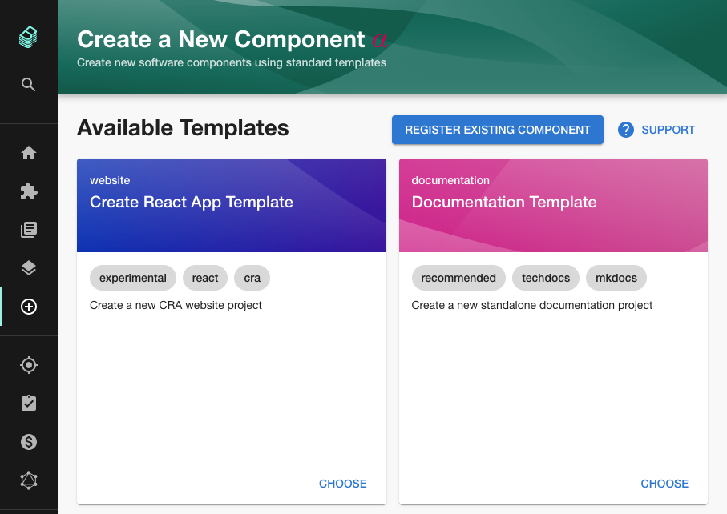
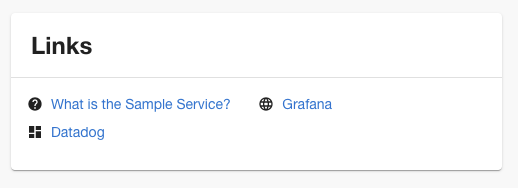

Engineering organisations often face a dilemma. When there is a lot of freedom to choose technologies and tools, the developer ecosystem ends up with high variability and few opportunities to optimize developer flows. On the other hand, if too much constraint is applied then innovation is stifled and creativity suffers.

Spotify addressed this problem by ensuring that the path to production consistency was also the path of least resistance for engineers who were just trying to get things done.

As part of this work, they developed the Scaffolder in Backstage. The scaffolder is a UI which collects metadata describing a new service and runs automation to create it with your organizations best practices baked in.

The existing alpha version of the open source Scaffolder can collect metadata and template a new GitHub repo into your account. This is great as an MVP, but it's about to get a lot more powerful.

Last week, Johan Haals from Spotify merged the [5th pull request](https://github.com/backstage/backstage/pull/4360) on the path towards getting the [scaffolder out of alpha](https://github.com/backstage/backstage/milestone/24).

You can read about the planned features and developer experience in [the RFC](https://github.com/backstage/backstage/issues/2771). The plans include:

1. A declarative, GitHub-Actions-like language for defining templates.
2. Template composability so users can use the TechDocs or monitoring setup steps in their Python backend API template and in their React website template.
3. Hooks for setting up CI pipelines, configuring projects or automatically setting branch protection rules.

Getting the scaffolder out of alpha is a Q1 goal for Spotify so we're looking forward to trying out these features soon.

## Merged last week

71 pull requests were merged last week. Here are the highlights...

### Rework the catalog import plugin

This pull request has 16 emoji's on it so you know it's a good one! ❤️

Dominik Henneke from [SDA SE](https://sda.se) took some early work that Roadie did to make it easier to add GitHub repos to Backstage and supercharged it so it's easier to use and covers more cases. The importer now has better monorepo support, a confirmation step to prevent mistakes and a refreshed UI which feels more natural. [#4271](https://github.com/backstage/backstage/pull/4271)

Here's a demo showing how it looks when adding a monorepo:

<iframe width="560" height="315" src="https://www.youtube.com/embed/7UmdZeaNni8" frameborder="0" allow="accelerometer; autoplay; clipboard-write; encrypted-media; gyroscope; picture-in-picture" allowfullscreen></iframe>

### Add entity links card component

This one seems simple, but can actually be quite powerful. We've all been in scenarios where something is down in production and there is a pertinent Grafana chart which could unlock the problem but nobody knows how to find it. 🚨

Entity links provide a simple solution to this problem by providing you with a way to tag your services with links to other locations. The next time the service goes down the relevant charts should be linked off it in Backstage. This could save vital minutes in an outage.

To use it, simply add some links to your `catalog-info.yaml` file and they will show up in Backstage.

Props to Andrew Thauer from [Wealthsimple](https://wealthsimple.com) for delivering this feature in chunks over the past few weeks.

## Roadie news

We are currently migrating all of our Backstage plugins to the new plugin composability API.

The AWS Lambda, ArgoCD, GitHub Insights, Security Insights, Buildkite and Firebase Functions plugins are done.

The Pull Requests, JIRA and TravisCI plugins are in progress and should be finished any day now.
