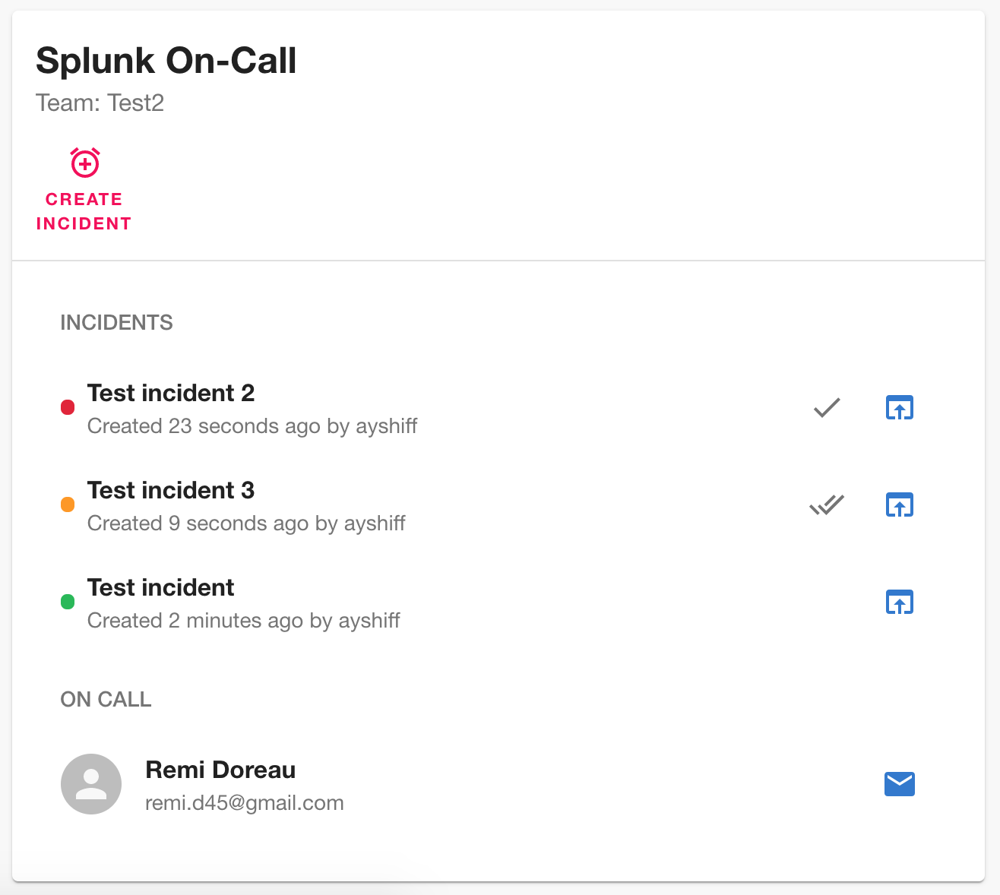
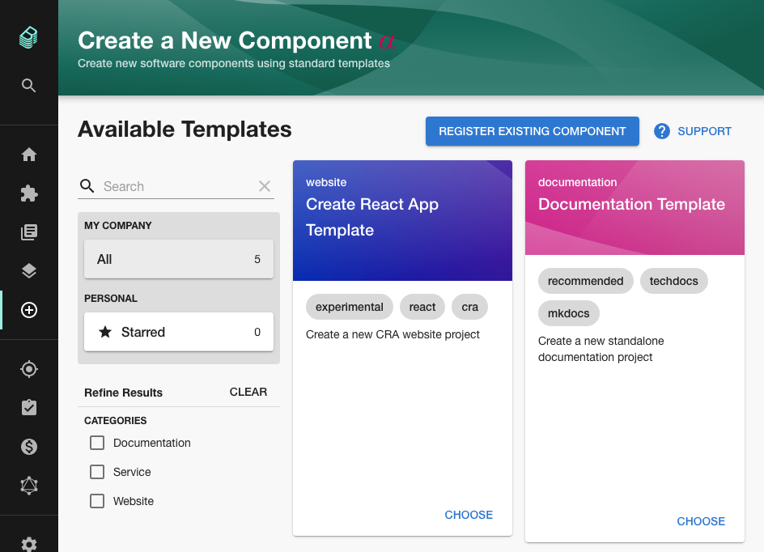

The first Backstage community session took place last Wednesday and was a resounding success. 117 people joined the core team on Zoom to hear Spotify explain the drivers behind the huge success of Backstage there.

We also got an update on recent progress against the roadmap and SDA SE spoke about how they are implementing Backstage to improve information sharing between insurance companies in Germany.

### How Spotify drove Backstage adoption

Spotify's Backstage journey began about 4 and a half years ago, in 2016. At the time, the company was growing rapidly and experiencing productivity issues as a result. Many new teams were formed and and a large number of new services were created. All this growth meant that discoverability was at an all time low.

Some engineers got together and asked themselves "how do we help and aid discoverability while empowering teams to move quickly". From this question, Backstage was born.

Once released, a number of key features drove adoption inside Spotify.

1. The service catalog became a central place to track ownership and simply look up contact details of teams.
2. The plugin model unlocked rapid growth in the number of ways that Backstage could be used and the features it had.
3. Building engineer onboarding flows into Backstage meant that new engineers got used to using it quite quickly.
4. Growing usage triggered a flywheel effect where more plugins brought more usage which caused more plugins to be added and even more usage.

Eventually enough gravity built up to ensure that Backstage became the default place to build any internal UI.

Today, an internal Bacskstage core team with only 4 engineers drives productivity improvements across the entire 2,000 person engineering organization. Only 15% of the code that makes up Backstage is contributed by this team. The other 85% comes in the form of plugins created by Spotify engineers who use it every day.

You can hear this story, and more recent adoption stories from SDA SE and Zalando by checking out full recording on YouTube.

<iframe width="560" height="315" src="https://www.youtube.com/embed/4-VX9tDdJYY" frameborder="0" allow="accelerometer; autoplay; clipboard-write; encrypted-media; gyroscope; picture-in-picture" allowfullscreen></iframe>

The next community session will take place on March 17th. You can suggest topics [via GitHub](https://github.com/backstage/community/issues/7).

## Merged last week

57 pull requests were merged last week. Here are the highlights...

### Splunk On-Call plugin

Splunk On-call is an incident management tool for DevOps teams. It helps with on-call scheduling, incident response and analysis. If you've used PagerDuty before you'll get the idea.

In addition to creating this plugin and opening a pull request packed with screenshots and details, Rémi Doreau also [documented the entire process on his blog](https://myopensourcejourney.com/docs/contributions/backstage4416/). [#4416](https://github.com/backstage/backstage/pull/4416)

### Search and filter for templates

Organizations who make heavy use of the Backstage scaffolder may find that they build up a large number of software templates. Pull request [#4479](https://github.com/backstage/backstage/pull/4479) from [Oscar D. Hernandez](https://github.com/OscarDHdz) adds the ability to search, filter and star templates so it's easier to find the exact one you need.

### Customize entity links via annotations

James Turley from [GoCardless](https://gocardless.com) added the ability to customize the entity links on the about card by setting certain annotations in your catalog-info.yaml file. This seems trivial but makes configuration much easier for Backstage users who want to populate the catalog from an existing service registry or custom backend. [#4575](https://github.com/backstage/backstage/pull/4575)

## Roadie news

We have published a humongous in-depth guide to [deploying Backstage on Fargate](https://roadie.io/blog/backstage-fargate-up-and-running/). It covers everything... setting up an RDS PostgreSQL database, configuring Backstage with parameter store, load balancing, deployment... you name it. Check it out if you're looking for a straightforward guide to deploying Backstage. Thanks to Roadie engineer [Jussi Hallila](https://github.com/Xantier) for writing this one.

We've paused work on the Backstage Datadog plugin. It seems that Datadog charts are either private on Datadog or public to the entire internet. There is no mode which allows Backstage to have secure access without making the chart completely public. We've posted our findings in the [GitHub issue](https://github.com/backstage/backstage/issues/849).
