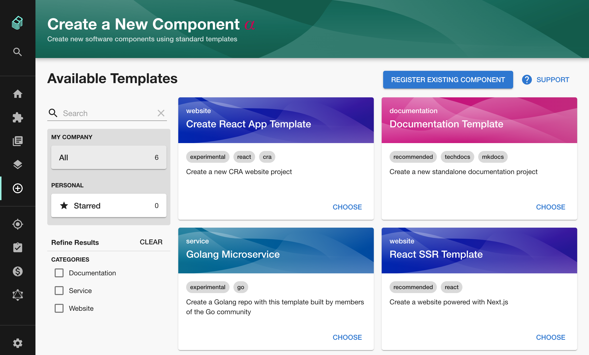
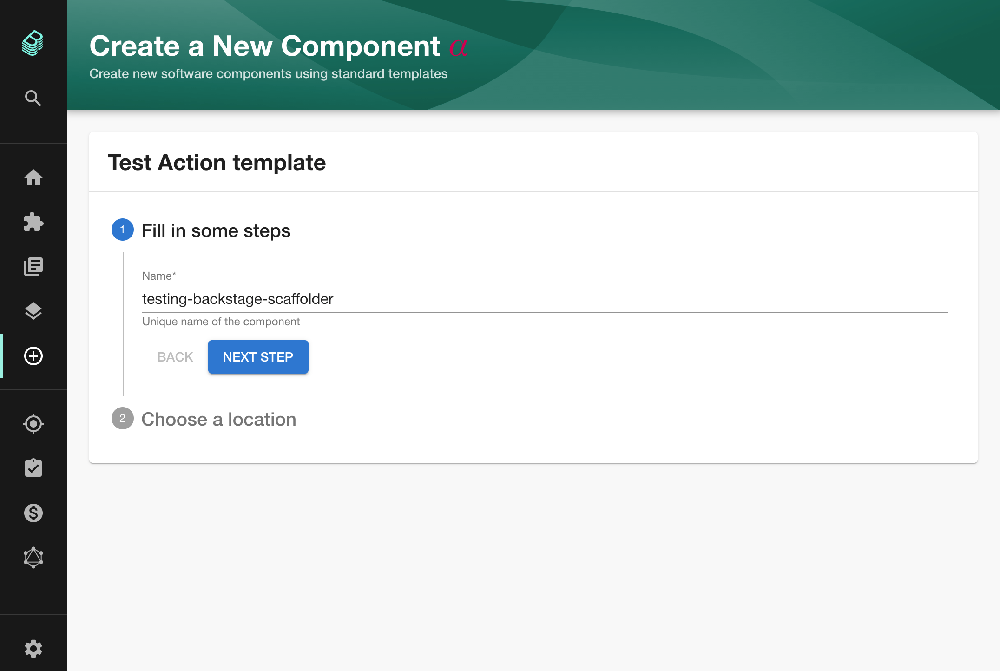
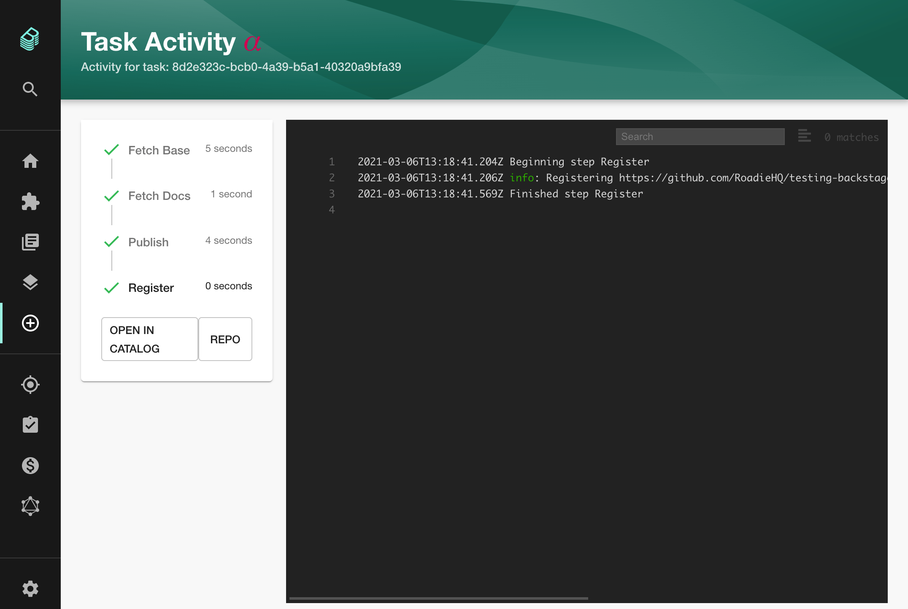
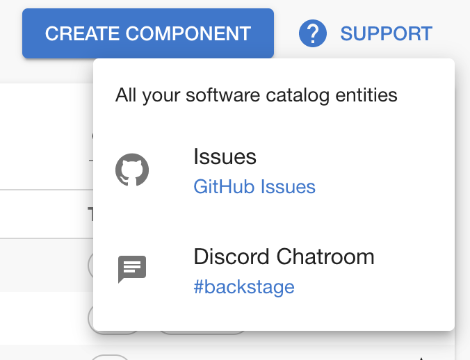
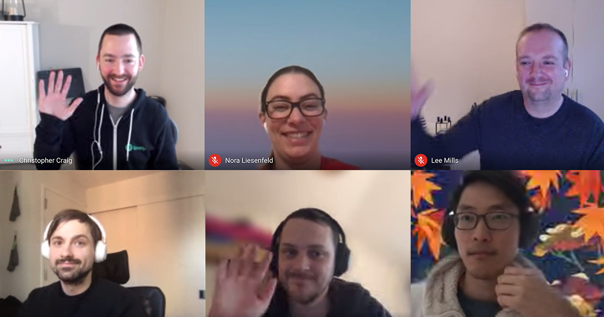

The Backstage scaffolder is an easy way for engineering organisations to bake best practices into a set of software templates and encourage their use for creating new services and components. This helps improve production consistency and reduce lead time for new services.

Each template is a YAML file which Backstage uses like a recipe for scaffolding a new application and performing actions on it.

Once templates have been defined and imported into Backstage, they appear in the template directory.

Engineers who wish to start a new project can choose a template from the directory, enter some customization parameters, and submit the form to Backstage for scaffolding to begin.

At this point, Backstage runs the steps defined in the template in order to do some work. As it runs, Backstage reports progress and logs to the user so they can understand what is happening. Once finished, the user is presented with some links to the newly created component.

Out of the box, Backstage supports useful scaffolding steps such as:

1. Fetch a cookiecutter template from a remote URL and run it with the parameters provided by the user.
2. Add the TechDocs framework to the templated application.
3. Publish the templated application to GitHub as a new repository.
4. Register the templated application in the Backstage catalog.

Last week, Spotify engineer Johan Haals added the ability for Backstage to support custom scaffolder actions ([#4718](https://github.com/backstage/backstage/pull/4718)). This opens up a whole world of new potential for the scaffolder.

For example, you could use the custom actions feature to hook your newly scaffolded application up to your CI system, configure it for monitoring, or even deploy it to a staging environment. Perhaps a whole marketplace like the GitHub actions marketplace will spring up around this feature.

Whatever way this goes, it's great to see the Backstage core team iterating on core features and constantly improving them. The scaffolder docs are [here](https://backstage.io/docs/features/software-templates/software-templates-index).

## Merged last 2 weeks...

There was no newsletter last week so we're covering 2 weeks and 142 merged pull requests here.

### OpenStack swift support for TechDocs

Swift is a distributed blob store for the popular open-source virtualization platform OpenStack. In pull request [#4714](https://github.com/backstage/backstage/pull/4714), Trendyol engineer Erdogan Oksuz added the ability to use it as a store for published TechDocs.

This is the first time I've seen OpenStack referenced in a Backstage pull request and it's a nice sign of the portability and broad platform support that the core team are baking in.

### Extended support button config

Andrew Thauer from Wealthsimple added a top level config to Backstage to help define ways that you can get help inside Backstage. When rolling out Backstage inside your org, it's important that users have a clearly defined way to get help while they are learning to use Backstage. This work from Andrew makes that a little easier to do. [#4517](https://github.com/backstage/backstage/pull/4517)

## Other news

Backstage team manager Lee Mills and Kubernetes plugin developer Matthew Clarke appeared on the [latest episode of the popular Kubelist Podcast](https://kubelist.com/issue/117/) where they talked about the inspiration for Backstage and direction of the project.

The Backstage team also participated in a wildly popular Ask Me Anything on Reddit a few days ago. Beyond the plugin, they talked about their philosophy for exposing developers to Kubernetes, how they hire people to work on Backstage and how they implement multi-tenancy in Kubernetes. [Check it out here](https://www.reddit.com/r/kubernetes/comments/lwb31v/were_the_engineers_rethinking_kubernetes_at/).

That's all for this week, get upgrading folks! 🚀
