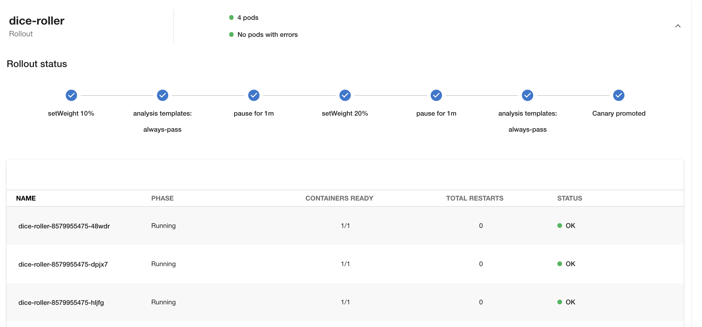
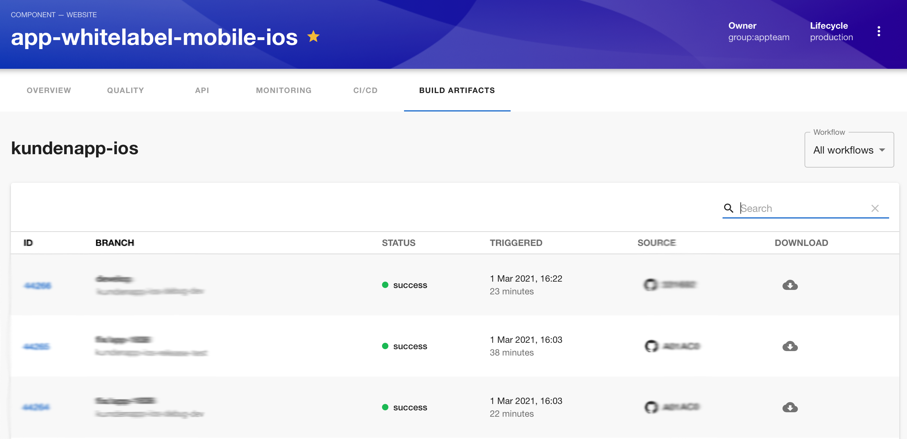
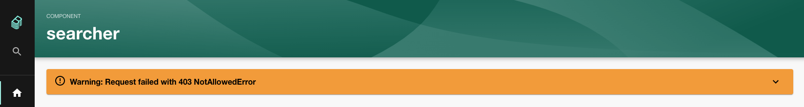

Believe it or not there are **two** Backstage meetups happening over the next 2 weeks! 📅

The next official [Backstage Community Session](https://github.com/backstage/community/issues/7) will take place on March 17th. As usual, you can suggest topics for the session and vote on your favorite topics using the linked GitHub issue. The current top suggestion is a presentation on how Expedia Group are using Backstage internally. Expedia is a huge organization with many engineers employed so this could be very interesting indeed.

Roughly a week later, on March 25th, the first ever Backstage Open Mic will take place. This is a community event where anyone can talk about technical topics or their experiences with Backstage. We at Roadie will present on how we're deploying Backstage on Kubernetes using terraform and flux. RSVP [here](https://frontside-software.typeform.com/to/ICn2IRZM).

## Merged last week

61 pull requests were merged last week. Here are the highlights.

### CRD Support for the Kubernetes plugin

Spotify engineer Matthew Clarke, who you may have recently come across on [the Kubelist podcast](https://kubelist.com/issue/117/), contributed CRD support for the Backstage Kubernetes plugin. So far it supports ArgoCD Canary rollouts, with more rollout types in the pipeline. [#4892](https://github.com/backstage/backstage/pull/4892)

If you use ArgoCD Canary rollouts you'll get a view like this inside Backstage and you'll be able to see your rollout progress over time.

### Bitrise plugin

SDA SE contributed a plugin for mobile app CI/CD platform [Bitrise](https://www.bitrise.io/) this week. It can quickly show you when your mobile builds are failing and even allow you to download the artefact generated by the builds. [#4746](https://github.com/backstage/backstage/pull/4746)

### Backstage errors package

The Backstage team have started an effort to standardize error reporting in Backstage in order to improve consistency when things go wrong. There is now a `@backstage/errors` package and an error panel which shows the most pertinent information to the user immediately and can also expand to show more details. [#4903](https://github.com/backstage/backstage/pull/4903)

I've seen a number of discussions about when and how to display errors to the user in Backstage so it's good to see standardization begin in this area.

