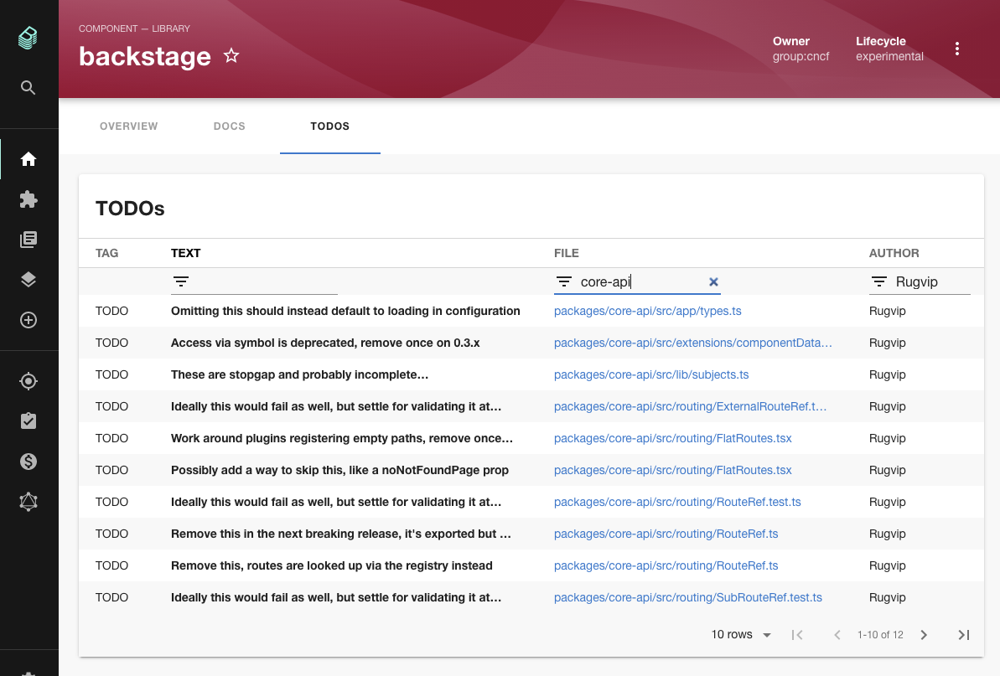
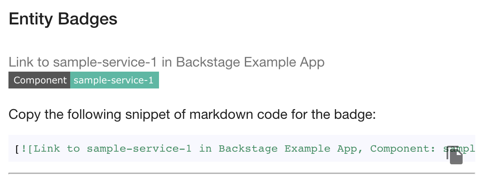

Last week marked the 1 year anniversary of Backstage being [announced to the world](https://engineering.atspotify.com/2020/03/17/what-the-heck-is-backstage-anyway/) on the Spotify Engineering blog.

> Last year, a small team of Spotifiers had a hunch about our homegrown developer portal: if Backstage could help our 1,600+ engineers manage the 14,000+ software components we use at Spotify, then couldn’t it do the same for other growing tech companies, too?

Backstage was released with a very limited feature set that has improved rapidly over the past few months. The service catalog and scaffolder, which didn't exist in that first release, have reached beta status, the Kubernetes plugin has developed into a useful window into production deployments, and the plugin ecosystem has begun to flourish.

Even more important than the technical achievements, the community is bonding, growing and collaborating and the number of non-Spotify contributors is increasing over time.

Of course, the community must keep one eye on the past and one on the future in order to thrive. [Tyson Singer](https://www.linkedin.com/in/tysonsinger/), the VP of Technology and Platform at Spotify, took 10 minutes of the latest Backstage Community Session to talk through Spotify's vision for Backstage and their history and relationship with the open source community at large. Tyson's org builds Backstage so he is in an influential and important position when it comes to its development.

Tyson talked through Spotify's strategic approach to open source over the past 2 or 3 years and **shared incredible learnings for anyone trying to drive large scale change in an engineering organization.**

Spotify followed a 3 step strategy to improve the impact of their open source development.

1. Clearly define the goal and the reasons for investing in open source.
2. Build new organizational capability and nurture it internally.
3. Unleash this capability on the world outside to achieve the goals.

Spotify identified 3 key reasons to improve their open source offering.

1. They wanted to attract and challenge the best technical talent and become known as a top 10 technical employer.
2. They wanted to gain influence over their cloud vendors.
3. They wanted to end the cycle of Spotifiers building great internal technology, only to see it replaced by open source offerings because they hadn't released it to the world.

Once they had the goal clearly defined, they built new 3 internal capabilities to help achieve it.

1. They aligned the organization around a customer-centric view which took focus away from infrastructure mechanics and placed it on the customer — other developers inside Spotify.
2. They spent more time with their customers by embedding in their teams, and encouraged their customers to do the reverse.
3. They built product marketing skills so they could communicate the value of their work effectively.

Once they had exercised this new organizational muscle internally and decided that Bacsktage would be their first Tier 1 Open Source project they released it early, iterated quickly and built in the open. The rest, as they say, is history.

You can see the rest of the meetup on YouTube.

<iframe width="560" height="315" src="https://www.youtube.com/embed/rRphwXeq33Q" title="YouTube video player" frameborder="0" allow="accelerometer; autoplay; clipboard-write; encrypted-media; gyroscope; picture-in-picture" allowfullscreen></iframe>

## Merged last week

58 pull requests were merged last week. Here are the highlights.

### Todo Plugin

Part of me feels like I could dedicate a whole newsletter issue to this neat idea.

The todos plugin finds `TODO` comments in the source code of each component in the catalog and creates a table inside Backstage where they can be seen by other developers.

To me, this simple idea represents everything that Backstage is about. TODO comments are typically buried in the code because they're only visible to the engineer who happens to have that code in front of them. This plugin makes TODOs visible to everyone in the company who may be curious, elevating them to a altogether different level of usefulness.

The plugin was contributed by Backstage core team member Patrick Oldsberg in [#4911](https://github.com/backstage/backstage/pull/4911).

### Powered by Backstage badges

Rolling out Backstage isn't simply a matter of deploying the technology. Backstage is at it's best when it is regularly used by a wide range of personas in an organization. During the rollout, it can be helpful to nudge towards Backstage by making it present inside their existing routines.

To facilitate one aspect of this, [Andreas Stenius](https://github.com/kaos) from Svenska Spel contributed badge generation for Backstage components. When you use this feature you get a copy-pastable markdown snippet which you can add to the GitHub readme of any component. [#4581](https://github.com/backstage/backstage/pull/4581)

Once added, people can more easily navigate to Backstage from GitHub repos and discovery should increase across your org.

## Roadie news

The first ever [Backstage Open Mic](https://backstage-openmic.com/) will take place on the 31st of March. This is a community organized Backstage event where people share the experiences with Backstage and help each other out. There will be two talks:

- Roadie engineer Iain Billet will present on how we're deploying Backstage on Kuberentes using flux and Terraform.
- SDA SE regular Dominik Henneke will show how to use the Backstage API docs plugin to discover APIs.

This was advertised as the 25th of March in a previous newsletter. It was rescheduled after publishing.
