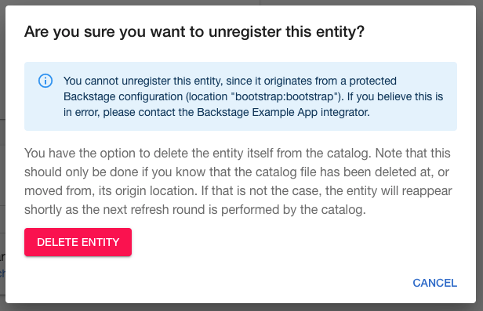
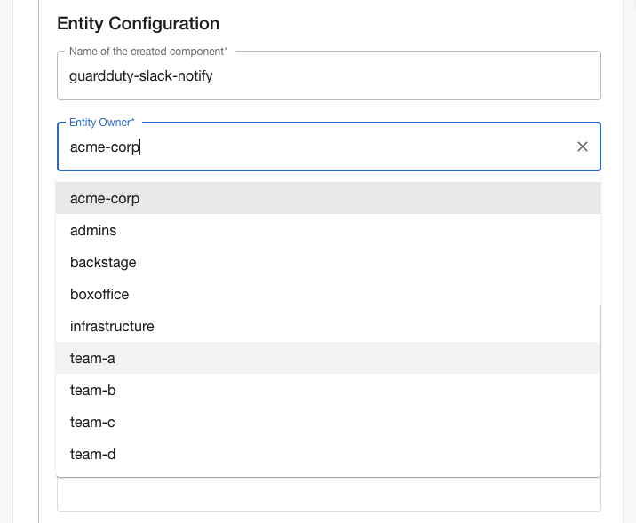

## Merged in the last 2 weeks

106 pull requests were merged in the last 2 weeks. Here are the highlights.

### Search foundations 🔍

The TechDocs team from Spotify added a new search API to the backend. Until now, all searching happened in the browser and thus was limited to small datasets. This move is one of the first steps towards offloading document indexing and querying to third-party tooling such as Elasticsearch.

Two new concepts are introduced in this PR ([#4515](https://github.com/backstage/backstage/pull/4515)). Collators are responsible for providing the `IndexableDocument` for a given type of document and Decorators are responsible for providing additional attributes on existing documents.

There are no user facing changes yet but it's great to see this progress.

### Delete items from catalog

Backstage now has more a natural deletion flow for catalog items. Previously you could "unregister" items which had been hardcoded into the Backstage config. This was confusing because they would magically reappear a few minutes later. The UI now handles the various different cases a little more elegantly. 

For example, if you add an entity via the Backstage configuration file, you will be warned that you're trying to perform an action that doesn't make sense and given an advanced option to proceed regardless. [#5043](https://github.com/backstage/backstage/pull/5043)

### Read-only mode

[Lunar](https://lunar.app/en/) architect Bjørn Sørensen added readonly mode to the Backstage catalog in [#5034](https://github.com/backstage/backstage/pull/5034). 

This feature is useful for organizations who don't want to use the Backstage scaffolder, perhaps because they have existing tooling in place or use a strict GitOps flow to create new components.

By setting `readonly: true` in the Backstage config, all UI interactions which would mutate the catalog are disabled.

### OwnerPicker and GitHub Deployments plugin

Fintech company [GoCardless](https://twitter.com/GoCardlessEng) have picked up the pace of their open-source development work with 2 notable merges recently.

The catalog importer now has UI for assigning ownership of a component to a given team. Previously you would have to exactly type the name of the team who owned the component. Now you can pick it from a select menu. [#5086](https://github.com/backstage/backstage/pull/5086)

GoCardless also added a GitHub deployments plugin which displays a table of the most recent deployments, showing the status and environment of each deployment, along with the commit which was deployed.

## Roadie news

### Plugin upgrades

We have upgraded and released new versions of most of our plugins lately. If you previously hit any issues because of mis-matched Backstage versions, please upgrade and try again. 

We have a dedicated open-source engineer starting in mid-April so the pace of development in this area should increase shortly.

### New Roadie feature

We've rolled out a new Dynamic UI feature to all of our customers. This feature allows users to reorganize their component overview pages by dragging and dropping plugin widgets around and add new tabs to Backstage components without editing the code.

<iframe width="560" height="315" src="https://www.youtube.com/embed/pe3Bshnw1mQ" title="YouTube video player" frameborder="0" allow="accelerometer; autoplay; clipboard-write; encrypted-media; gyroscope; picture-in-picture" allowfullscreen></iframe>
