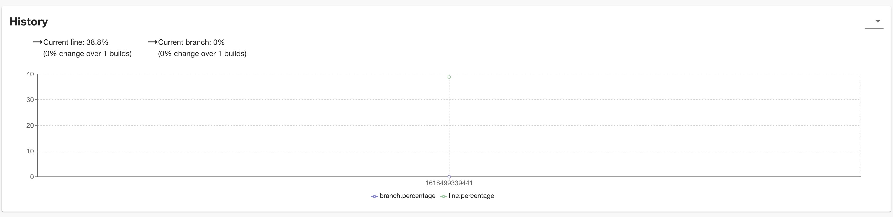
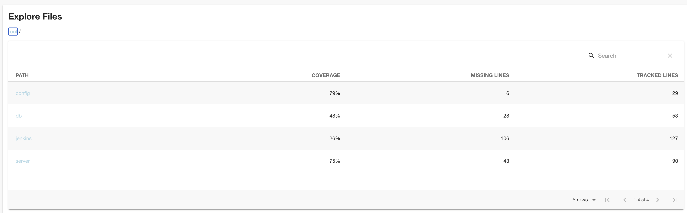
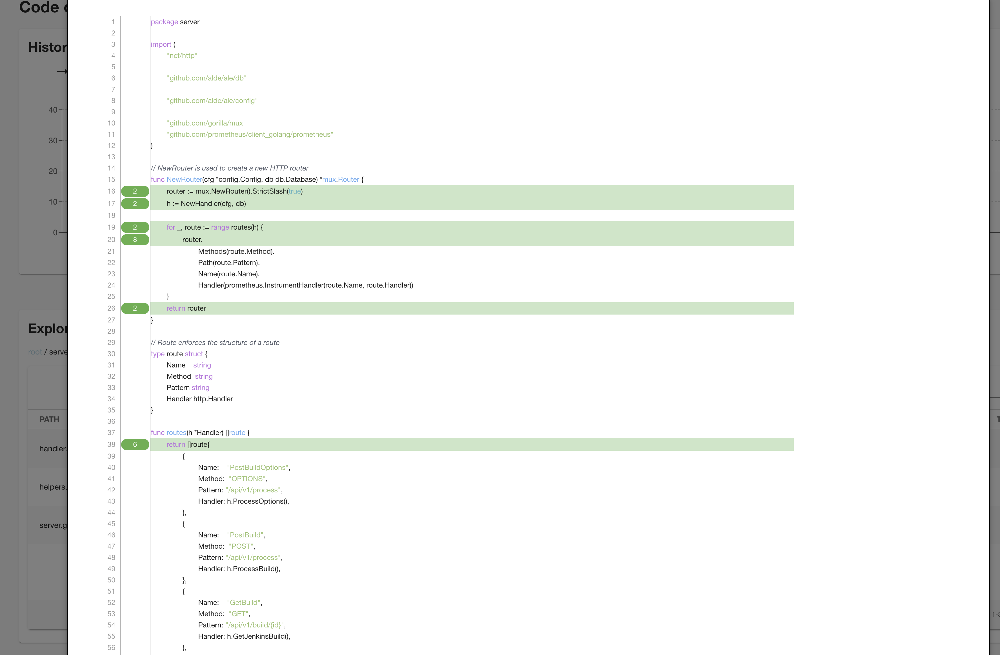
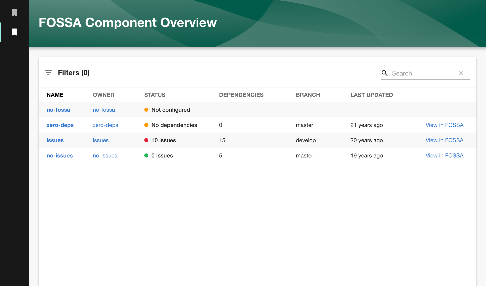

Two pretty exciting plugin changes were merged last week:

1. Spotify added a brand new code coverage plugin to Backstage. All 16 thousand lines of code of it!

2. SDA SE made a change to their FOSSA plugin which sheds light on how compliance and security teams can use Backstage to improve their workflows.

And the Backstage team also got a new member. Welcome Tejas!

<blockquote class="twitter-tweet">
🔥 MAJOR CAREER ANNOUNCEMENT!   I wanted to: - solve problems at massive scale, - do open source full time, - have it be related to a hobby, - work with people I enjoy and admire.  Excited to start my new job at... <a href="https://t.co/4Ek01wFQGv">pic.twitter.com/4Ek01wFQGv</a>
&mdash; ◢◤ Tejas Kumar ◢◤ (@TejasKumar_) <a href="https://twitter.com/TejasKumar_/status/1384524632263471106?ref_src=twsrc%5Etfw">April 20, 2021</a></blockquote>

### Code coverage plugin

This plugin, added by Rickard Dybeck in [#5350](https://github.com/backstage/backstage/pull/5350), comes with its own backend, API endpoints and database. This allows it to support some cool features.

It can show the history of code coverage over time for each component in your Backstage catalog. All of these images are sourced directly from Rickard's PR. Thanks Rickard!

It also includes a file explorer.... 

...and a file viewer which highlights tested lines of code.

Java code coverage tools Jacoco and Cobertura are supported out of the box, and I'm sure it's only a matter of time until the community adds support for a bunch more tools.

There are a few steps required to set up this plugin:

1. Install the frontend and backend components of the plugin to Backstage.
2. Add the backstage.io/code-coverage annotation to your components.
3. Add a step to your CI system so it publishes code coverage reports to your Backstage instance.
4. Try it out and let us know what you think!

### FOSSA overview page

The existing FOSSA plugin allowed Backstage users to add widgets to components in the catalog, in order to highlight any licensing issues with them.

This was great, but imagine you are a compliance person who is trying to find problems across the whole fleet. You would have to individually go through each component and look at its widget to see if it was good or not. 😳

In [#5379](https://github.com/backstage/backstage/pull/5350), SDA SE have added an overview page to their FOSSA plugin. This new page inverts the relationship, so you can look at the whole fleet in once place, inside Backstage.

You can even look up a particular team on this page, to see if any of the components they own have license issues.

Dominik, from SDA SE, explains where they are going with this:

> In the end, we are heading to a team-targeted-dashboard that shows a widget with [...] the "top 5 open issues" that a team should look at.

This PR is the beginnings of open-source Backstage becoming a fleet management system with rolled up KPIs at the component, team and org level. Can't wait! 🎯

## Roadie news

We had two new engineers join us this week.

[Nicolas](https://github.com/nicolasarnold12321) joins our platform team from Workday. He worked on an internal kubernetes platform and massive scale deployment tools there.

[Irma](https://github.com/Irma12) smashed our interviews and will work on improving our suite of open source plugins and the Roadie frontend. She also has a humongous dog 🐶.

We are still hiring. If you would like to build out a fast growing Kubernetes platform, or you want to work on Backstage with Tejas... [you know where to go](/careers/).
