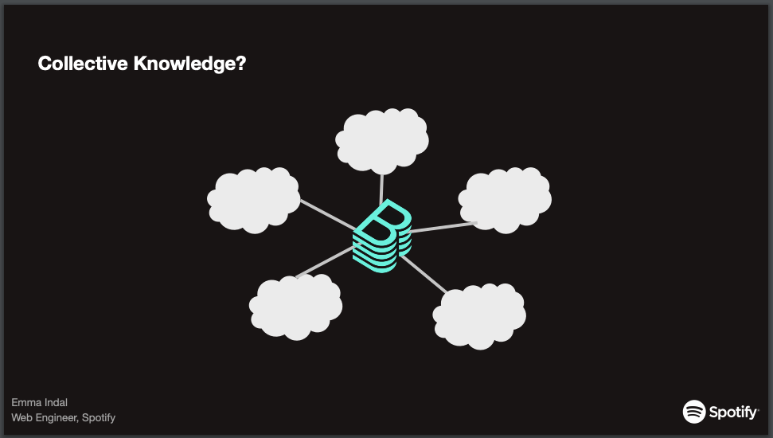
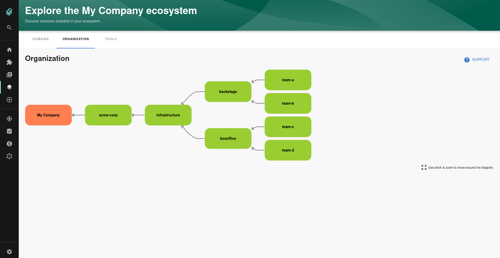

KubeCon Europe has just wrapped and Backstage got a mention thanks to a great talk by Spotify engineer and search wizard [Emma Indal](https://twitter.com/emmaindal).

Emma talked through how Spotify uses three core Backstage features - the scaffolder, techdocs and the service catalog - to unlock the potential of their engineering organizations collective knowledge.

If you registered for KubeCon but didn't catch the talk you can check it out [here](https://kccnceu2021.sched.com/event/iE4G/). [The slides](<https://static.sched.com/hosted_files/kccnceu2021/d4/TechDocs_ Unlocking the Potential of Engineers’ Collective Knowledge_.pdf>) and a transcript are available to everyone.

### Simplicity tools vs. complexity embracing tools

Which category is Backstage in?

<blockquote class="twitter-tweet">
When we talk about &quot;developer experience,&quot; we really need to separate dev tools into two categories: ones that simplify things away and ones that help developers engage with complexity. DX needs are different for simplification tools vs complexity-embracing tools!  Thread. 👇
&mdash; ⚡️ Jean Yang ⚡️ (@jeanqasaur) <a href="https://twitter.com/jeanqasaur/status/1389645922183696384?ref_src=twsrc%5Etfw">May 4, 2021</a></blockquote>

### Cost Insights on Redmonk

Spotify product manager Janisa Anandamohan and her colleague Tim Hansen met with Redmonk's James Governor to explain the history and success of cloud cost management at Spotify.

<iframe width="560" height="315" src="https://www.youtube.com/embed/5GN2ucN1Lxs" title="YouTube video player" frameborder="0" allow="accelerometer; autoplay; clipboard-write; encrypted-media; gyroscope; picture-in-picture" allowfullscreen></iframe>

After a year on the cloud, Spotify realised that cloud costs were growing more quickly than revenue and decided to get better control over spend. They employed both top down and bottom up approaches to right the ship and Backstage played a core role.

Janisa and Tim talked through how they used Backstage's Cost Insights plugin to show engineering teams how costs relate to growth, to highlight when cost optimizations might be necessary, and to offer clear recommendations on how to reduce excessive spending.

### Building high performing teams with observability

A high-performing team is one that gets to spend almost all of their time solving interesting problems that move the business forward. Not doing a lot of toil. Not working on things they have to do in order to get to the things they want to do.

Charity Majors explains how to get there.

<iframe src="https://open.spotify.com/embed/episode/0W71x1QG54QO7sDFTlWH53" width="100%" height="232" frameborder="0" allowtransparency="true" allow="encrypted-media"></iframe>

## Merged in the last two weeks

102 pull requests were merged in last 2 weeks. 

High visibility changes are a little sparse right now because the catalog is undergoing a rewrite and search is under heavy development.

### Organization Diagram

Kévin Gomez from VOI Technologies gave Backstage the ability to render your org chart in [#5466](https://github.com/backstage/backstage/pull/5466). This works by traversing the Group entities in your catalog.

That's all for this week folks. Good luck and get upgrading! 🚀
