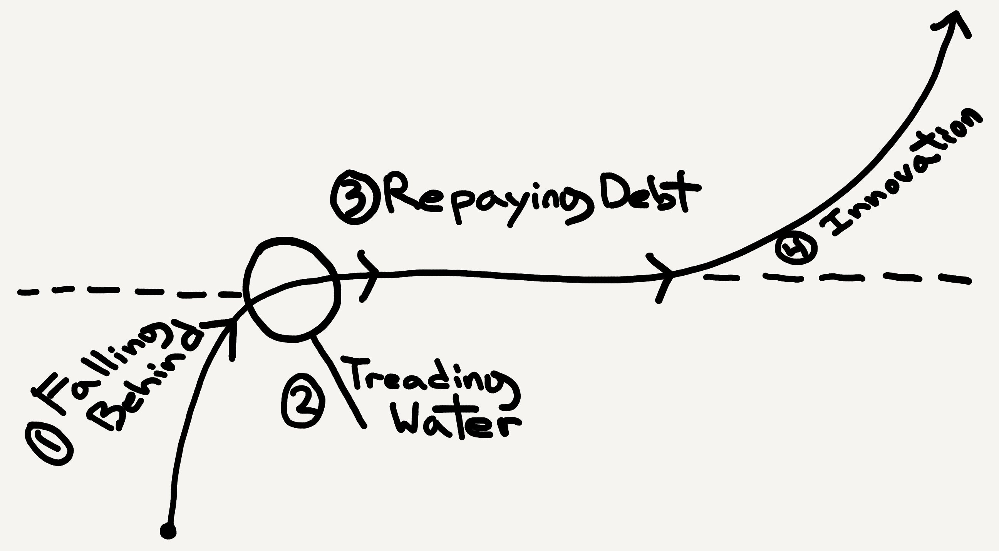
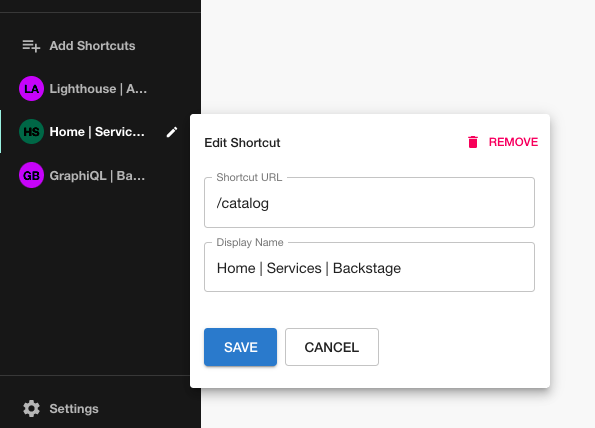

The final episode of Spotify: A Product Story, the podcast miniseries hosted by Spotify's Chief R&D Officer, dropped last week.

I really enjoyed this series because it goes into more technical depth than I expected. R&D leader Gustav Söderström does a great job of pinpointing and explaining the lessons learned from each of Spotify's monuments product challenges. There should be something useful in there for every engineering leader.

Amongst the interesting technical stories covered are:

1. How Spotify gradually worked machine learning into more and more of their stack, ensured they were solving real business problems with it, and what their plans are for the future.
2. How they switched from on-prem to the cloud over a number of years, how they chose their cloud vendor, and the hard choices they had to make along the way.
3. Why Spotify chose to build Backstage, and how to think about build vs. buy decisions more generally.

<iframe src="https://open.spotify.com/embed/show/3L9tzrt0CthF6hNkxYIeSB" width="100%" height="232" frameborder="0" allowtransparency="true" allow="encrypted-media"></iframe>

### Developer portals are a super power

I tackled two [misconceptions about Backstage](/blog/developer-portals-are-a-superpower) on the Roadie blog this week.

The main points are:

1. Backstage is a reusable tool that can empower your engineers, rather than locking them in to a bespoke solution.
2. Backstage doesn't naturally block your engineers from reaching for direct API or UI access when required.

### Staying on the path to high performing teams

Will Larson, ex-Stripe and currently CTO at Calm, explains that engineering teams typically exist on a continuum of 4 states. For each state, Will then describes the solution required to move the team up the value chain to the next state.

There's also a section which explains how to think about doing this across multiple teams in an organization at the same time.

[Article link](https://lethain.com/durably-excellent-teams/)

### The mortifying ordeal of pairing all day

The Cloud Foundry R&D team at Pivotal paired on code, all day every day, for years at a time.

Nat Bennett shares their opinion on the burnout and organisational failure this experiment caused.

[Article link](https://www.simplermachines.com/the-mortifying-ordeal-of-pairing-all-day/)

## Merged into Backstage last week

It was a 3 day week in Sweden so only 32 pull requests were merged. We still got some goodies though.

### Shortcuts plugin for sidebar

Spotify engineer Marcus Eide dropped this neat little shortcuts plugin in [#5392](https://github.com/backstage/backstage/pull/5392). It lets you quickly add a shortcut to the Backstage sidebar.

The shortcuts are stored in your browser localstorage and are personal to you.

### GitHub Release Manager plugin

This new plugin can help take some of the tedium out of publishing releases on GitHub by automatically cutting branches, tagging and releasing and promoting code, with help from the user.

There are screenshots in the pull request [#5299](https://github.com/backstage/backstage/pull/5299) and the credit belongs to Spotify engineer Erik Engervall.
