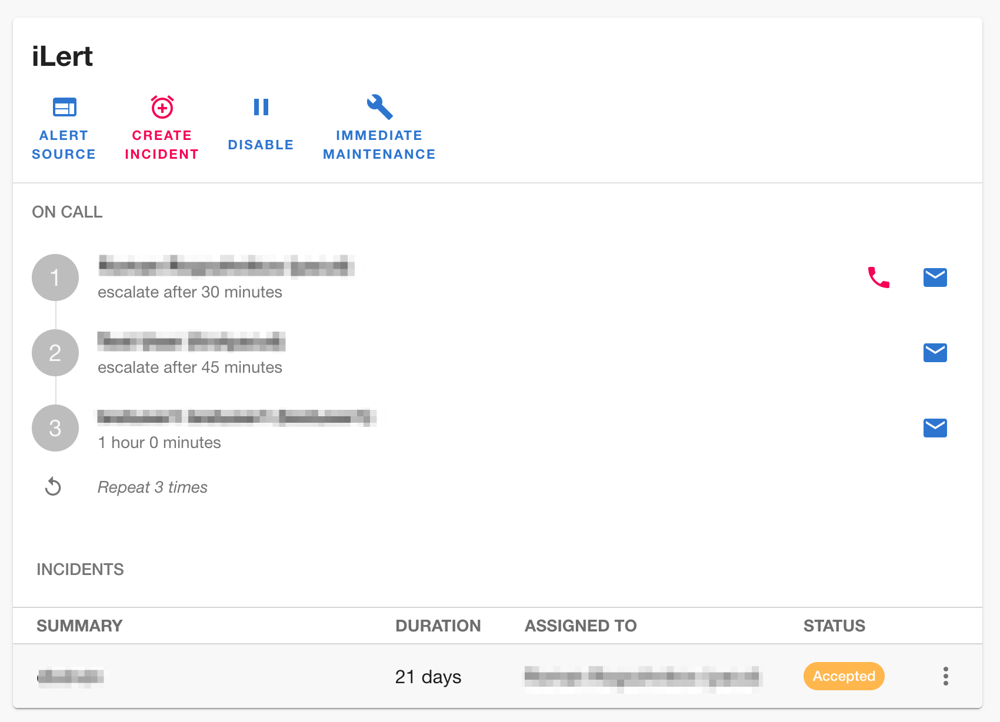
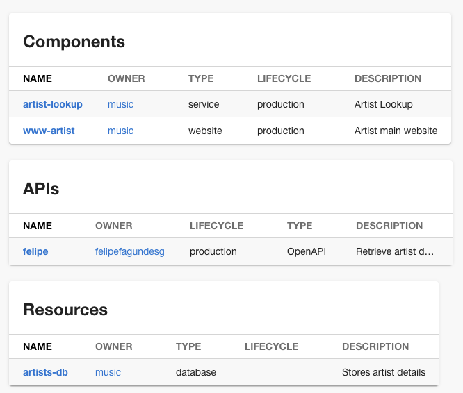

Expedia Group recently rolled out Backstage to more than 5,000 internal developers. It now functions as their designated internal service catalog, API catalog, documentation library and developer portal.

I sat down with engineering manager Erik Lindgren and product manager Mike Turner to hear Expedia's reasons for choosing Backstage and the lessons they have learned so far.

It's a fascinating case study with lessons for anyone who is considering adopting Backstage.

[Read the case study][expedia post]

### Backstage entity validation library

Backstage requires a lot of YAML files, and it's easy to make a mistake when writing them.

One thing we've heard repeatedly from the community and the companies we work with, is that catching YAML problems before they get sent to Backstage would cut the feedback cycle and improve the usability.

We heard you, so last week we open-sourced the [Backstage Entity Validator](https://github.com/RoadieHQ/backstage-entity-validator).

The features so far include:

1. Validate YAML syntax,
2. Validate that the required properties for each entity kind are in place,
3. Validate that well know annotations have the correct type (e.g. `github:`),
4. Validate that URLs are valid.

It comes with a GitHub action and a Circle CI Orb included so you can drop it straight into your CI workflows if you use those tools.

Please drop feedback in the GitHub issues if you try this out. We'd love to hear it and we're looking forward to adding even more features over the coming months.

## Merged last week

59 pull requests were merged last week. Here are the highlights.

### iLert plugin

Yet another official corporate Backstage plugin has appeared. Roman Frey at iLert contributed a huge Backstage plugin for the DevOps alerting and incident response tool. When I say huge, I mean this thing has features.

It has a widget for showing recent incidents and other information for a specific service in the catalog.

So far, this is similar to the existing PagerDuty or OpsGenie plugins. The iLert plugin doesn't stop there though. It includes pages for showing who is on call across the whole fleet, pages for viewing all incidents happening in your organization and a lists of uptime monitors you have running. See [#5501](https://github.com/backstage/backstage/pull/5501) for more screenshots.

It's really cool to see corporate sponsored plugins appear in the Backstage ecosystem and it's a good indication of the level of adoption and growth that Backstage is seeing.

### Display system dependencies in cards

Jonah Grimes from Appriss Insights added a few cards for mapping systems in [#5361](https://github.com/backstage/backstage/pull/5361). The PR includes cards for showing the resources, components and APIs that a system depends on.

Here's how it looks.

That's all for this week folks. Get upgrading! 🚀

[expedia post]: /case-studies/expedia-group-backstage-mvp/
