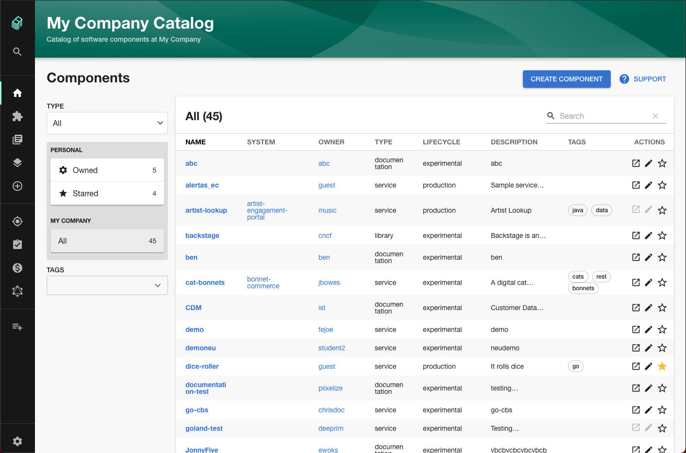
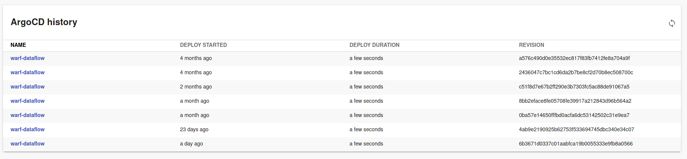

Having talked to many companies who are adopting Backstage, one thing is clear... Backstage means different things to different people. Because Backstage is a flexible and highly customizable framework, it can be tricky to figure out where to start.

Clear direction and implementation guidance is part of the value we bring at [Roadie](https://roadie.io), but it's also a concern for the Backstage core team.

To help companies orient themselves, Austin Lamon — Director of Product for Platform at Spotify — recently published a guide to adopting Backstage on the official Backstage blog.

Austin's guide describes three key of a software engineer — create, manage and explore — and explains how Backstage can help with each job. It also provides headcount tailored recommendations on which job to target with your Backstage MVP.

It's a fascinating read I believe it goes a long way towards filling a gap in the communities collective knowledge graph.

[Read the guide on the Backstage blog](https://backstage.io/blog/2021/05/20/adopting-backstage)

### Backstage community session 4

The fourth Backstage community session happened in mid May and was expertly MCed by Senior Engineering Manager Helen Greul.

The main event was a presentation by TELUS Digital and ThoughtWorks. They talked through the work they are doing to build out an internal documentation hub with Backstage. Interestingly they are skinning Backstage with the TELUS look and feel rather than sticking with the default theme.

The core team also gave an update on a major catalog refactor which is in progress. The upcoming changes will spread catalog API requests out over time so that Backstage is less likely to be rate limited by GitHub and other source code hosting platforms. The changes also open the door to event driven cataloguing.

<iframe width="560" height="315" src="https://www.youtube.com/embed/UZTVjv-AvZA" title="YouTube video player" frameborder="0" allow="accelerometer; autoplay; clipboard-write; encrypted-media; gyroscope; picture-in-picture" allowfullscreen></iframe>

## Merged last week

52 pull requests were merged last week. Here are the highlights.

### New catalog UI

Spotify engineer Tim Hansen merged [#5643](https://github.com/backstage/backstage/pull/5643) and released a new UI for the catalog. This change improves the UX in a few important ways:

1. Tags are now in a dropdown so that long lists won't cause vertical scrolling.
2. It's possible to see all Kinds of entity on one page.

Andrew Thauer should also get a shoutout for originally designing these UI changes.

### ArgoCD history card

Backend engineer [Kévin Gomez](https://github.com/K-Phoen) implemented a deployment history card for Roadie's ArgoCD plugin. The plugin can now show every deployment that happened to a given service and includes useful information like how long the deployment took. Thanks Kévin! 

Upgrade to version 1.0.5 to get it.

