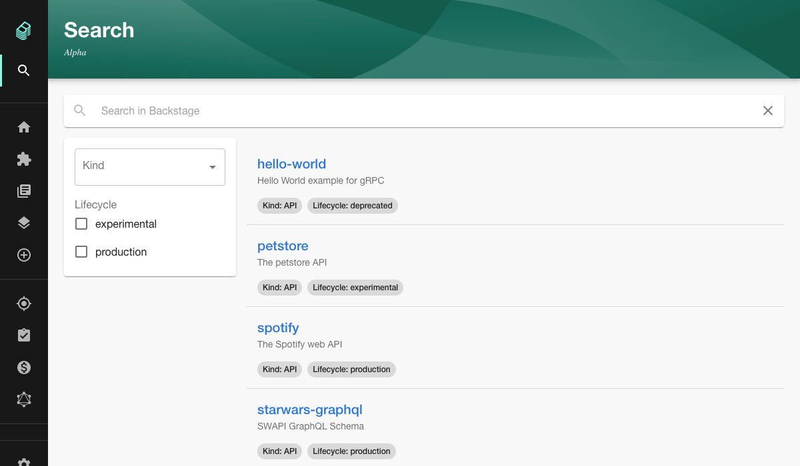
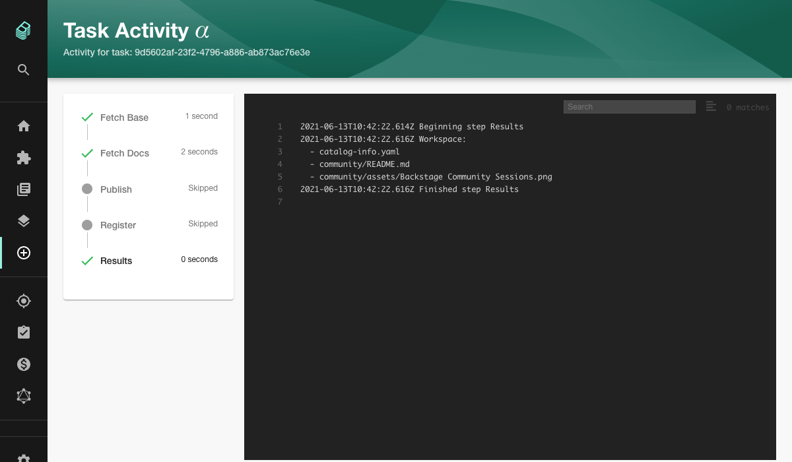

There were some important milestones reached over the last 2 weeks so we're going to skip past the pre-amble and get straight into the new features.

## Merged in the last 2 weeks

99 pull requests were merged in the past 2 weeks. Here are the highlights...

### Search V1 Alpha released

A new version of Backstage search was merged last week. Here's how the new search page looks in a Backstage example app:



This release is the culmination of a lot of hard work by the search team in Spotify and includes the following features:

- A highly extensible search backend, responsible for document indexing and query handling. Previously, all search happened within the browser.
- An out-of-the-box server-side search engine (Lunr), with an API in place to support other search engines in the future. ElasticSearch support is planned.
- Support for indexing the contents of the software catalog, with an API in place to index other types of content. Theoretically any Backstage plugin should now be able to send documents for indexing.
- A highly composable frontend for tailoring the search experience for your organization's needs.

The [docs have already been updated](https://backstage.io/docs/features/search/search-overview), so you can try this out immediately. The upcoming Beta and GA releases will include ElasticSearch support and support for searching within TechDocs.

Don't miss [this weeks Backstage Community Session](https://github.com/backstage/community/issues/20) where the search team will talk through the new features and how to use them.

### @backstage/core breakup

Pull request [#5825](https://github.com/backstage/backstage/pull/5825) splits the core package up into three new `@backstage` packages. This change should make life much easier for plugin authors. 

Previously, plugins depending on different versions of `@backstage/core` would struggle to co-exist within the same Backstage application. If you and all other plugin authors didn't frequently update plugin dependencies in lock-step, Backstage plugins could crash, sometimes taking out the whole application.

These new packages include a slimmed down `core-plugin-api` package which can run alongside other versions of itself, preventing the issue mentioned above. All the glorious technical details you could ever want are in RFC [#4872](https://github.com/backstage/backstage/issues/4872).

The new packages are called `core-components`, `core-plugin-api` and `core-app-api`.

- The `core-components` package contains all of the visual components you see when you click around in a Backstage app.
- The `core-app-api` package has the bits you need to create a new Backstage app and set up the context from which plugins consume.
- The `core-plugin-api` is the part that plugins consume, and is the part that is most frequently duplicated.

Stay tuned for migration details. Some of that is still being worked out. The new `@backstage/codemods` package is being prepped in order to keep tedious manual work to a minimum.

We are prolific plugin authors here at Roadie and we really appreciate this change from the core Backstage team. Here's to improved stability 🍾.

### Conditional scaffolder steps

Oliver Sand from SDA SE added the ability to include conditional steps in your scaffolder templates - [#5849](https://github.com/backstage/backstage/pull/5849). Here's how it looks in code:

```yaml
- id: register
  if: '{{ not parameters.dryRun }}'
  name: Register
  action: catalog:register
  input:
    repoContentsUrl: '{{ steps.publish.output.repoContentsUrl }}'
    catalogInfoPath: '/catalog-info.yaml'
```

And here's how it looks when the UI skips steps based on conditionals (see the "Skipped" steps in the card on the left).



That's all for this week folks. Get upgrading! 🚀
