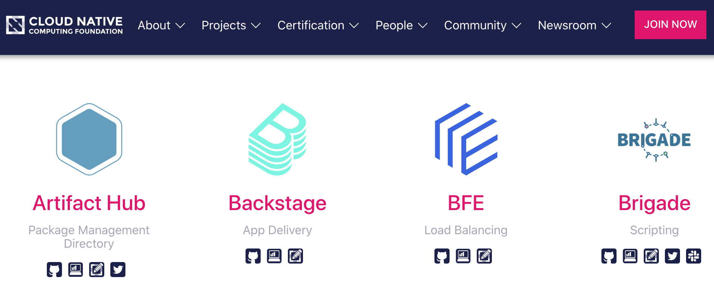

Backstage has been accepted into the CNCF Sandbox. 🎉

The Sandbox is an entry point into the CNCF ecosystem. The goals of the sandbox include encouraging public visibility of projects and helping them grow to the point where they can move on to the next CNCF level. In addition to Backstage, the Sandbox holds projects such as chaos engineering Kubernetes operator Chaos Mesh and GitOps operator Flux.

This can only mean good things for those of us who are investing in Backstage and should help ease the minds of many organizations who were considering adopting it, either by deploying internally or by using a hosted Backstage provider such as [Roadie](https://roadie.io).

The Backstage team wrote about the implications of this on their official blog post, and on the Spotify engineering blog.

> The Backstage community is healthy and growing quickly. Over 130 people have contributed to the project, and roughly **40% of pull requests are now coming from external, non-Spotify, contributors**. With companies now deciding to adopt Backstage we are also seeing a shift in the kinds of contributions we are getting from the community.

## Merged last week...

70 pull requests we merged in the last week. Here are the highlights:

1.  [Matthew Clarke](https://github.com/mclarke47), who works on infrastructure at Spotify, had more than 7,000 lines of code merged for his Backstage Kubernetes plugin. This is going to be such an important plugin for cloud-native companies who want to use Backstage and could really ease onboarding in future. It's great to see progress being made. You can now list Kubernetes clusters and pods in Backstage. [#2618](https://github.com/spotify/backstage/pull/2618), [#2571](https://github.com/spotify/backstage/pull/2571) and others.
2.  [Fredrik Adelöw](https://github.com/freben) (Spotify) added a concept of Users to Backstage. [#2587](https://github.com/spotify/backstage/pull/2587) and [Althaf Hameez](https://github.com/althafh) (Grab) added a concept of Groups [#1838](https://github.com/spotify/backstage/pull/1838). Groups will associate users with teams, departments and organizations. The association between services and the teams that own them will be core to the value of Backstage and allow many powerful ownership oriented features in future.
