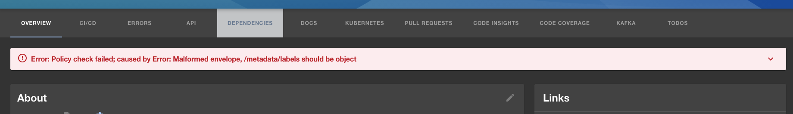

The Backstage maintainers were on summer vacation for the month of July, but this didn't stop the contributions from flowing. 200 pull requests were merged during this holiday month.

As the core team filter back to work, we thought it would be a good idea to take a look at the top community contributions in July.

These contributions come from 5 different companies and touch many of the important parts of Backstage - the catalog, TechDocs, the scaffolder and the plugins.

## Roadie news

We have added support for the Kubernetes, Snyk and SonarCloud plugins to Roadie. To use them, all you need to do is configure them [via the docs](https://roadie.io/docs/integrations/kubernetes/) and drag and drop them into your Backstage interface. It should take mere minutes.

We have also published a blog post explaining how to model software systems in Backstage and map the relationships between dependent components. Check it out [here](https://roadie.io/blog/modeling-software-backstage/).

## July community contribution spotlight

### Jenkins plugin - Multiple instance support

In [#5642](https://github.com/backstage/backstage/pull/5642), Sainsbury's engineer Andrew Shirley contributed a backend plugin for Jenkins and integrated it with the existing frontend plugin.

The plugin can now integrate with multiple Jenkins instances, and will look up each job in the associated instance. This makes Backstage a great place to browse through builds, regardless of which Jenkins instance they actually run in.

Hopefully, this is the first step towards a repeatable pattern for Backstage plugins which need to integrate with multiple instances of a third-party system like Jenkins.

### TechDocs - Access generator logs in the UI

Regular contributor, Dominik Henneke from SDA SE, improved the "basic" architecture for TechDocs by allowing Backstage to access the logs from the process which transformed the docs from markdown to HTML. [#6341](https://github.com/backstage/backstage/pull/6341)

Errors can happen during this transformation process and, before Dominik's change, Backstage users would have to access the backend logs of Backstage itself in order to understand what was wrong. With this change in place, the logs are streamed to the Backstage UI where they can be inspected easily.

<iframe src="https://player.vimeo.com/video/582510092?badge=0&amp;autopause=0&amp;player_id=0&amp;app_id=58479" frameborder="0" allow="autoplay; fullscreen; picture-in-picture" allowfullscreen style="position:absolute;top:0;left:0;width:100%;height:100%;" title="Log stream build failure"></iframe>

### Catalog - Show parsing errors to users

Backstage metadata YAML files come with certain formatting and specification requirements which can be tricky to get right when you are first getting started. Nicolas Torres from Backbase has given users a way to see the errors that occur when your YAML doesn't meet the spec. [#6586](https://github.com/backstage/backstage/pull/6586)

Before this change, you would need to go to the Backstage logs to search for errors or warnings. Now they are visible on the entity page for the component which is experiencing the problem.

### Scaffolder - Filesystem actions

Live sports streaming service DAZN contributed some standard scaffolder actions for removing and deleting files on the filesystem. It's a simple thing, but quite frequently needed when manipulating the templates for creating new services in your company. See [#6340](https://github.com/backstage/backstage/pull/6340) for the implementation. 

### Scaffolder - Ruby on Rails template

Rogerio Angeliski, from Digital Marketing software creator RD Station, contributed a template for creating new Ruby on Rails applications with the scaffolder. [#6016](https://github.com/backstage/backstage/pull/6016)

Rails is one of the most popular web application frameworks in the world and most Ruby devs have typed `rails new` countless times. Now you can let the Backstage scaffolder set up your Rails projects for you.

That’s all for this week folks. Good luck and get upgrading!
