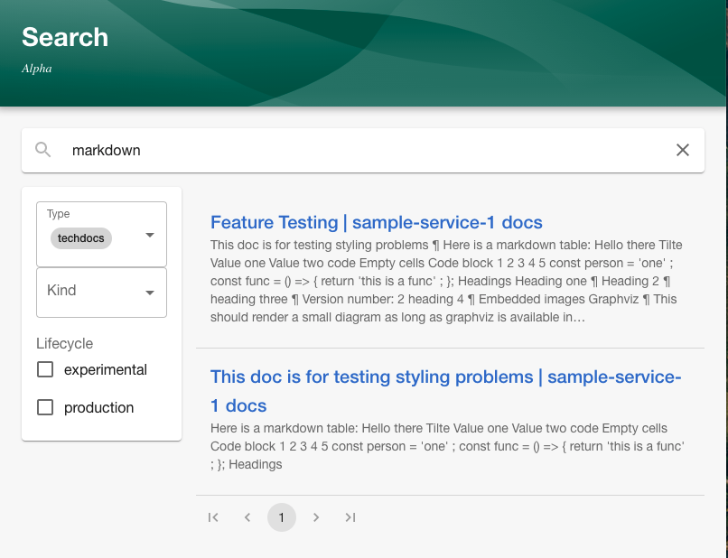
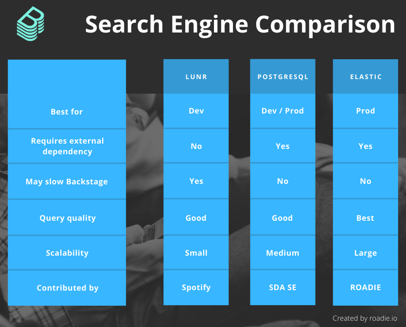

TechDocs search is possibly the most hotly anticipated Backstage feature of the last few months. We've heard it from Roadie customers, we heard it in [the Lunar case study](https://roadie.io/case-studies/lunar-backstage-adoption/), and we've heard it from the community.

This week, a number of pull requests came together to make TechDocs search a viable solution for the first time ever. If you've been holding out on moving off Confluence, this might be your moment. 🏃

Here's how the search results look in Backstage. I have a component in my catalog. That component has docs. Those docs mention the word "markdown".

### How it works

At a high level, the search architecture is quite simple. The TechDocs plugin registers content with the Backstage search layer. The search layer periodically reaches out to index that content in a search engine of some description. The query layer can search for results in the index and display them in the search UI. 

For more details, see the comprehensive diagram in the [Backstage docs](https://backstage.io/docs/features/search/architecture).

### Supported search engines

Thanks to hard work by Spotify, SDA SE and Roadie, three search engines are now supported. They are Lunr, PostgreSQL and ElasticSearch.

**Lunr**

Lunr support was contributed by Spotify and is best for local development.

Lunr is a NodeJS based in-memory search engine which doesn't require any external dependencies. It works out of the box and is the default option when you scaffold a new Backstage application (although, [this may change](https://github.com/backstage/backstage/issues/6720) in the future). 

Being a development solution, Lunr comes with a number of downsides:

1. It can slow Backstage startup time because search documents are indexed during application boot.
2. It will increase the memory consumption of Backstage since it runs in-process.
3. The indexing procedure blocks NodeJS execution, potentially causing other Backstage activities to hang.

**PostgreSQL**

PostgreSQL search support was [contributed by SDA SE](https://github.com/backstage/backstage/pull/6682) and is best for small scale production usage.

It brings a nice balance of simple setup, decent results and decent scalability. It should perform well even with thousands of documents indexed. Because this search function is backed by a real database, the index isn't rebuilt every time Backstage starts up, and boot performance is improved. 

PostgreSQL search requires at least PostgreSQL 11. A similar SQL based search implementation my be possible for MySQL or Sqlite in the future, but there are currently no plans for this.

**ElasticSearch**

ElasticSearch was [contributed by Roadie](https://github.com/backstage/backstage/pull/6569) and is best for high-scale production usage. 

A specialized search engine will bring the best scalability. It should also bring the best results due to the enhanced query language options.

This improved performance comes at the cost of having another Backstage dependency to manage.

### What's next

To get started with search in Backstage, check out [the official docs](https://backstage.io/docs/features/search/search-engines).

In the meantime, work is ongoing in the search space. We at Roadie are finishing up the last bits on [a pull request](https://github.com/backstage/backstage/pull/6651) which will add a search bar to each TechDocs page. The idea being that you can search within the docs you are currently reading.

The core team have also identified the last work required before the launch of [Backstage Search - Production Ready](https://github.com/backstage/backstage/milestone/27) (the beta launch). Most notably, pagination is coming to fix [#6062](https://github.com/backstage/backstage/issues/6062).
