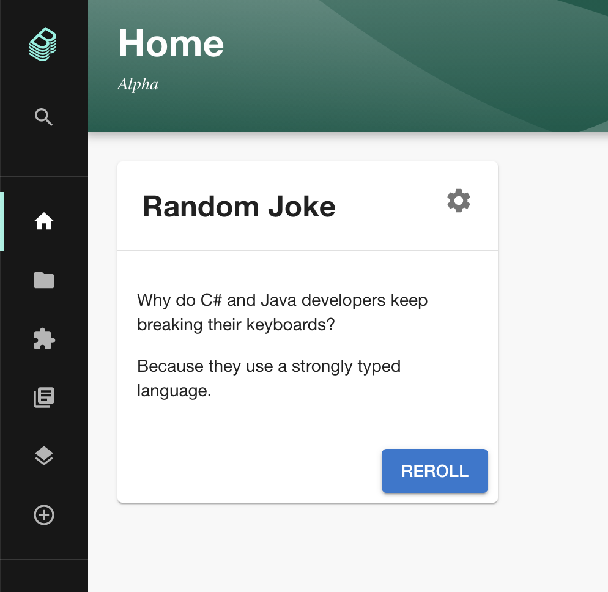
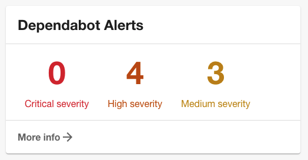

This week we're covering:

1. DAZN and American Airlines showing off their Backstage deployments.
2. SDA SE hiring a dedicated Backstage engineer.
3. The last few weeks of pull request goodies merged into Backstage.

## News roundup

### Backstage in the wild

Both DAZN and American Airlines published details of their internal Backstage deployments recently.

DAZN [wrote about how they are using Backstage](https://medium.com/dazn-tech/integrating-backstage-at-dazn-b8ef5268b347) to clearly establish ownership of services. They built Backstage onto their existing service metadata to provide a window into components and tools used across their 500 strong engineering organization.

American Airlines did a [50 minute demo](https://youtu.be/kZFdHmM5-7M) of their internal Backstage deployment, which they call Runway. They talked through some of the custom plugins they've built and how they are using Backstage Templates to scaffold new services. Very interesting viewing!

### Backstage jobs

In what may be a world-first (outside of Spotify and Roadie), SDA SE are hiring a dedicated Backstage developer. Responsibilities include actively contributing to the open-source project and evangelizing Backstage internally.

More proof that serious companies are going all-in on Backstage.

[Get hired here!](https://myfuture.sda.se/jobs/backstage-react-developer-m-w-d/)

### Backstage blog posts

We've been going though ink at record rates in recent weeks here at Roadie ✍️

First up, we published a post about [how we securely rolled out a GitHub app](/blog/avoid-leaking-github-org-data/). We tested the security of multiple multinational tech companies during the design of this feature and found a number of them were leaking their customer's source code because they had integrated insecurely. This post shows how to do it right.

We've also explained [why we migrated all of out Backstage plugins into a monorepo](/blog/monorepo-plugins-migration/). This one might be interesting if you're writing your own plugins for internal usage.

## Merged recently

### Composable homepage

The software catalog is great for deep-diving tech components, but sometimes you want Backstage to bring the information to you instead of digging for it yourself.

That's the goal of the new composable homepage which Spotify intern Ruben Lindstrom recently added in [#6486](https://github.com/backstage/backstage/pull/6486).

This page can be customized with HomePage Components which surface relevant information to the user. Here's an example of a simple HomePage component.

This feature lives at `/home` for now but it should soon replace the catalog view as the default homepage.

### Dependabot alerts

We've added a cool new feature to our Backstage Security Insights plugin. It provides two views into Dependabot alerts across your components. You can deep dive into alerts in the full-page tab view, or you can quickly get a sense of the number of open vulnerabilities by adding the overview card.

### TechDocs reaches Beta

With the addition of [in-context search](https://github.com/backstage/backstage/pull/6651), [pagination](https://github.com/backstage/backstage/pull/6815) and a few [tidy-ups](https://github.com/backstage/backstage/pull/6709), the beta release of TechDocs is here. 🎉
