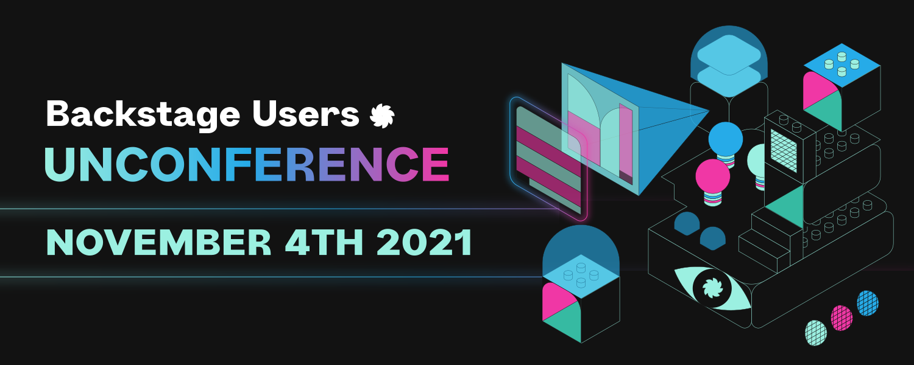
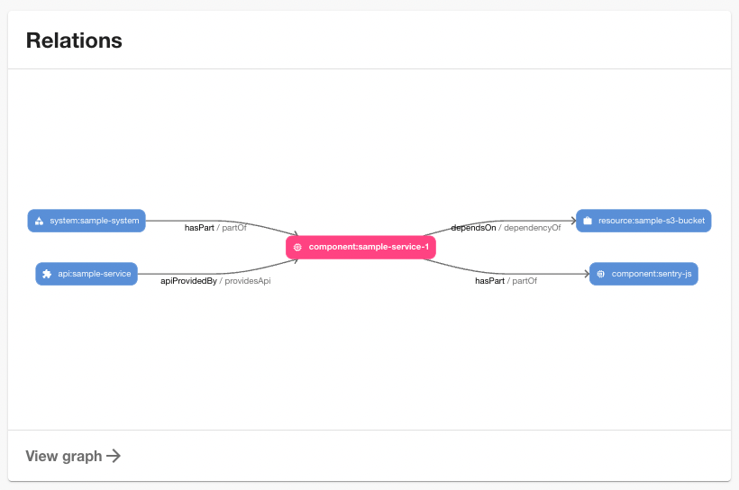
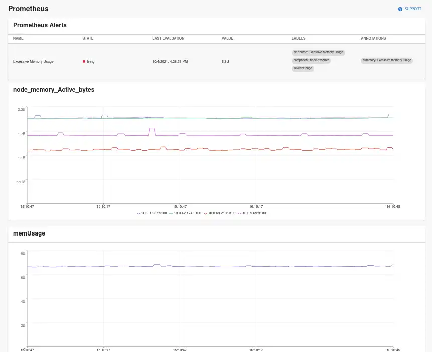
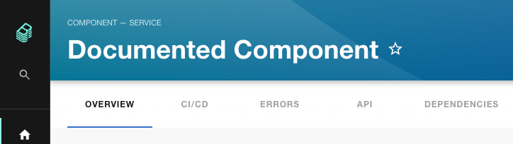

The first ever Backstage Unconference will take place on November 4th at 16:00 UTC time. Us Roadie folks are collaborating with Backstage consultancy Frontside to host the event. Participants will propose topics on the day and we will split into groups for open discussion and knowledge sharing. It's going to be a lot of fun and should be a good way to pick the brains of other adopters or contributors. [Register here](https://hopin.com/events/backstage-users-unconference).

There are also two official Backstage Community Session meetings this week. For the first time, the Backstage Community Session meeting has two tracks. Day 1, on October 20th is aimed at Adopters, and Day 2, on October 21st is aimed at Contributors. [Use the GitHub issue](https://github.com/backstage/community/issues/32) to suggest topics and find calendar links.

## Recent releases

### Catalog graph plugin

The most celebrated Backstage pull request of the past month is the Catalog Graph Plugin from Oliver Sand. This plugin adds the ability to view, filter and traverse the dependency tree of your Backstage components. 

It comes with an entity card for the overview page so you can see the immediate dependencies of each component in the catalog, and a full page viewer for doing deep dives into component dependencies. 

See [the PR](https://github.com/backstage/backstage/pull/7185) for video demos. If you want to learn more about how these relationships work, check out our blog on [modeling software in Backstage](/blog/modeling-software-backstage/).

### Prometheus plugin

Roadie have published a brand new Prometheus plugin. It provides the ability to embed Prometheus graphs and alerts into Backstage. [Visit our website](https://roadie.io/backstage/plugins/prometheus/) to learn how to use it.

The Prometheus plugin was the most requested plugin of all time in the Backstage GitHub issues so it's good to have this one released. 

Here's how it looks:

### Bugsnag plugin

We also published a Bugsnag plugin in the past few weeks. It works similarly to the Sentry and Rollbar plugins, allowing you to track your error rates in Backstage. [Learn how to install the Bugsnag plugin](/backstage/plugins/bugsnag/) on our website.

### Human readable component names

This nifty addition changes the Name column in the Backstage catalog into a human readable title. It's a tiny change but you wouldn't believe the number of Roadie customers who have mentioned that they would love to have more human component names. 

If the optional `metadata.title` property is not set, the catalog will fall back to the required property `metadata.name`. Thanks to Alex Rybchenko for delivering this feature in [#736](https://github.com/backstage/backstage/pull/7367).

Previously, this could only show `documented-component`:

That's all for this week folks. Get upgrading! 🚀
