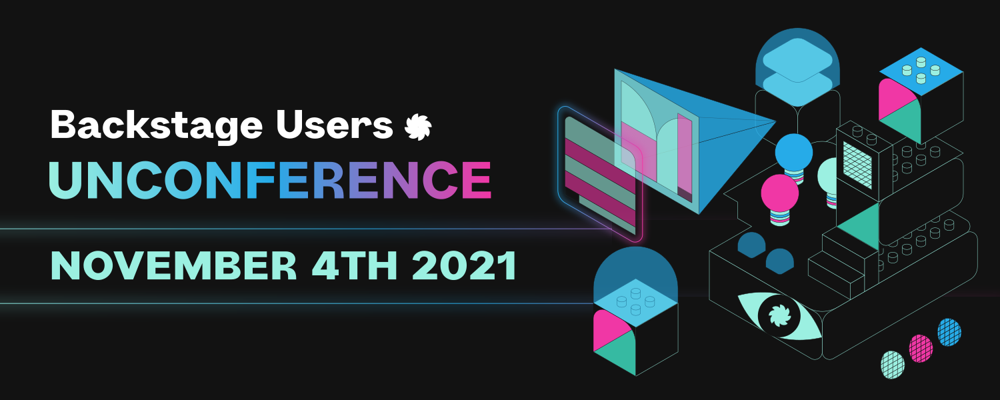
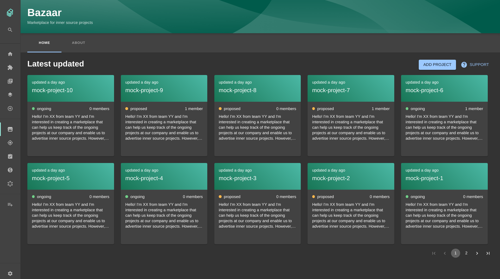

Backstage development has slowed this week since Spotify have given the whole company the week off to focus on wellness and recuperation. If you're still yearning for a Backstage fix, we have got you covered.

The first ever Backstage Unconference takes place tomorrow, November 4th at 16:00 UTC time. **Over 110 people are already registered to attend**. It's totally free and organized by the community.

Participants will propose topics on the day and we will split into groups for open discussion and knowledge sharing. It’s going to be a lot of fun and should be a good way to pick the brains of other adopters or contributors. **[Register here](https://hopin.com/events/backstage-users-unconference)**.

## Recent Backstage merges

### Tech insights is coming

Roadie engineer Jussi Hallila merged the first of a series of pull requests which will give Backstage the ability to monitor and highlight the production readiness of your service fleet - see [#7679](https://github.com/backstage/backstage/pull/7679). 

This first pull request allows integrators to start developing "fact retrievers" and to run checks against stored facts. It also exposes endpoints which enable the development of frontend modules consuming individual facts, facts between timestamps, checks and scorecard data.

We have already started work on some UI pieces which will display scorecards in the Backstage UI. We will mention them in this newsletter as they become available.

### Bazaar plugin

The Bazaar plugin, developed by folks at Axis Communications, is a place where propose projects for cross-functional team development. Essentially a marketplace for internal projects suitable for [Inner Sourcing](https://en.wikipedia.org/wiki/Inner_source). 

Many companies today are of high need to increase the ease of cross-team cooperation. The Bazaar allows engineers and teams to open up and announce their new and exciting projects for transparent cooperation in other parts of larger organizations.

Learn more in pull request [#7174](https://github.com/backstage/backstage/pull/7174).

### Support for mkdocs.yaml

Previously, Backstage's TechDocs feature was militant about ensuring that your MkDocs configuration file had the extension `.yml`. The commonly accepted alternative, `.yaml` was NOT supported. This would lead to countless situations where docs would not appear because of the incorrect extension.

HelloFresh engineer Diego Marangoni recently merged [#59](https://github.com/backstage/mkdocs-monorepo-plugin/pull/59) into the Backstage MkDocs monorepo to add support for `.yaml`. It seems like an insignificant change, but TechDocs adoption gets easier with every piece of friction removed. Though small, I suspect this change will be mighty!

## Roadie stuff

We have launched a new [roadie.io](http://roadie.io) website which is built with CSS framework Tailwind and the suite of Tailwind UI components. It looks quite similar to our old website, but we now have much more design flexibility so we can add pages more easily. Look out for About Us and Pricing pages coming soon.

That's all for this week folks. Get upgrading! 🚀
