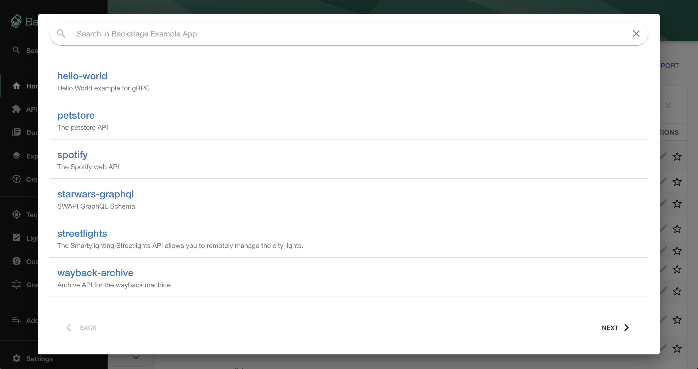
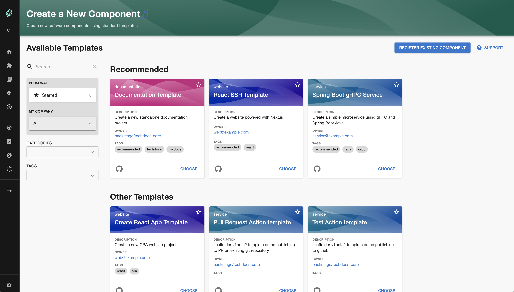

We’ve been onboarding an increased number of awesome engineering organizations to our SaaS Backstage platform recently.

One question comes up again and again… “Does Backstage support monorepos?”

It does... and we decided to write down everything we know about using Backstage to track monorepos. Thanks to the engineering team at Contentful for working with us on this.

[Here's the link](/blog/backstage-monorepo-guide/)

## Merged to Backstage recently

### Search Modal

Finding stuff is one of the main reasons to use Backstage. For this reason, it's important that search is responsive and easy to access. 

Rod Machen from Expedia Group has turned search into a modal in [#7316](https://github.com/backstage/backstage/pull/7316). In my personal experience, this makes the search feel more readily available.

### Catalog fact retriever (Tech Insights phase 2)

This feature builds on [our previous work](/blog/backstage-weekly-36-backstage-unconference/#tech-insights-is-coming) to get Tech Insights into Backstage. [#8057](https://github.com/backstage/backstage/pull/8057) adds a FactRetriever which can track the completeness of entity data in the catalog. 

We're going to combine this with the UI parts in [#8093](https://github.com/backstage/backstage/pull/8093) (which is waiting on a final review) to create a "scorecard" which can help teams understand the value of completing the metadata of their services in Backstage.

The first set of checks can do things like ensure the presence of TechDocs and ensure that each component has an owner listed. 

We're hoping that the community will expand on this over time to build a comprehensive set of checks into every Backstage plugin.

### Add swimlanes to Scaffolder

This change groups scaffolder templates together so it's easier to find the one you're looking for. Recommended scaffolder templates will appear at the top of the page where they are more noticeable.

Thanks to James Russo from Brex for contributing this in [#8252](https://github.com/backstage/backstage/pull/8252).

## Roadie news

### Scaffolder in beta

We are proud to launch scaffolder support for all users. Our scaffolder architecture ensures that scaffolder tasks are run in an isolated and ephemeral environment which keeps customer data secure.

If you've been holding off from trying Roadie because we didn't support the scaffolder.. now is the time to give it a go.

### Backstage Unconference success

The first ever Backstage Unconference on November 4th was a massive success. We had over 190 people register for the event, and more than 90 people simultaneously in attendance.

THANK YOU to everyone who shared their knowledge and best practices around Backstage usage.

While we don't have a date yet, we will definitely be doing this again. Stay tuned!
